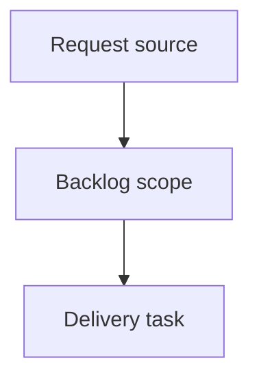

## item_368_notify_operators_when_logics_manager_updates_are_available - Notify operators when logics-manager updates are available
> From version: 2.2.0
> Schema version: 1.0
> Status: Ready
> Understanding: 90
> Confidence: 82
> Progress: 0
> Complexity: Medium
> Theme: Operator workflow
> Reminder: Update status/understanding/confidence/progress and linked request/task references when you edit this doc.

# Problem
Notify operators when a newer `logics-manager` release is available while they use the CLI.
Expose the same update-available signal in the local browser viewer, where CLI-driven users may spend most of their time.
Keep the notification lightweight and non-blocking so normal commands, JSON output, automation, and viewer usage stay reliable.

# Scope
- In:
  - one coherent delivery slice from the source request
- Out:
  - unrelated sibling slices that should stay in separate backlog items instead of widening this doc

# Acceptance criteria
- AC1: Human-oriented CLI commands can display a concise update-available notice with current version, latest version, and recommended update command.
- AC2: JSON output remains machine-safe; update metadata is either omitted from stdout text or exposed through structured fields where appropriate.
- AC3: The local viewer can display update availability without blocking item loading, refresh, health, read, or edit-document flows.
- AC4: Remote version checks are cached or throttled and fail closed without noisy stack traces when offline or when a registry is unreachable.
- AC5: The implementation handles Python and npm installation paths well enough to recommend the right update command or a safe generic fallback.
- AC6: Tests cover version comparison, cache/throttle behavior, CLI output behavior, JSON safety, and local viewer update notice rendering.

# AC Traceability
- request-AC1 -> This backlog slice. Proof: AC1: Human-oriented CLI commands can display a concise update-available notice with current version, latest version, and recommended update command.
- request-AC2 -> This backlog slice. Proof: AC2: JSON output remains machine-safe; update metadata is either omitted from stdout text or exposed through structured fields where appropriate.
- request-AC3 -> This backlog slice. Proof: AC3: The local viewer can display update availability without blocking item loading, refresh, health, read, or edit-document flows.
- request-AC4 -> This backlog slice. Proof: AC4: Remote version checks are cached or throttled and fail closed without noisy stack traces when offline or when a registry is unreachable.
- request-AC5 -> This backlog slice. Proof: AC5: The implementation handles Python and npm installation paths well enough to recommend the right update command or a safe generic fallback.
- request-AC6 -> This backlog slice. Proof: AC6: Tests cover version comparison, cache/throttle behavior, CLI output behavior, JSON safety, and local viewer update notice rendering.

# Decision framing
- Product framing: Not needed
- Product signals: (none detected)
- Product follow-up: No product brief follow-up is expected based on current signals.
- Architecture framing: Not needed
- Architecture signals: (none detected)
- Architecture follow-up: No architecture decision follow-up is expected based on current signals.

# Links
- Product brief(s): (none yet)
- Architecture decision(s): (none yet)
- Request: `logics/request/req_204_notify_operators_when_logics_manager_updates_are_available.md`
- Primary task(s): (none yet)

# AI Context
- Summary: Notify operators when logics-manager updates are available
- Keywords: backlog-groom, request, notify operators when logics-manager updates are available, bounded slice
- Use when: Use when implementing or reviewing the delivery slice for Notify operators when logics-manager updates are available.
- Skip when: Skip when the change is unrelated to this delivery slice or its linked request.

# Priority
- Impact:
- Urgency:

# Notes
- Hybrid rationale: Derived from request `req_204_notify_operators_when_logics_manager_updates_are_available` and kept bounded to one coherent delivery slice.
- Source file: `logics/request/req_204_notify_operators_when_logics_manager_updates_are_available.md`.
- Generated locally by logics-manager.

# Tasks
- `task_169_notify_operators_when_logics_manager_updates_are_available`
