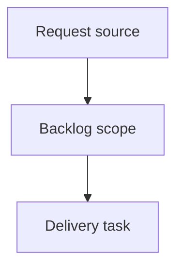

## item_369_redesign_local_viewer_corpus_filters_and_sorting - Redesign local viewer corpus filters and sorting
> From version: 2.2.0
> Schema version: 1.0
> Status: Done
> Understanding: 90%
> Confidence: 85%
> Progress: 100%
> Complexity: High
> Theme: Operator workflow and runtime integration
> Reminder: Update status/understanding/confidence/progress and linked request/task references when you edit this doc.

# Problem
Replace the local viewer filter panel with a model that helps operators manage a corpus, not just toggle low-level display flags.
Add and remove controls based on actual corpus-navigation jobs: focus active work, inspect document types, isolate statuses, find relationship gaps, and identify recent or stale work.
Make grouping and sorting visually secondary but still available, with clearer labels and active result counts.

# Scope
- In:
  - one coherent delivery slice from the source request
- Out:
  - unrelated sibling slices that should stay in separate backlog items instead of widening this doc

# Acceptance criteria
- AC1: The visible local viewer filter panel is organized around Focus, Type, Status, Relations, Activity, and Organize sections.
- AC2: Low-level compatibility toggles are no longer the primary visible model.
- AC3: Filter axes can combine so operators can isolate cases such as blocked tasks, unlinked docs, stale work, companion docs, and items needing promotion.
- AC4: Group and sort controls have clearer labels, and title sorting is supported.
- AC5: Existing viewer flows continue to work: search, refresh, health, corpus insights, read, and edit document.
- AC6: Tests cover the combined local filter axes and existing shared webview filter behavior remains green.

# AC Traceability
- request-AC1 -> This backlog slice. Proof: AC1: The visible local viewer filter panel is organized around Focus, Type, Status, Relations, Activity, and Organize sections.
- request-AC2 -> This backlog slice. Proof: AC2: Low-level compatibility toggles are no longer the primary visible model.
- request-AC3 -> This backlog slice. Proof: AC3: Filter axes can combine so operators can isolate cases such as blocked tasks, unlinked docs, stale work, companion docs, and items needing promotion.
- request-AC4 -> This backlog slice. Proof: AC4: Group and sort controls have clearer labels, and title sorting is supported.
- request-AC5 -> This backlog slice. Proof: AC5: Existing viewer flows continue to work: search, refresh, health, corpus insights, read, and edit document.
- request-AC6 -> This backlog slice. Proof: AC6: Tests cover the combined local filter axes and existing shared webview filter behavior remains green.

# Decision framing
- Product framing: Not needed
- Product signals: (none detected)
- Product follow-up: No product brief follow-up is expected based on current signals.
- Architecture framing: Not needed
- Architecture signals: (none detected)
- Architecture follow-up: No architecture decision follow-up is expected based on current signals.

# Links
- Product brief(s): (none yet)
- Architecture decision(s): (none yet)
- Request: `logics/request/req_205_redesign_local_viewer_corpus_filters_and_sorting.md`
- Primary task(s): (none yet)

# AI Context
- Summary: Redesign local viewer corpus filters and sorting
- Keywords: backlog-groom, request, redesign local viewer corpus filters and sorting, bounded slice
- Use when: Use when implementing or reviewing the delivery slice for Redesign local viewer corpus filters and sorting.
- Skip when: Skip when the change is unrelated to this delivery slice or its linked request.

# Priority
- Impact:
- Urgency:

# Notes
- Hybrid rationale: Derived from request `req_205_redesign_local_viewer_corpus_filters_and_sorting` and kept bounded to one coherent delivery slice.
- Source file: `logics/request/req_205_redesign_local_viewer_corpus_filters_and_sorting.md`.
- Generated locally by logics-manager.
- Task `task_170_redesign_local_viewer_corpus_filters_and_sorting` was finished via `logics-manager flow finish task` on 2026-06-07.

# Tasks
- `task_170_redesign_local_viewer_corpus_filters_and_sorting`
