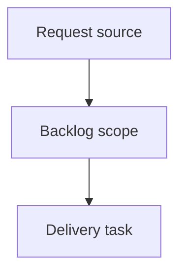

## item_370_add_progressive_group_rendering_for_large_item_lists - Add progressive group rendering for large item lists
> From version: 2.2.0
> Schema version: 1.0
> Status: Done
> Understanding: 92
> Confidence: 84
> Progress: 100%
> Complexity: High
> Theme: UI
> Reminder: Update status/understanding/confidence/progress and linked request/task references when you edit this doc.

# Problem
Keep large board/list groups usable when the Logics corpus contains many visible items.
Render each group progressively, for example 10 items at a time, so the first paint stays readable and fast.
Make hidden overflow explicit with an in-flow control such as `Show 10 more`, instead of silently hiding matches.

# Scope
- In:
  - Add per-group progressive rendering state to the existing board/list rendering path.
  - Use a default reveal page size around 10 items per group unless implementation evidence suggests a better value.
  - Render a `Show more` pseudo-card or row action inside each truncated group.
  - Keep visible and total group counts clear when truncation is active.
  - Reconcile reveal limits when search, filters, grouping, or sorting changes.
  - Add focused renderer/harness tests for truncation, reveal, search, and filter/sort transitions.
- Out:
  - Server-side pagination or changing the viewer item payload contract.
  - Virtual scrolling or a new frontend framework/dependency.
  - Changes to Logics workflow document semantics or indexing rules.
  - Broader redesign of the board/list visual hierarchy beyond the progressive reveal affordance.

# Acceptance criteria
- AC1: Board/list groups render an initial bounded number of items per group when a group exceeds the configured threshold.
- AC2: Each truncated group exposes a visible in-flow control to reveal the next page of items, with copy that makes the hidden count clear.
- AC3: Group headers or summaries distinguish total matching items from currently rendered items when truncation is active.
- AC4: Filtering, search, grouping, and sorting produce predictable visible limits and do not leave stale expansion state that hides expected results.
- AC5: Search remains operator-friendly; relevant matches are not buried behind repeated `Show more` clicks.
- AC6: Tests cover initial truncation, reveal-more behavior, reset/reconciliation after filter or sort changes, and search behavior.

# AC Traceability
- request-AC1 -> This backlog slice. Proof: AC1: Board/list groups render an initial bounded number of items per group when a group exceeds the configured threshold.
- request-AC2 -> This backlog slice. Proof: AC2: Each truncated group exposes a visible in-flow control to reveal the next page of items, with copy that makes the hidden count clear.
- request-AC3 -> This backlog slice. Proof: AC3: Group headers or summaries distinguish total matching items from currently rendered items when truncation is active.
- request-AC4 -> This backlog slice. Proof: AC4: Filtering, search, grouping, and sorting produce predictable visible limits and do not leave stale expansion state that hides expected results.
- request-AC5 -> This backlog slice. Proof: AC5: Search remains operator-friendly; relevant matches are not buried behind repeated `Show more` clicks.
- request-AC6 -> This backlog slice. Proof: AC6: Tests cover initial truncation, reveal-more behavior, reset/reconciliation after filter or sort changes, and search behavior.

# Decision framing
- Product framing: Not needed for the first slice; the request and backlog define the operator need.
- Product signals: Large-corpus navigation should stay scannable without hiding overflow silently.
- Product follow-up: Revisit if progressive groups become configurable or part of a broader navigation model.
- Architecture framing: Lightweight implementation expected.
- Architecture signals: Prefer local renderer state over payload/API changes for the first slice.
- Architecture follow-up: Revisit if future server-side paging, virtualization, or persisted reveal state is proposed.

# Links
- Product brief(s): (none yet)
- Architecture decision(s): (none yet)
- Request: `logics/request/req_206_add_progressive_group_rendering_for_large_item_lists.md`
- Primary task(s): (none yet)

# AI Context
- Summary: Add progressive group rendering for large item lists
- Keywords: backlog-groom, request, add progressive group rendering for large item lists, bounded slice
- Use when: Use when implementing or reviewing the delivery slice for Add progressive group rendering for large item lists.
- Skip when: Skip when the change is unrelated to this delivery slice or its linked request.

# Priority
- Impact: Medium-high for large Logics corpora; low risk for small corpora if the threshold is above normal group sizes.
- Urgency: Medium; useful follow-up after recent local viewer corpus-navigation work.

# Notes
- Hybrid rationale: Derived from request `req_206_add_progressive_group_rendering_for_large_item_lists` and kept bounded to one coherent delivery slice.
- Source file: `logics/request/req_206_add_progressive_group_rendering_for_large_item_lists.md`.
- Generated locally by logics-manager.
- Task `task_171_add_progressive_group_rendering_for_large_item_lists` was finished via `logics-manager flow finish task` on 2026-06-07.

# Tasks
- `task_171_add_progressive_group_rendering_for_large_item_lists`
