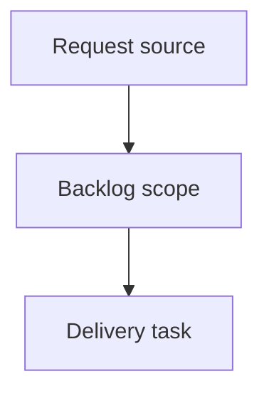

## item_371_add_local_viewer_favicon_from_existing_app_assets - Add local viewer favicon from existing app assets
> From version: 2.2.0
> Schema version: 1.0
> Status: Ready
> Understanding: 96
> Confidence: 94
> Progress: 0
> Complexity: Low
> Theme: UI
> Reminder: Update status/understanding/confidence/progress and linked request/task references when you edit this doc.

# Problem
Show the Logics app icon in browser tabs when the local viewer is open.
Reuse the existing extension/application assets instead of introducing a separate favicon source.
Keep the change lightweight and packaging-safe for the bundled viewer.

# Scope
- In:
  - Add favicon declarations to `clients/viewer/index.html`.
  - Use existing assets from `clients/shared-web/media/`, with `icon.png` as the primary favicon candidate.
  - Verify the current `/media/` route in `logics_manager/viewer.py` serves the referenced asset correctly.
  - Add or update packaging/viewer tests so referenced favicon assets stay included.
- Out:
  - Designing new icon artwork.
  - Changing VS Code extension branding or activity bar icons.
  - Adding a favicon generation pipeline.
  - Adding browser-specific icon variants not already present in the repo.

# Acceptance criteria
- AC1: The local viewer HTML declares a favicon using existing app assets from `clients/shared-web/media/`.
- AC2: The favicon path is served by the local viewer without adding a new static route unless the existing media route proves insufficient.
- AC3: The selected primary icon works in common browsers from `http://127.0.0.1:<port>/` without requiring a page reload loop or external asset.
- AC4: Packaging or viewer tests cover that the referenced favicon asset is included and addressable.
- AC5: The implementation does not alter VS Code extension icon behavior or introduce a new icon source.

# AC Traceability
- request-AC1 -> This backlog slice. Proof: AC1: The local viewer HTML declares a favicon using existing app assets from `clients/shared-web/media/`.
- request-AC2 -> This backlog slice. Proof: AC2: The favicon path is served by the local viewer without adding a new static route unless the existing media route proves insufficient.
- request-AC3 -> This backlog slice. Proof: AC3: The selected primary icon works in common browsers from `http://127.0.0.1:<port>/` without requiring a page reload loop or external asset.
- request-AC4 -> This backlog slice. Proof: AC4: Packaging or viewer tests cover that the referenced favicon asset is included and addressable.
- request-AC5 -> This backlog slice. Proof: AC5: The implementation does not alter VS Code extension icon behavior or introduce a new icon source.

# Decision framing
- Product framing: Not needed; this is a small browser identity polish.
- Product signals: Browser tabs should show the same Logics identity as the installed app/extension.
- Product follow-up: None expected unless new icon artwork is requested.
- Architecture framing: Not needed; existing static asset serving should be sufficient.
- Architecture signals: Prefer `clients/shared-web/media/icon.png` and the existing `/media/` route.
- Architecture follow-up: Revisit only if packaging cannot include the referenced asset reliably.

# Links
- Product brief(s): (none yet)
- Architecture decision(s): (none yet)
- Request: `logics/request/req_207_add_local_viewer_favicon_from_existing_app_assets.md`
- Primary task(s): (none yet)

# AI Context
- Summary: Add local viewer favicon from existing app assets
- Keywords: backlog-groom, request, add local viewer favicon from existing app assets, bounded slice
- Use when: Use when implementing or reviewing the delivery slice for Add local viewer favicon from existing app assets.
- Skip when: Skip when the change is unrelated to this delivery slice or its linked request.

# Priority
- Impact: Low-medium; improves browser recognition with minimal implementation risk.
- Urgency: Low; suitable as a quick polish task.

# Notes
- Hybrid rationale: Derived from request `req_207_add_local_viewer_favicon_from_existing_app_assets` and kept bounded to one coherent delivery slice.
- Source file: `logics/request/req_207_add_local_viewer_favicon_from_existing_app_assets.md`.
- Generated locally by logics-manager.

# Tasks
- `task_172_add_local_viewer_favicon_from_existing_app_assets`
