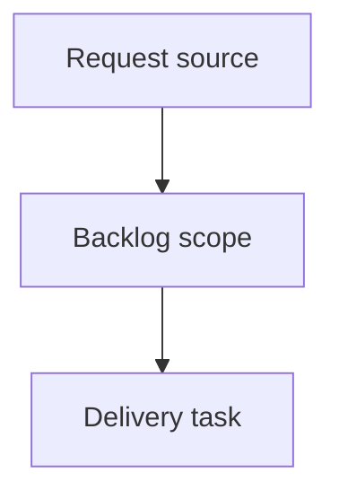

## item_372_auto_refresh_local_viewer_data_without_page_navigation - Auto refresh local viewer data without page navigation
> From version: 2.2.0
> Schema version: 1.0
> Status: Done
> Understanding: 94
> Confidence: 86
> Progress: 100%
> Complexity: Medium
> Theme: UI
> Reminder: Update status/understanding/confidence/progress and linked request/task references when you edit this doc.

# Problem
Keep the local viewer data current while an operator leaves the browser tab open.
Refresh item data in place without reloading the page, changing browser location, or closing the current document preview.
Avoid noisy UI churn and concurrent refresh races.

# Scope
- In:
  - Add a browser-host refresh loop around the existing `/api/refresh` endpoint.
  - Use an interval around 60 seconds.
  - Preserve selected item, open document preview, filters, search, grouping, sorting, and other viewer UI state where practical.
  - Add an in-flight guard so automatic refreshes cannot overlap.
  - Define hidden-tab behavior explicitly: skip/defer background ticks and refresh when the tab becomes visible again.
  - Keep automatic refresh status feedback quiet unless an error needs to be surfaced.
- Out:
  - WebSockets, server-sent events, or push-based file watcher updates.
  - `location.reload` or any full-page reload mechanism.
  - User-configurable refresh intervals in the first implementation slice.
  - API payload shape changes unless implementation evidence requires them.

# Acceptance criteria
- AC1: The local viewer refreshes its item payload automatically about once per minute while visible.
- AC2: Automatic refresh uses existing viewer APIs and does not reload or navigate the browser page.
- AC3: Automatic refresh preserves the currently open document preview, selected item, filters, search, grouping, and sorting where practical.
- AC4: Refreshes do not overlap; a new automatic tick is skipped or deferred while a previous refresh is still in flight.
- AC5: Hidden-tab behavior is intentional: background ticks are skipped/deferred and the viewer refreshes when it becomes visible again.
- AC6: Tests cover timer-driven refresh, no page navigation, in-flight guarding, and state preservation for document/viewer UI.

# AC Traceability
- request-AC1 -> This backlog slice. Proof: AC1: The local viewer refreshes its item payload automatically about once per minute while visible.
- request-AC2 -> This backlog slice. Proof: AC2: Automatic refresh uses existing viewer APIs and does not reload or navigate the browser page.
- request-AC3 -> This backlog slice. Proof: AC3: Automatic refresh preserves the currently open document preview, selected item, filters, search, grouping, and sorting where practical.
- request-AC4 -> This backlog slice. Proof: AC4: Refreshes do not overlap; a new automatic tick is skipped or deferred while a previous refresh is still in flight.
- request-AC5 -> This backlog slice. Proof: AC5: Hidden-tab behavior is intentional: background ticks are skipped/deferred and the viewer refreshes when it becomes visible again.
- request-AC6 -> This backlog slice. Proof: AC6: Tests cover timer-driven refresh, no page navigation, in-flight guarding, and state preservation for document/viewer UI.

# Decision framing
- Product framing: Not needed for the first slice; the need is local data freshness while the viewer stays open.
- Product signals: Operators use terminal commands while watching the browser viewer and should not need manual refresh for routine changes.
- Product follow-up: Revisit if users ask for a visible auto-refresh toggle or interval preference.
- Architecture framing: Lightweight client-side polling is preferred for the first slice.
- Architecture signals: Reuse `/api/refresh`; avoid new backend streaming mechanisms.
- Architecture follow-up: Revisit only if polling becomes too noisy for large corpora.

# Links
- Product brief(s): (none yet)
- Architecture decision(s): (none yet)
- Request: `logics/request/req_208_auto_refresh_local_viewer_data_without_page_navigation.md`
- Primary task(s): (none yet)

# AI Context
- Summary: Auto refresh local viewer data without page navigation
- Keywords: backlog-groom, request, auto refresh local viewer data without page navigation, bounded slice
- Use when: Use when implementing or reviewing the delivery slice for Auto refresh local viewer data without page navigation.
- Skip when: Skip when the change is unrelated to this delivery slice or its linked request.

# Priority
- Impact: Medium; reduces stale local viewer state during CLI-driven work.
- Urgency: Medium; pairs naturally with ongoing local viewer polish.

# Notes
- Hybrid rationale: Derived from request `req_208_auto_refresh_local_viewer_data_without_page_navigation` and kept bounded to one coherent delivery slice.
- Source file: `logics/request/req_208_auto_refresh_local_viewer_data_without_page_navigation.md`.
- Generated locally by logics-manager.
- Task `task_173_auto_refresh_local_viewer_data_without_page_navigation` was finished via `logics-manager flow finish task` on 2026-06-07.

# Tasks
- `task_173_auto_refresh_local_viewer_data_without_page_navigation`
