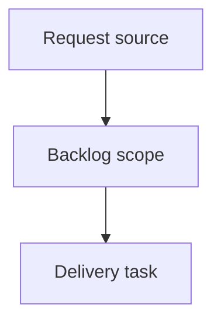

## item_373_open_focused_logics_items_in_the_local_viewer - Open focused Logics items in the local viewer
> From version: 2.3.0
> Schema version: 1.0
> Status: Done
> Understanding: 90%
> Confidence: 85%
> Progress: 100%
> Complexity: High
> Theme: Operator workflow and runtime integration
> Reminder: Update status/understanding/confidence/progress and linked request/task references when you edit this doc.

# Problem
Let AI assistants and humans point to a specific Logics corpus item with a local viewer link.
Provide a robust fallback command that launches the viewer and opens the same focused item when the server is not already running.
Make the focused item obvious in the viewer by selecting it, scrolling it into view, and opening the details or read surface.

# Scope
- In:
  - parse viewer focus targets from URL query parameters;
  - add a `logics-manager view --focus <ref-or-path>` launch path;
  - wire focus selection, scroll, details opening, and optional read-preview behavior in the local viewer;
  - document the assistant handoff pattern: viewer link plus fallback command;
  - add focused coverage for target resolution and browser-host behavior.
- Out:
  - public or remote sharing links;
  - OS-level protocol handlers;
  - workflow mutation from the viewer;
  - MCP permission expansion beyond producing bounded guidance or link text.

# Acceptance criteria
- AC1: The viewer accepts a focus target in the URL query and resolves both workflow refs and repo-relative Logics Markdown paths.
- AC2: `logics-manager view` supports a focus option that starts the local viewer and opens the focused URL when requested.
- AC3: A focused viewer load selects the item, scrolls it into view, and opens the details panel without mutating workflow files.
- AC4: Optional read-preview mode can open the rendered Markdown preview for the focused item, including Mermaid rendering fallback behavior.
- AC5: Missing, stale, or invalid focus targets produce clear viewer feedback while keeping the corpus usable.
- AC6: Assistant-facing guidance and README/CLI docs explain the link plus fallback-command pattern, including what to do when the server is not running.
- AC7: Focus target parsing is covered by tests for refs, repo-relative paths, URL encoding, missing items, and path traversal rejection.

# AC Traceability
- request-AC1 -> This backlog slice. Proof: AC1: The viewer accepts a focus target in the URL query and resolves both workflow refs and repo-relative Logics Markdown paths.
- request-AC2 -> This backlog slice. Proof: AC2: `logics-manager view` supports a focus option that starts the local viewer and opens the focused URL when requested.
- request-AC3 -> This backlog slice. Proof: AC3: A focused viewer load selects the item, scrolls it into view, and opens the details panel without mutating workflow files.
- request-AC4 -> This backlog slice. Proof: AC4: Optional read-preview mode can open the rendered Markdown preview for the focused item, including Mermaid rendering fallback behavior.
- request-AC5 -> This backlog slice. Proof: AC5: Missing, stale, or invalid focus targets produce clear viewer feedback while keeping the corpus usable.
- request-AC6 -> This backlog slice. Proof: AC6: Assistant-facing guidance and README/CLI docs explain the link plus fallback-command pattern, including what to do when the server is not running.
- request-AC7 -> This backlog slice. Proof: AC7: Focus target parsing is covered by tests for refs, repo-relative paths, URL encoding, missing items, and path traversal rejection.

# Decision framing
- Product framing: Not needed
- Product signals: (none detected)
- Product follow-up: No product brief follow-up is expected based on current signals.
- Architecture framing: Not needed
- Architecture signals: (none detected)
- Architecture follow-up: No architecture decision follow-up is expected based on current signals.

# Links
- Product brief(s): (none yet)
- Architecture decision(s): (none yet)
- Request: `logics/request/req_209_viewer_focus_links.md`
- Primary task(s): `logics/tasks/task_174_open_focused_logics_items_in_the_local_viewer.md`

# AI Context
- Summary: Open focused Logics items in the local viewer
- Keywords: backlog-groom, request, open focused logics items in the local viewer, bounded slice
- Use when: Use when implementing or reviewing the delivery slice for Open focused Logics items in the local viewer.
- Skip when: Skip when the change is unrelated to this delivery slice or its linked request.

# Priority
- Impact: Medium-high. The feature makes assistant handoffs more actionable and turns the local viewer into a shared reference surface during review or planning.
- Urgency: Medium. The viewer is newly documented, so adding deep links now helps establish the interaction contract before assistant guidance spreads.

# Implementation notes
- Prefer a stable query contract first, for example `?focus=<ref-or-path>` and `&read=1`.
- Resolve refs and paths through the same safe corpus model used by the viewer payload; reject traversal or non-Logics paths.
- If progressive rendering hides the target initially, reveal enough items before scrolling.
- Keep the fallback command visible in docs because a stopped localhost server cannot be launched from a plain HTTP link.

# Notes
- Hybrid rationale: Derived from request `req_209_viewer_focus_links` and kept bounded to one coherent delivery slice.
- Source file: `logics/request/req_209_viewer_focus_links.md`.
- Generated locally by logics-manager.
- Task `task_174_open_focused_logics_items_in_the_local_viewer` was finished via `logics-manager flow finish task` on 2026-06-07.

# Tasks
- `task_174_open_focused_logics_items_in_the_local_viewer`
