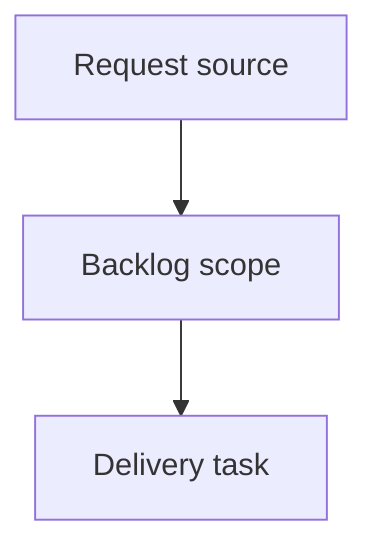

## item_374_improve_local_logics_viewer_controls_and_activity_signals - Improve local Logics viewer controls and activity signals
> From version: 2.3.3
> Schema version: 1.0
> Status: Done
> Understanding: 90%
> Confidence: 85%
> Progress: 100%
> Complexity: High
> Theme: Operator workflow and runtime integration
> Reminder: Update status/understanding/confidence/progress and linked request/task references when you edit this doc.

# Problem
Improve `logics-manager view` so the local browser viewer is less noisy, keeps refresh behavior under operator control, and exposes clearer runtime status.
Preserve the current default behavior where the viewer auto-refreshes about once per minute, while allowing users to disable auto-refresh from the UI and configure a shorter interval from the CLI.
Make recent activity easier to scan by adding a document-type signal at the start of each activity entry.

# Scope
- In:
  - one coherent delivery slice from the source request
- Out:
  - unrelated sibling slices that should stay in separate backlog items instead of widening this doc

# Acceptance criteria
- AC1: In `logics-manager view`, the topbar shows `Auto`, `Refresh`, `Insights`, and `Health` in that order.
- AC2: The `Auto` checkbox enables and disables automatic refresh without disabling manual `Refresh`.
- AC3: The CLI supports configuring the automatic refresh interval, keeps a 60-second default, and accepts shorter positive intervals.
- AC4: The filter toolbar no longer includes the redundant corpus-insights icon, while the main `Insights` button still opens corpus insights.
- AC5: The local viewer tools menu is removed from the browser viewer UI.
- AC6: The viewer startup output includes the localhost URL and, when available/applicable, a network-facing address for the bound server.
- AC7: The refreshed metadata line includes a seconds countdown until the next automatic refresh when auto-refresh is active.
- AC8: Recent activity entries include a leading visual marker describing the document type.
- AC9: Existing viewer behavior for focus/read URLs, manual refresh, insights, health, and packaged PyPI/pipx assets remains covered by tests.

# AC Traceability
- request-AC1 -> This backlog slice. Proof: AC1: In `logics-manager view`, the topbar shows `Auto`, `Refresh`, `Insights`, and `Health` in that order.
- request-AC2 -> This backlog slice. Proof: AC2: The `Auto` checkbox enables and disables automatic refresh without disabling manual `Refresh`.
- request-AC3 -> This backlog slice. Proof: AC3: The CLI supports configuring the automatic refresh interval, keeps a 60-second default, and accepts shorter positive intervals.
- request-AC4 -> This backlog slice. Proof: AC4: The filter toolbar no longer includes the redundant corpus-insights icon, while the main `Insights` button still opens corpus insights.
- request-AC5 -> This backlog slice. Proof: AC5: The local viewer tools menu is removed from the browser viewer UI.
- request-AC6 -> This backlog slice. Proof: AC6: The viewer startup output includes the localhost URL and, when available/applicable, a network-facing address for the bound server.
- request-AC7 -> This backlog slice. Proof: AC7: The refreshed metadata line includes a seconds countdown until the next automatic refresh when auto-refresh is active.
- request-AC8 -> This backlog slice. Proof: AC8: Recent activity entries include a leading visual marker describing the document type.
- request-AC9 -> This backlog slice. Proof: AC9: Existing viewer behavior for focus/read URLs, manual refresh, insights, health, and packaged PyPI/pipx assets remains covered by tests.

# Decision framing
- Product framing: Not needed
- Product signals: (none detected)
- Product follow-up: No product brief follow-up is expected based on current signals.
- Architecture framing: Not needed
- Architecture signals: (none detected)
- Architecture follow-up: No architecture decision follow-up is expected based on current signals.

# Links
- Product brief(s): (none yet)
- Architecture decision(s): (none yet)
- Request: `logics/request/req_210_improve_local_logics_viewer_controls_and_activity_signals.md`
- Primary task(s): (none yet)

# AI Context
- Summary: Improve local Logics viewer controls and activity signals
- Keywords: backlog-groom, request, improve local logics viewer controls and activity signals, bounded slice
- Use when: Use when implementing or reviewing the delivery slice for Improve local Logics viewer controls and activity signals.
- Skip when: Skip when the change is unrelated to this delivery slice or its linked request.

# Priority
- Impact:
- Urgency:

# Notes
- Hybrid rationale: Derived from request `req_210_improve_local_logics_viewer_controls_and_activity_signals` and kept bounded to one coherent delivery slice.
- Source file: `logics/request/req_210_improve_local_logics_viewer_controls_and_activity_signals.md`.
- Generated locally by logics-manager.
- Task `task_175_improve_local_logics_viewer_controls_and_activity_signals` was finished via `logics-manager flow finish task` on 2026-06-08.

# Tasks
- `task_175_improve_local_logics_viewer_controls_and_activity_signals`
