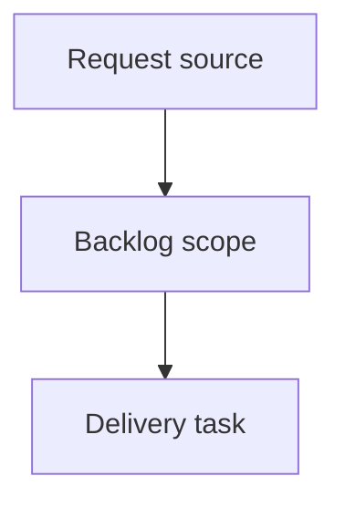

## item_375_improve_viewer_repository_identity_and_recent_activity_scanning - Improve viewer repository identity and recent activity scanning
> From version: 2.3.3
> Schema version: 1.0
> Status: Ready
> Understanding: 90%
> Confidence: 85%
> Progress: 0%
> Complexity: High
> Theme: Operator workflow and runtime integration
> Reminder: Update status/understanding/confidence/progress and linked request/task references when you edit this doc.

# Problem
Make the active repository immediately visible in the local Logics viewer header so operators can distinguish multiple open viewer windows.
Improve Recent activity scanning by showing whether an entry represents a detected status change or a general document update.
Keep the Recent activity panel compact by listing the first 10 entries by default and letting operators reveal the next entries in batches.

# Scope
- In:
  - one coherent delivery slice from the source request
- Out:
  - unrelated sibling slices that should stay in separate backlog items instead of widening this doc

# Acceptance criteria
- AC1: The viewer topbar displays a compact repository-name pill immediately to the right of `Logics Viewer`.
- AC2: The repository pill uses the short repo directory name and exposes the full repository path where practical.
- AC3: Recent activity entries show a leading activity-type icon or marker.
- AC4: A status-change marker is used only when the viewer can reliably detect that a document status changed since the previous known snapshot.
- AC5: A general update marker is used for entries that changed but do not have a reliable status-change signal.
- AC6: Recent activity initially renders at most 10 entries.
- AC7: A reveal control lets users show the next 10 Recent activity entries without changing the existing recency sort order.
- AC8: The reveal control is hidden or disabled when no additional activity entries remain.
- AC9: Existing activity entry selection, double-click read behavior, and timestamp rendering continue to work.

# AC Traceability
- request-AC1 -> This backlog slice. Proof: AC1: The viewer topbar displays a compact repository-name pill immediately to the right of `Logics Viewer`.
- request-AC2 -> This backlog slice. Proof: AC2: The repository pill uses the short repo directory name and exposes the full repository path where practical.
- request-AC3 -> This backlog slice. Proof: AC3: Recent activity entries show a leading activity-type icon or marker.
- request-AC4 -> This backlog slice. Proof: AC4: A status-change marker is used only when the viewer can reliably detect that a document status changed since the previous known snapshot.
- request-AC5 -> This backlog slice. Proof: AC5: A general update marker is used for entries that changed but do not have a reliable status-change signal.
- request-AC6 -> This backlog slice. Proof: AC6: Recent activity initially renders at most 10 entries.
- request-AC7 -> This backlog slice. Proof: AC7: A reveal control lets users show the next 10 Recent activity entries without changing the existing recency sort order.
- request-AC8 -> This backlog slice. Proof: AC8: The reveal control is hidden or disabled when no additional activity entries remain.
- request-AC9 -> This backlog slice. Proof: AC9: Existing activity entry selection, double-click read behavior, and timestamp rendering continue to work.

# Decision framing
- Product framing: Not needed
- Product signals: (none detected)
- Product follow-up: No product brief follow-up is expected based on current signals.
- Architecture framing: Not needed
- Architecture signals: (none detected)
- Architecture follow-up: No architecture decision follow-up is expected based on current signals.

# Links
- Product brief(s): (none yet)
- Architecture decision(s): (none yet)
- Request: `logics/request/req_211_improve_viewer_repository_identity_and_recent_activity_scanning.md`
- Primary task(s): (none yet)

# AI Context
- Summary: Improve viewer repository identity and recent activity scanning
- Keywords: backlog-groom, request, improve viewer repository identity and recent activity scanning, bounded slice
- Use when: Use when implementing or reviewing the delivery slice for Improve viewer repository identity and recent activity scanning.
- Skip when: Skip when the change is unrelated to this delivery slice or its linked request.

# Priority
- Impact:
- Urgency:

# Notes
- Hybrid rationale: Derived from request `req_211_improve_viewer_repository_identity_and_recent_activity_scanning` and kept bounded to one coherent delivery slice.
- Source file: `logics/request/req_211_improve_viewer_repository_identity_and_recent_activity_scanning.md`.
- Generated locally by logics-manager.

# Tasks
- `task_176_improve_viewer_repository_identity_and_recent_activity_scanning`
