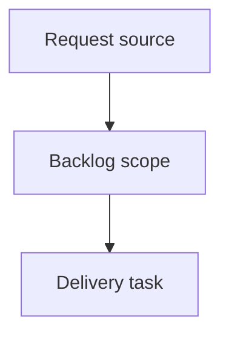

## item_376_expand_viewer_health_navigation_and_corpus_insights - Expand viewer health navigation and corpus insights
> From version: 2.3.3
> Schema version: 1.0
> Status: Done
> Understanding: 90%
> Confidence: 85%
> Progress: 100%
> Complexity: High
> Theme: Operator workflow and runtime integration
> Reminder: Update status/understanding/confidence/progress and linked request/task references when you edit this doc.

# Problem
Make Validation health findings actionable by letting operators open the related document directly from each document-scoped finding.
Expand Corpus insights beyond a small summary into an operational overview that helps operators understand workflow shape, flow health, activity, traceability, quality signals, and recommended next checks.
Restore confidence in the toolbar attention filter by verifying and fixing the `Show blocked, orphaned, unprocessed, or inconsistent items` button when it no longer filters the viewer as expected.
Keep the expanded insights readable and bounded so the viewer remains a focused workflow tool rather than a heavy dashboard.

# Scope
- In:
  - one coherent delivery slice from the source request
- Out:
  - unrelated sibling slices that should stay in separate backlog items instead of widening this doc

# Acceptance criteria
- AC1: Validation health document-scoped findings expose a clickable path or control that opens the referenced document in the viewer read preview.
- AC2: Repository-level findings remain non-clickable and are visually distinguishable from document-scoped findings.
- AC3: Missing, invalid, or unsafe finding paths are rendered safely and do not break the Health screen.
- AC4: Corpus insights includes an `Overview` section with document counts by type, open/closed counts, blocked counts, missing or ambiguous status counts, and recently modified document counts.
- AC5: Corpus insights includes a `Flow health` section with incomplete workflow chain signals and orphan/linkage risk signals.
- AC6: Corpus insights includes an `Activity` section with latest changes, stale active docs, recently active docs, and a simple activity classification.
- AC7: Corpus insights includes a `Traceability` section with most referenced docs, unlinked docs, broken references, and relationship counts by document type.
- AC8: Corpus insights includes a `Quality signals` section summarizing lint/audit categories, finding counts by document type, and documents with concentrated issues.
- AC9: Corpus insights includes an `Operator actions` section with recommended next checks that are derived from available corpus, lint, and audit signals.
- AC10: The `Show blocked, orphaned, unprocessed, or inconsistent items` button toggles active/pressed state and filters the board/list to attention-required items in the local viewer.
- AC11: Turning the attention filter off restores the previous visible corpus according to the active search/filter settings.
- AC12: Existing `Insights` and `Health` buttons continue to work in the local viewer and in packaged PyPI/pipx assets.

# AC Traceability
- request-AC1 -> This backlog slice. Proof: AC1: Validation health document-scoped findings expose a clickable path or control that opens the referenced document in the viewer read preview.
- request-AC2 -> This backlog slice. Proof: AC2: Repository-level findings remain non-clickable and are visually distinguishable from document-scoped findings.
- request-AC3 -> This backlog slice. Proof: AC3: Missing, invalid, or unsafe finding paths are rendered safely and do not break the Health screen.
- request-AC4 -> This backlog slice. Proof: AC4: Corpus insights includes an `Overview` section with document counts by type, open/closed counts, blocked counts, missing or ambiguous status counts, and recently modified document counts.
- request-AC5 -> This backlog slice. Proof: AC5: Corpus insights includes a `Flow health` section with incomplete workflow chain signals and orphan/linkage risk signals.
- request-AC6 -> This backlog slice. Proof: AC6: Corpus insights includes an `Activity` section with latest changes, stale active docs, recently active docs, and a simple activity classification.
- request-AC7 -> This backlog slice. Proof: AC7: Corpus insights includes a `Traceability` section with most referenced docs, unlinked docs, broken references, and relationship counts by document type.
- request-AC8 -> This backlog slice. Proof: AC8: Corpus insights includes a `Quality signals` section summarizing lint/audit categories, finding counts by document type, and documents with concentrated issues.
- request-AC9 -> This backlog slice. Proof: AC9: Corpus insights includes an `Operator actions` section with recommended next checks that are derived from available corpus, lint, and audit signals.
- request-AC10 -> This backlog slice. Proof: AC10: The `Show blocked, orphaned, unprocessed, or inconsistent items` button toggles active/pressed state and filters the board/list to attention-required items in the local viewer.
- request-AC11 -> This backlog slice. Proof: AC11: Turning the attention filter off restores the previous visible corpus according to the active search/filter settings.
- request-AC12 -> This backlog slice. Proof: AC12: Existing `Insights` and `Health` buttons continue to work in the local viewer and in packaged PyPI/pipx assets.

# Decision framing
- Product framing: Not needed
- Product signals: (none detected)
- Product follow-up: No product brief follow-up is expected based on current signals.
- Architecture framing: Not needed
- Architecture signals: (none detected)
- Architecture follow-up: No architecture decision follow-up is expected based on current signals.

# Links
- Product brief(s): (none yet)
- Architecture decision(s): (none yet)
- Request: `logics/request/req_212_expand_viewer_health_navigation_and_corpus_insights.md`
- Primary task(s): (none yet)

# AI Context
- Summary: Expand viewer health navigation and corpus insights
- Keywords: backlog-groom, request, expand viewer health navigation and corpus insights, bounded slice
- Use when: Use when implementing or reviewing the delivery slice for Expand viewer health navigation and corpus insights.
- Skip when: Skip when the change is unrelated to this delivery slice or its linked request.

# Priority
- Impact:
- Urgency:

# Notes
- Hybrid rationale: Derived from request `req_212_expand_viewer_health_navigation_and_corpus_insights` and kept bounded to one coherent delivery slice.
- Source file: `logics/request/req_212_expand_viewer_health_navigation_and_corpus_insights.md`.
- Generated locally by logics-manager.
- Task `task_177_expand_viewer_health_navigation_and_corpus_insights` was finished via `logics-manager flow finish task` on 2026-06-08.

# Tasks
- `task_177_expand_viewer_health_navigation_and_corpus_insights`
