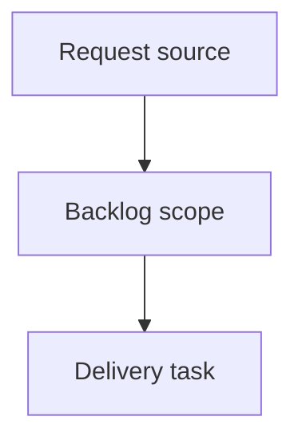

## item_377_dogfood_local_logics_viewer_on_real_corpora - Dogfood local Logics viewer on real corpora
> From version: 2.3.3
> Schema version: 1.0
> Status: Done
> Understanding: 95
> Confidence: 85
> Progress: 100%
> Complexity: Medium
> Theme: UX validation
> Reminder: Update status/understanding/confidence/progress and linked request/task references when you edit this doc.

# Problem
Validate the local browser viewer against real Logics corpora before adding more features on top of it.
Capture concrete UX, layout, and workflow issues from actual operator usage instead of relying only on implementation-time assumptions.

# Scope
- In:
  - run the local dev viewer against the current repository corpus
  - review core operator workflows across desktop, tablet-width, and mobile-width layouts
  - record prioritized findings and implement only low-risk fixes discovered during the pass
- Out:
  - new Insights interaction models
  - persistent activity history
  - browser automation or visual regression infrastructure

# Acceptance criteria
- AC1: The viewer is exercised from the local dev entrypoint against the current repo corpus.
- AC2: The review covers topbar controls, repository pill, Auto/Refresh, Insights, Health, attention filter, read preview, and recent activity.
- AC3: The review covers at least desktop, tablet-width, and mobile-width layouts.
- AC4: Findings are grouped into `must fix`, `should fix`, and `nice to have`.
- AC5: Any immediate fixes are small, validated, and documented; larger findings become new requests instead of being hidden in this work.
- AC6: The resulting backlog slice is actionable without needing the original chat context.

# AC Traceability
- request-AC1 -> This backlog slice. Proof: AC1: The viewer is exercised from the local dev entrypoint against the current repo corpus.
- request-AC2 -> This backlog slice. Proof: AC2: The review covers topbar controls, repository pill, Auto/Refresh, Insights, Health, attention filter, read preview, and recent activity.
- request-AC3 -> This backlog slice. Proof: AC3: The review covers at least desktop, tablet-width, and mobile-width layouts.
- request-AC4 -> This backlog slice. Proof: AC4: Findings are grouped into `must fix`, `should fix`, and `nice to have`.
- request-AC5 -> This backlog slice. Proof: AC5: Any immediate fixes are small, validated, and documented; larger findings become new requests instead of being hidden in this work.
- request-AC6 -> This backlog slice. Proof: AC6: The resulting backlog slice is actionable without needing the original chat context.

# Decision framing
- Product framing: Not needed
- Product signals: (none detected)
- Product follow-up: No product brief follow-up is expected based on current signals.
- Architecture framing: Not needed
- Architecture signals: (none detected)
- Architecture follow-up: No architecture decision follow-up is expected based on current signals.

# Links
- Product brief(s): (none yet)
- Architecture decision(s): (none yet)
- Request: `logics/request/req_213_dogfood_local_logics_viewer_on_real_corpora.md`
- Primary task(s): (none yet)

# AI Context
- Summary: Dogfood local Logics viewer on real corpora
- Keywords: backlog-groom, request, dogfood local logics viewer on real corpora, bounded slice
- Use when: Use when implementing or reviewing the delivery slice for Dogfood local Logics viewer on real corpora.
- Skip when: Skip when the change is unrelated to this delivery slice or its linked request.

# Priority
- Impact:
- Urgency:

# Notes
- Hybrid rationale: Derived from request `req_213_dogfood_local_logics_viewer_on_real_corpora` and kept bounded to one coherent delivery slice.
- Source file: `logics/request/req_213_dogfood_local_logics_viewer_on_real_corpora.md`.
- Generated locally by logics-manager.
- Task `task_178_dogfood_local_logics_viewer_on_real_corpora` was finished via `logics-manager flow finish task` on 2026-06-08.

# Tasks
- `task_178_dogfood_local_logics_viewer_on_real_corpora`
