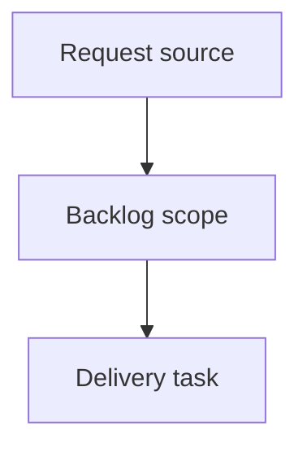

## item_378_make_local_viewer_corpus_insights_actionable - Make local viewer corpus insights actionable
> From version: 2.3.3
> Schema version: 1.0
> Status: Done
> Understanding: 95
> Confidence: 85
> Progress: 100%
> Complexity: Medium
> Theme: Viewer insights
> Reminder: Update status/understanding/confidence/progress and linked request/task references when you edit this doc.

# Problem
Turn corpus Insights from a static report into a practical navigation surface for operators.
Let users move directly from an insight signal to the matching filtered corpus or document preview.

# Scope
- In:
  - make actionable Insights rows apply existing local viewer filters where possible
  - render safe document paths as read-preview controls inside insight lists
  - add bounded list reveal behavior for dense insight sections
- Out:
  - adding persistent activity snapshots
  - adding browser-level visual regression automation
  - introducing new backend-only corpus metrics outside the loaded viewer payload

# Acceptance criteria
- AC1: Flow health signals can apply the relevant local viewer filter where a matching filter already exists.
- AC2: Quality and traceability document lists render as compact rows with clickable read-preview controls for safe Logics document paths.
- AC3: Long lists initially render a bounded number of rows and expose a reveal control without changing sort order.
- AC4: Operator action rows either apply a filter, open Health, or open a relevant document preview.
- AC5: Turning an insight-derived filter off restores normal viewer filter behavior.
- AC6: Existing Insights and Health buttons continue to work in local dev and packaged assets.

# AC Traceability
- request-AC1 -> This backlog slice. Proof: AC1: Flow health signals can apply the relevant local viewer filter where a matching filter already exists.
- request-AC2 -> This backlog slice. Proof: AC2: Quality and traceability document lists render as compact rows with clickable read-preview controls for safe Logics document paths.
- request-AC3 -> This backlog slice. Proof: AC3: Long lists initially render a bounded number of rows and expose a reveal control without changing sort order.
- request-AC4 -> This backlog slice. Proof: AC4: Operator action rows either apply a filter, open Health, or open a relevant document preview.
- request-AC5 -> This backlog slice. Proof: AC5: Turning an insight-derived filter off restores normal viewer filter behavior.
- request-AC6 -> This backlog slice. Proof: AC6: Existing Insights and Health buttons continue to work in local dev and packaged assets.

# Decision framing
- Product framing: Not needed
- Product signals: (none detected)
- Product follow-up: No product brief follow-up is expected based on current signals.
- Architecture framing: Not needed
- Architecture signals: (none detected)
- Architecture follow-up: No architecture decision follow-up is expected based on current signals.

# Links
- Product brief(s): (none yet)
- Architecture decision(s): (none yet)
- Request: `logics/request/req_214_make_local_viewer_corpus_insights_actionable.md`
- Primary task(s): (none yet)

# AI Context
- Summary: Make local viewer corpus insights actionable
- Keywords: backlog-groom, request, make local viewer corpus insights actionable, bounded slice
- Use when: Use when implementing or reviewing the delivery slice for Make local viewer corpus insights actionable.
- Skip when: Skip when the change is unrelated to this delivery slice or its linked request.

# Priority
- Impact:
- Urgency:

# Notes
- Hybrid rationale: Derived from request `req_214_make_local_viewer_corpus_insights_actionable` and kept bounded to one coherent delivery slice.
- Source file: `logics/request/req_214_make_local_viewer_corpus_insights_actionable.md`.
- Generated locally by logics-manager.
- Task `task_179_make_local_viewer_corpus_insights_actionable` was finished via `logics-manager flow finish task` on 2026-06-08.

# Tasks
- `task_179_make_local_viewer_corpus_insights_actionable`
