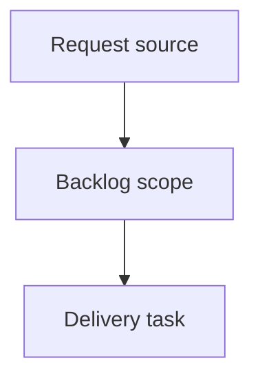

## item_379_add_reliable_local_activity_snapshots_to_the_viewer - Add reliable local activity snapshots to the viewer
> From version: 2.3.3
> Schema version: 1.0
> Status: Ready
> Understanding: 90
> Confidence: 80
> Progress: 0
> Complexity: Medium
> Theme: Viewer activity
> Reminder: Update status/understanding/confidence/progress and linked request/task references when you edit this doc.

# Problem
Detect real local viewer activity changes across refreshes without inventing status-change signals from the current document state alone.
Give operators a trustworthy recent-activity feed that distinguishes general updates from confirmed status transitions.

# Scope
- In:
  - persist a bounded previous viewer snapshot in localStorage
  - classify reliable status-change activity across refreshes
  - expose a clear-history control that does not wipe unrelated viewer preferences
- Out:
  - server-side Git history mining
  - cross-device activity synchronization
  - unrelated changes to Insights reporting

# Acceptance criteria
- AC1: The viewer stores a minimal previous snapshot keyed by stable document path.
- AC2: `Status changed` appears only when the previous snapshot had a known status and the refreshed item has a different status.
- AC3: First load and newly discovered documents use general update markers, not status-change markers.
- AC4: The activity history is bounded and does not grow indefinitely in localStorage.
- AC5: A clear-history control removes local activity history without clearing unrelated viewer preferences.
- AC6: Existing recent activity selection, double-click read behavior, and timestamp rendering continue to work.

# AC Traceability
- request-AC1 -> This backlog slice. Proof: AC1: The viewer stores a minimal previous snapshot keyed by stable document path.
- request-AC2 -> This backlog slice. Proof: AC2: `Status changed` appears only when the previous snapshot had a known status and the refreshed item has a different status.
- request-AC3 -> This backlog slice. Proof: AC3: First load and newly discovered documents use general update markers, not status-change markers.
- request-AC4 -> This backlog slice. Proof: AC4: The activity history is bounded and does not grow indefinitely in localStorage.
- request-AC5 -> This backlog slice. Proof: AC5: A clear-history control removes local activity history without clearing unrelated viewer preferences.
- request-AC6 -> This backlog slice. Proof: AC6: Existing recent activity selection, double-click read behavior, and timestamp rendering continue to work.

# Decision framing
- Product framing: Not needed
- Product signals: (none detected)
- Product follow-up: No product brief follow-up is expected based on current signals.
- Architecture framing: Not needed
- Architecture signals: (none detected)
- Architecture follow-up: No architecture decision follow-up is expected based on current signals.

# Links
- Product brief(s): (none yet)
- Architecture decision(s): (none yet)
- Request: `logics/request/req_215_add_reliable_local_activity_snapshots_to_the_viewer.md`
- Primary task(s): (none yet)

# AI Context
- Summary: Add reliable local activity snapshots to the viewer
- Keywords: backlog-groom, request, add reliable local activity snapshots to the viewer, bounded slice
- Use when: Use when implementing or reviewing the delivery slice for Add reliable local activity snapshots to the viewer.
- Skip when: Skip when the change is unrelated to this delivery slice or its linked request.

# Priority
- Impact:
- Urgency:

# Notes
- Hybrid rationale: Derived from request `req_215_add_reliable_local_activity_snapshots_to_the_viewer` and kept bounded to one coherent delivery slice.
- Source file: `logics/request/req_215_add_reliable_local_activity_snapshots_to_the_viewer.md`.
- Generated locally by logics-manager.

# Tasks
- `task_180_add_reliable_local_activity_snapshots_to_the_viewer`
