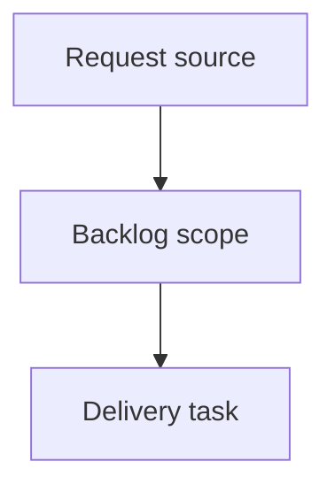

## item_380_add_visual_regression_smoke_coverage_for_the_local_viewer - Add visual regression smoke coverage for the local viewer
> From version: 2.3.3
> Schema version: 1.0
> Status: Ready
> Understanding: 90
> Confidence: 80
> Progress: 0
> Complexity: Medium
> Theme: Testing
> Reminder: Update status/understanding/confidence/progress and linked request/task references when you edit this doc.

# Problem
Add browser-level smoke coverage that catches blank screens, obvious layout overlap, and broken viewer interactions before release.
Cover the local viewer experience that unit tests cannot fully validate through DOM-only assertions.

# Scope
- In:
  - start the local dev viewer from repo code in an automated browser test
  - cover desktop, tablet, and mobile viewport smoke checks
  - capture screenshots or traces as diagnostics without pixel-perfect gating
- Out:
  - full design approval
  - fragile pixel-perfect visual diff requirements
  - tests that depend on the published package instead of local source

# Acceptance criteria
- AC1: The test starts the local dev viewer from repo code and opens it in a browser.
- AC2: Desktop, tablet, and mobile viewport smoke checks verify the topbar, repository pill, board, details area, and document preview are nonblank and reachable.
- AC3: The test opens Insights and Health and verifies both surfaces render visible content.
- AC4: The test exercises Auto off/on, Refresh, recent activity selection, and double-click read behavior.
- AC5: The test fails on uncaught browser errors and stores screenshots or traces as CI artifacts where supported.
- AC6: The test is integrated into CI in a way that remains deterministic and does not depend on a published package.

# AC Traceability
- request-AC1 -> This backlog slice. Proof: AC1: The test starts the local dev viewer from repo code and opens it in a browser.
- request-AC2 -> This backlog slice. Proof: AC2: Desktop, tablet, and mobile viewport smoke checks verify the topbar, repository pill, board, details area, and document preview are nonblank and reachable.
- request-AC3 -> This backlog slice. Proof: AC3: The test opens Insights and Health and verifies both surfaces render visible content.
- request-AC4 -> This backlog slice. Proof: AC4: The test exercises Auto off/on, Refresh, recent activity selection, and double-click read behavior.
- request-AC5 -> This backlog slice. Proof: AC5: The test fails on uncaught browser errors and stores screenshots or traces as CI artifacts where supported.
- request-AC6 -> This backlog slice. Proof: AC6: The test is integrated into CI in a way that remains deterministic and does not depend on a published package.

# Decision framing
- Product framing: Not needed
- Product signals: (none detected)
- Product follow-up: No product brief follow-up is expected based on current signals.
- Architecture framing: Not needed
- Architecture signals: (none detected)
- Architecture follow-up: No architecture decision follow-up is expected based on current signals.

# Links
- Product brief(s): (none yet)
- Architecture decision(s): (none yet)
- Request: `logics/request/req_216_add_visual_regression_smoke_coverage_for_the_local_viewer.md`
- Primary task(s): (none yet)

# AI Context
- Summary: Add visual regression smoke coverage for the local viewer
- Keywords: backlog-groom, request, add visual regression smoke coverage for the local viewer, bounded slice
- Use when: Use when implementing or reviewing the delivery slice for Add visual regression smoke coverage for the local viewer.
- Skip when: Skip when the change is unrelated to this delivery slice or its linked request.

# Priority
- Impact:
- Urgency:

# Notes
- Hybrid rationale: Derived from request `req_216_add_visual_regression_smoke_coverage_for_the_local_viewer` and kept bounded to one coherent delivery slice.
- Source file: `logics/request/req_216_add_visual_regression_smoke_coverage_for_the_local_viewer.md`.
- Generated locally by logics-manager.

# Tasks
- `task_181_add_visual_regression_smoke_coverage_for_the_local_viewer`
