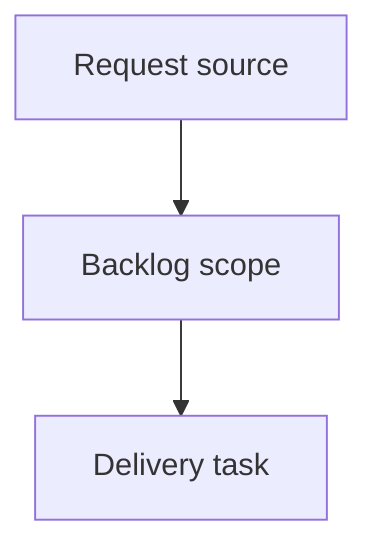

## item_381_add_local_viewer_git_status_summary - Add local viewer Git status summary
> From version: 2.3.3
> Schema version: 1.0
> Status: Done
> Understanding: 95
> Confidence: 90
> Progress: 100%
> Complexity: Medium
> Theme: Developer experience
> Reminder: Update status/understanding/confidence/progress and linked request/task references when you edit this doc.

# Problem
Add a read-only Git status surface to the local Logics viewer so operators can understand the repository state without leaving the browser.
Make the Git state quick to scan during Logics work: current branch, tracking state, dirty files, staged files, untracked files, and the latest commit should be visible at a glance.
Keep the feature deliberately non-mutating: the viewer must never run `pull`, `push`, `fetch`, `checkout`, `reset`, or any other command that changes repository state.

# Scope
- In:
  - add a read-only Git button and Git status screen to the local browser viewer
  - collect bounded Git status data from the repository root using read-only commands
  - render a scan-friendly UX with summary cards, grouped file changes, clean/unavailable/non-repo/error states, and sanitized remote details
  - update both source viewer assets and packaged fallback assets
- Out:
  - mutating Git operations
  - network Git commands
  - replacing terminal Git workflows
  - adding Git command actions to the VS Code extension surface

# Acceptance criteria
- AC1: The local viewer topbar shows `Auto`, `Refresh`, `Git`, `Insights`, and `Health` in that order.
- AC2: Clicking `Git` opens a read-only Git status screen in the same secondary viewer surface used by Insights and Health.
- AC3: When Git is available and the viewer root is inside a worktree, the screen shows branch, tracking branch when available, ahead/behind counts when available, clean/dirty state, staged count, modified/deleted count, untracked count, and latest commit summary.
- AC4: File changes are grouped by useful operator categories such as staged, modified, deleted, renamed, and untracked, with long paths wrapping safely.
- AC5: A clean repository renders an explicit clean state and does not show empty or confusing file sections.
- AC6: Git unavailable, non-Git repository, and command failure states render safely with short user-facing messages and no stack trace.
- AC7: Remote URLs or tracking details are sanitized so credentials, tokens, or embedded secrets are not displayed.
- AC8: The backend uses only read-only Git commands and never performs network or mutating Git operations.
- AC9: Existing Auto, Refresh, Insights, Health, focus/read URLs, and packaged PyPI/pipx assets continue to work.
- AC10: Python tests cover the Git payload collector states, and browser-host tests cover the Git screen rendering and topbar placement.

# AC Traceability
- request-AC1 -> This backlog slice. Proof: AC1: The local viewer topbar shows `Auto`, `Refresh`, `Git`, `Insights`, and `Health` in that order.
- request-AC2 -> This backlog slice. Proof: AC2: Clicking `Git` opens a read-only Git status screen in the same secondary viewer surface used by Insights and Health.
- request-AC3 -> This backlog slice. Proof: AC3: When Git is available and the viewer root is inside a worktree, the screen shows branch, tracking branch when available, ahead/behind counts when available, clean/dirty state, staged count, modified/deleted count, untracked count, and latest commit summary.
- request-AC4 -> This backlog slice. Proof: AC4: File changes are grouped by useful operator categories such as staged, modified, deleted, renamed, and untracked, with long paths wrapping safely.
- request-AC5 -> This backlog slice. Proof: AC5: A clean repository renders an explicit clean state and does not show empty or confusing file sections.
- request-AC6 -> This backlog slice. Proof: AC6: Git unavailable, non-Git repository, and command failure states render safely with short user-facing messages and no stack trace.
- request-AC7 -> This backlog slice. Proof: AC7: Remote URLs or tracking details are sanitized so credentials, tokens, or embedded secrets are not displayed.
- request-AC8 -> This backlog slice. Proof: AC8: The backend uses only read-only Git commands and never performs network or mutating Git operations.
- request-AC9 -> This backlog slice. Proof: AC9: Existing Auto, Refresh, Insights, Health, focus/read URLs, and packaged PyPI/pipx assets continue to work.
- request-AC10 -> This backlog slice. Proof: AC10: Python tests cover the Git payload collector states, and browser-host tests cover the Git screen rendering and topbar placement.

# Decision framing
- Product framing: Not needed
- Product signals: (none detected)
- Product follow-up: No product brief follow-up is expected based on current signals.
- Architecture framing: Not needed
- Architecture signals: (none detected)
- Architecture follow-up: No architecture decision follow-up is expected based on current signals.

# Links
- Product brief(s): (none yet)
- Architecture decision(s): (none yet)
- Request: `logics/request/req_217_add_local_viewer_git_status_summary.md`
- Primary task(s): (none yet)

# AI Context
- Summary: Add local viewer Git status summary
- Keywords: backlog-groom, request, add local viewer git status summary, bounded slice
- Use when: Use when implementing or reviewing the delivery slice for Add local viewer Git status summary.
- Skip when: Skip when the change is unrelated to this delivery slice or its linked request.

# Priority
- Impact:
- Urgency:

# Notes
- Hybrid rationale: Derived from request `req_217_add_local_viewer_git_status_summary` and kept bounded to one coherent delivery slice.
- Source file: `logics/request/req_217_add_local_viewer_git_status_summary.md`.
- Generated locally by logics-manager.
- Task `task_182_add_local_viewer_git_status_summary` was finished via `logics-manager flow finish task` on 2026-06-08.

# Tasks
- `task_182_add_local_viewer_git_status_summary`
