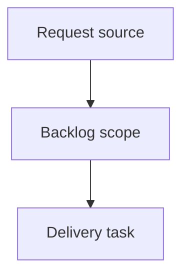

## item_382_add_a_git_cockpit_to_the_local_viewer - Add a Git cockpit to the local viewer
> From version: 2.4.0
> Schema version: 1.0
> Status: Ready
> Understanding: 90%
> Confidence: 85%
> Progress: 0%
> Complexity: Medium
> Theme: Operator workflow
> Reminder: Update status/understanding/confidence/progress and linked request/task references when you edit this doc.

# Problem
- The local viewer is useful for Logics corpus inspection, but repository-state inspection still falls back to terminal-only Git commands.
- Operators need a bounded first slice that answers "what changed in this repo?" inside the viewer without introducing risky Git mutations.

# Scope
- In:
  - a read-only Git cockpit entrypoint in the local viewer;
  - repository status summary with branch, dirty state, staged/unstaged counts, and upstream ahead/behind when available;
  - changed-file groups for staged, unstaged, untracked, deleted, renamed, and conflicted states;
  - selected-file diff preview with safe truncation for large diffs;
  - Logics document markers for changed files under `logics/`;
  - tests that preserve existing viewer behavior.
- Out:
  - commit, push, rebase, reset, checkout, stash, and other Git mutations;
  - full conflict-resolution workflows;
  - redesigning the broader Logics board/list/filter system;
  - exposing repository state beyond the existing local viewer safety model.

# Acceptance criteria
- AC1: A Git cockpit view or tab is reachable from `logics-manager view` without disrupting the existing board, health, insights, focus/read, and refresh flows.
- AC2: The cockpit displays a compact status band with branch, clean/dirty state, staged/unstaged counts, and upstream ahead/behind when Git provides the data.
- AC3: Changed files render in grouped Git-state sections and include compact markers for Logics workflow documents.
- AC4: Selecting a changed file renders a diff preview or an explicit truncation/unsupported-state message.
- AC5: The first slice is read-only and does not expose mutating Git actions.
- AC6: Tests cover status hydration, grouped changed-file rendering, diff selection behavior, and existing viewer regression paths touched by the change.

# AC Traceability
- request-AC1 -> AC1. Proof: the backlog creates a dedicated Git cockpit entrypoint.
- request-AC2 -> AC2. Proof: the status band covers branch, dirty state, staged/unstaged counts, and upstream state.
- request-AC3 -> AC3, AC4. Proof: changed files are grouped and selectable with diff preview behavior.
- request-AC4 -> AC3. Proof: Logics workflow documents get compact file markers.
- request-AC5 -> AC5. Proof: write actions are explicitly out of scope.
- request-AC6 -> AC6. Proof: existing viewer regression paths remain covered.

# Decision framing
- Product framing: `logics/product/prod_021_git_cockpit_for_the_local_viewer.md`
- Architecture framing: Not needed

# Links
- Product brief(s): `prod_021_git_cockpit_for_the_local_viewer`
- Architecture decision(s): (none yet)
- Request: `logics/request/req_218_add_a_git_cockpit_to_the_local_viewer.md`
- Primary task(s): `task_183_add_a_git_cockpit_to_the_local_viewer`

# AI Context
- Summary: Implement the first read-only Git cockpit slice for the local viewer: status band, grouped changes, Logics markers, and diff preview.
- Keywords: local-viewer, git-cockpit, status-band, changed-files, diff-preview, logics-markers
- Use when: You need to implement or review the bounded first slice for the local viewer Git cockpit.
- Skip when: The work is about future mutating Git actions, release automation, or unrelated viewer chrome.

# Priority
- Impact: High for operator orientation before commit, closeout, and handoff.
- Urgency: Medium; it builds on the local viewer maturity work and should remain behind read-only safety.

# Notes
- Generated locally by logics-manager, then expanded from the linked product brief.

# References
- `logics/product/prod_021_git_cockpit_for_the_local_viewer.md`
- `logics/request/req_218_add_a_git_cockpit_to_the_local_viewer.md`
- `logics/product/prod_020_local_web_viewer_for_cli_driven_logics_work.md`
- `logics_manager/viewer.py`
- `clients/viewer/index.html`
- `clients/viewer/browser-host.js`
- `clients/viewer/viewer.css`
- `clients/shared-web/media/webviewChrome.js`

# Tasks
- `task_183_add_a_git_cockpit_to_the_local_viewer`
