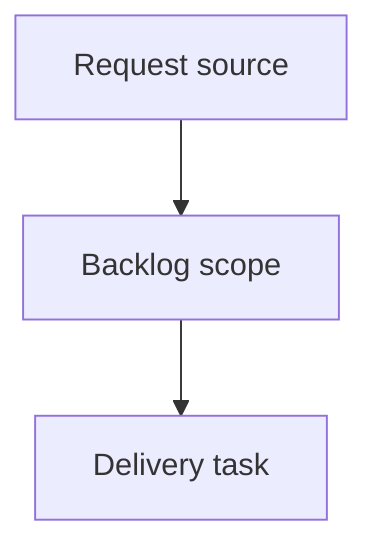

## item_383_add_a_cdx_status_cockpit_to_the_local_viewer - Add a CDX status cockpit to the local viewer
> From version: 2.4.0
> Schema version: 1.0
> Status: Done
> Understanding: 90%
> Confidence: 85%
> Progress: 100%
> Complexity: Medium
> Theme: Operator workflow
> Reminder: Update status/understanding/confidence/progress and linked request/task references when you edit this doc.

# Problem
- Operators using `logics-manager view` still need to leave the viewer to run `cdx status` before starting or resuming agent work.
- The first implementation slice should make CDX readiness visible in the local viewer while keeping CDX optional and read-only.

# Scope
- In:
  - backend detection of `cdx` on `PATH`;
  - read-only `/api/cdx-status` endpoint that invokes `cdx status --json` with a short timeout;
  - safe unavailable, timeout, command failure, and invalid-JSON payloads;
  - `CDX` topbar button next to `Git`;
  - browser-rendered CDX status screen with summary cards, session/provider lists, and copyable next-command text;
  - refresh behavior when the CDX screen is open;
  - source and packaged viewer assets;
  - Python and browser-host tests.
- Out:
  - mutating CDX commands from the viewer;
  - launching, killing, renaming, or reconfiguring CDX sessions;
  - editing credentials or provider auth files;
  - parsing colorized terminal output as the primary contract;
  - making CDX required for normal viewer startup.

# Acceptance criteria
- AC1: The viewer backend can report CDX availability and status without failing when `cdx` is absent.
- AC2: `/api/cdx-status` returns structured safe payloads for available, unavailable, timeout, failed-command, and invalid-JSON states.
- AC3: The viewer topbar includes `CDX` adjacent to `Git` for the local viewer source and packaged assets.
- AC4: Clicking `CDX` renders a read-only status screen using cards/lists rather than raw terminal output.
- AC5: The screen includes provider/session readiness and safe next-command suggestions when present in the structured payload.
- AC6: Refresh updates the open CDX screen while preserving the rest of the viewer.
- AC7: The implementation exposes no mutating CDX action controls.
- AC8: Tests cover backend collection, UI rendering, refresh behavior, unavailable/error states, and asset packaging parity.

# AC Traceability
- request-AC1 -> AC1, AC2. Proof: CDX detection and safe unavailable state are explicit backend requirements.
- request-AC2 -> AC3. Proof: the `CDX` topbar button is part of the viewer surface.
- request-AC3 -> AC2, AC4. Proof: endpoint consumes structured `cdx status --json` and renders a status screen.
- request-AC4 -> AC4, AC5. Proof: UI renders semantic cards/lists and command suggestions.
- request-AC5 -> AC2. Proof: absent, timeout, failed, and invalid JSON states are tested payload states.
- request-AC6 -> AC6. Proof: refresh behavior is a backlog acceptance criterion.
- request-AC7 -> AC7. Proof: mutating controls are explicitly out of scope.
- request-AC8 -> AC8. Proof: tests and asset parity are required.

# Decision framing
- Product framing: `logics/product/prod_022_cdx_status_cockpit_for_the_local_viewer.md`
- Architecture framing: Not needed

# Links
- Product brief(s): `prod_022_cdx_status_cockpit_for_the_local_viewer`
- Architecture decision(s): (none yet)
- Request: `req_219_add_a_cdx_status_cockpit_to_the_local_viewer`
- Primary task(s): `task_184_add_a_cdx_status_cockpit_to_the_local_viewer`

# AI Context
- Summary: Implement the first optional read-only CDX status cockpit for `logics-manager view`.
- Keywords: cdx, local-viewer, status, provider-readiness, sessions, json-contract, read-only
- Use when: You need to build or review CDX status visibility in the local viewer.
- Skip when: The work is about mutating CDX sessions or changing CDX provider internals.

# Priority
- Impact: High for agent-assisted Logics operators who need runtime readiness before handoff or execution.
- Urgency: Medium; this extends the existing local viewer cockpit model after Git.

# Notes
- Generated locally by logics-manager, then expanded from the linked product brief.
- Task `task_184_add_a_cdx_status_cockpit_to_the_local_viewer` was finished via `logics-manager flow finish task` on 2026-06-09.

# References
- `logics/product/prod_022_cdx_status_cockpit_for_the_local_viewer.md`
- `logics/request/req_219_add_a_cdx_status_cockpit_to_the_local_viewer.md`
- `logics_manager/viewer.py`
- `clients/viewer/index.html`
- `clients/viewer/browser-host.js`
- `clients/viewer/viewer.css`
- `logics_manager/viewer_assets/viewer/index.html`
- `logics_manager/viewer_assets/viewer/browser-host.js`
- `tests/python/test_logics_manager_cli.py`
- `tests/viewer.browser-host.test.ts`

# Tasks
- `task_184_add_a_cdx_status_cockpit_to_the_local_viewer`
