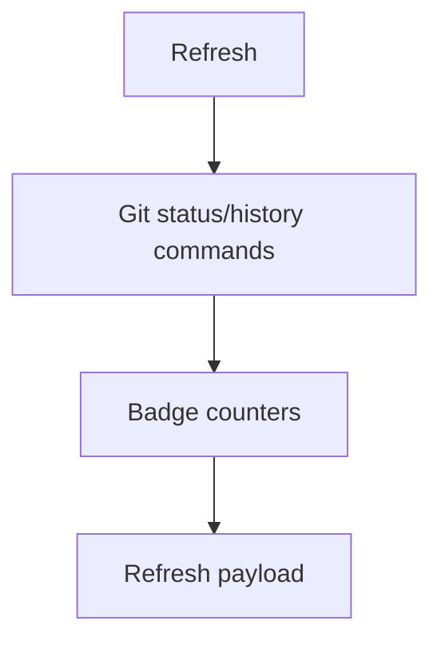

## item_384_compute_git_badge_counters_on_refresh - Compute Git badge counters on refresh
> From version: 2.4.0
> Schema version: 1.0
> Status: Ready
> Understanding: 95%
> Confidence: 90%
> Progress: 0%
> Complexity: Medium
> Theme: Git workflow visibility
> Reminder: Update status/understanding/confidence/progress and linked request/task references when you edit this doc.

# Problem
The refresh pipeline needs bounded Git counters that can drive notification badges without requiring the UI to recompute Git state.

# Scope
- In:
  - count local commits that exist on `HEAD` but not on the configured upstream;
  - count files with uncommitted changes using existing Git status semantics;
  - expose both counts as part of the refresh result or equivalent state payload.
- Out:
  - rendering badges;
  - tracking whether the operator has seen a badge;
  - changing the existing Git status/history screens beyond the data contract needed here.

# Acceptance criteria
- AC1: Refresh reports an `unpushedCommits` count for the current branch when an upstream exists.
- AC2: Refresh handles missing upstream configuration without a blocking error and reports a safe zero or unavailable state.
- AC3: Refresh reports an `uncommittedFiles` count consistent with the existing Git status display.
- AC4: Counts are not reported as badge-visible when they are zero.
- AC5: Git command failures are captured in the existing error/reporting pattern without breaking unrelated refresh data.

# AC Traceability
- request-AC1 -> This backlog slice.
- request-AC2 -> This backlog slice.
- request-AC3 -> This backlog slice.
- request-AC7 -> This backlog slice.
- request-AC9 -> This backlog slice.

# Links
- Request: `logics/request/req_220_add_git_notification_badges_for_unpushed_commits_and_uncommitted_changes.md`
- Product brief(s): (none yet)
- Architecture decision(s): (none yet)

# AI Context
- Summary: Compute unpushed commit and uncommitted file counts during refresh.
- Keywords: git, refresh, counters, upstream, status
- Use when: Implementing refresh-side Git badge data.
- Skip when: Work only changes badge presentation or seen state.

# Priority
- Impact: Improves Git awareness before opening the Git screen.
- Urgency: Medium.

# Notes
- Prefer existing Git helpers and status parsing over adding independent parsing with different semantics.
- If upstream is absent, avoid noisy failure states in normal use.

# Tasks
- `task_185_count_local_commits_not_pushed_to_upstream`
- `task_186_count_modified_and_uncommitted_files_consistently_with_git_status`
- `task_187_expose_badge_counters_through_the_refresh_result`
