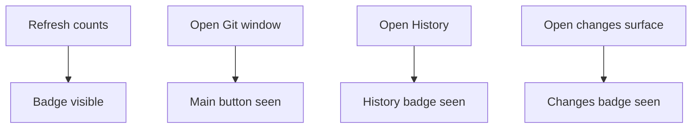

## item_385_track_git_badge_visibility_and_viewed_state - Track Git badge visibility and viewed state
> From version: 2.4.0
> Schema version: 1.0
> Status: Ready
> Understanding: 95%
> Confidence: 90%
> Progress: 0%
> Complexity: Medium
> Theme: Git workflow visibility
> Reminder: Update status/understanding/confidence/progress and linked request/task references when you edit this doc.

# Problem
Git badges should behave as notifications about newly observed Git state, not as the source of truth for whether Git work remains.

# Scope
- In:
  - track whether the main Git button badges have been seen;
  - track whether the History badge has been seen;
  - track whether the local changes badge has been seen when a matching surface exists;
  - reset badge visibility when refresh detects relevant counts again.
- Out:
  - persisting badge state across app restarts unless the existing app pattern already does this for similar notifications;
  - changing the meaning of actual Git status.

# Acceptance criteria
- AC1: Opening the Git window hides both badge types from the main Git button.
- AC2: Opening the Git window does not hide the unpushed commits badge from History.
- AC3: Opening History hides the unpushed commits badge on the History control.
- AC4: Opening the relevant changes surface hides the uncommitted files badge on that surface when applicable.
- AC5: Refresh can make previously seen badges visible again when counts greater than zero are detected.
- AC6: Badge dismissal never changes or clears the underlying Git state.

# AC Traceability
- request-AC4 -> This backlog slice.
- request-AC5 -> This backlog slice.
- request-AC6 -> This backlog slice.
- request-AC7 -> This backlog slice.

# Links
- Request: `logics/request/req_220_add_git_notification_badges_for_unpushed_commits_and_uncommitted_changes.md`
- Product brief(s): (none yet)
- Architecture decision(s): (none yet)

# AI Context
- Summary: Manage seen/unseen notification state for Git badges on the main button and Git subviews.
- Keywords: git, badge visibility, seen state, notification state
- Use when: Implementing badge lifecycle behavior.
- Skip when: Work only computes Git counters or styles badges.

# Priority
- Impact: Prevents stale or misleading badge behavior.
- Urgency: Medium.

# Notes
- Keep state naming explicit: badge visibility is not equivalent to repository cleanliness.

# Tasks
- `task_188_persist_viewed_state_for_the_main_git_button`
- `task_189_persist_viewed_state_for_git_history_and_changes_subviews`
- `task_190_reset_badge_visibility_when_refresh_detects_counts`
