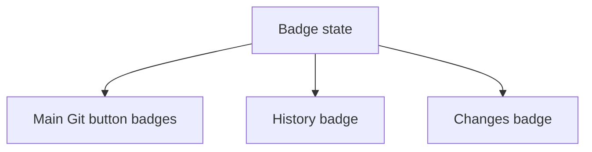

## item_386_render_git_notification_badges_in_the_ui - Render Git notification badges in the UI
> From version: 2.4.0
> Schema version: 1.0
> Status: Ready
> Understanding: 95%
> Confidence: 90%
> Progress: 0%
> Complexity: Medium
> Theme: Git workflow visibility
> Reminder: Update status/understanding/confidence/progress and linked request/task references when you edit this doc.

# Problem
The UI needs compact, readable badges for two distinct Git states without making the Git button noisy or ambiguous.

# Scope
- In:
  - render two adjacent compact badges on the main Git button when visible;
  - render the unpushed commits badge on the Git History control;
  - render the uncommitted files badge on a local changes control/surface when one exists;
  - add distinct colors and hover tooltips for each badge type.
- Out:
  - redesigning the Git screen layout;
  - adding new Git actions;
  - using badge color as the only source of meaning.

# Acceptance criteria
- AC1: The main Git button can display both badges at the same time without resizing or obscuring the button label/icon.
- AC2: The unpushed commits badge and uncommitted files badge use distinct, theme-compatible colors.
- AC3: Each badge displays its count and is hidden when the corresponding visible state is false.
- AC4: The unpushed commits badge appears on the History control until History has been viewed.
- AC5: The uncommitted files badge appears on the local changes control/surface when applicable until viewed.
- AC6: Hovering each badge shows a clear tooltip, such as `3 commits locaux non pushés` or `5 fichiers modifiés non commités`.
- AC7: Badge placement is compact and does not overlap adjacent UI on supported viewport sizes.

# AC Traceability
- request-AC1 -> This backlog slice.
- request-AC2 -> This backlog slice.
- request-AC3 -> This backlog slice.
- request-AC5 -> This backlog slice.
- request-AC6 -> This backlog slice.
- request-AC8 -> This backlog slice.

# Links
- Request: `logics/request/req_220_add_git_notification_badges_for_unpushed_commits_and_uncommitted_changes.md`
- Product brief(s): (none yet)
- Architecture decision(s): (none yet)

# AI Context
- Summary: Render compact Git notification badges with distinct colors and tooltips.
- Keywords: git, badge, tooltip, history, changes, ui
- Use when: Implementing or reviewing badge UI.
- Skip when: Work only changes backend refresh counters or notification state.

# Priority
- Impact: Makes Git state visible without opening the Git screen.
- Urgency: Medium.

# Notes
- Avoid aggressive warning colors unless the existing design language already uses them for this severity.
- Keep badges small enough to read but not dominate the Git control.

# Tasks
- `task_191_render_two_compact_badges_on_the_main_git_button`
- `task_192_render_the_unpushed_commits_badge_on_the_git_history_control`
- `task_193_render_the_uncommitted_changes_badge_on_the_changes_surface_when_available`
- `task_194_add_badge_colors_placement_and_hover_tooltips`
