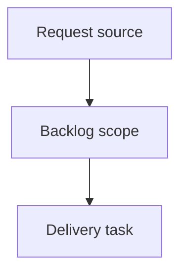

## item_387_redesign_local_viewer_insights_screen - Redesign local viewer Insights screen
> From version: 2.5.2
> Schema version: 1.0
> Status: Ready
> Understanding: 90%
> Confidence: 85%
> Progress: 0%
> Complexity: High
> Theme: Operator workflow and runtime integration
> Reminder: Update status/understanding/confidence/progress and linked request/task references when you edit this doc.

# Problem
Redesign the local viewer Insights screen so it is clearer, more attractive, and consistent with the other viewer screens.
Shift Insights from a dense report into an operator cockpit that shows what needs attention first, then explains why.
Preserve the existing Logics/VS Code-like theme and avoid decorative dashboard patterns or fake analytics.

# Scope
- In:
  - one coherent delivery slice from the source request
- Out:
  - unrelated sibling slices that should stay in separate backlog items instead of widening this doc

# Acceptance criteria
- AC1: Insights opens with a compact "Now" summary that highlights the most important corpus signals before secondary detail.
- AC2: Operator actions are visible near the top of the screen and each action clearly applies a filter, opens Health, or opens a relevant document preview.
- AC3: Overview metrics are reduced to a small set of meaningful tiles and do not dominate the screen.
- AC4: Corpus shape is shown with a readable, theme-native visual treatment such as compact horizontal bars by document type.
- AC5: Flow health rows explain the document, status, reason, and next action without relying on comma-separated text blobs.
- AC6: Activity uses a short timeline or grouped rows for recent, stale, and quiet docs, with bounded lists and reveal behavior where needed.
- AC7: Traceability prioritizes broken references and unlinked documents before lower-priority inventory such as most-referenced docs.
- AC8: Quality signals summarize lint/audit health and route detailed findings to the Health screen rather than duplicating the full Health view.
- AC9: The redesigned layout remains consistent with the viewer theme, uses existing CSS variables and controls, and avoids decorative dashboard filler.
- AC10: Focused browser-host or viewer tests cover the new layout structure, action wiring, and at least one dense-data readability case.

# AC Traceability
- request-AC1 -> This backlog slice. Proof: AC1: Insights opens with a compact "Now" summary that highlights the most important corpus signals before secondary detail.
- request-AC2 -> This backlog slice. Proof: AC2: Operator actions are visible near the top of the screen and each action clearly applies a filter, opens Health, or opens a relevant document preview.
- request-AC3 -> This backlog slice. Proof: AC3: Overview metrics are reduced to a small set of meaningful tiles and do not dominate the screen.
- request-AC4 -> This backlog slice. Proof: AC4: Corpus shape is shown with a readable, theme-native visual treatment such as compact horizontal bars by document type.
- request-AC5 -> This backlog slice. Proof: AC5: Flow health rows explain the document, status, reason, and next action without relying on comma-separated text blobs.
- request-AC6 -> This backlog slice. Proof: AC6: Activity uses a short timeline or grouped rows for recent, stale, and quiet docs, with bounded lists and reveal behavior where needed.
- request-AC7 -> This backlog slice. Proof: AC7: Traceability prioritizes broken references and unlinked documents before lower-priority inventory such as most-referenced docs.
- request-AC8 -> This backlog slice. Proof: AC8: Quality signals summarize lint/audit health and route detailed findings to the Health screen rather than duplicating the full Health view.
- request-AC9 -> This backlog slice. Proof: AC9: The redesigned layout remains consistent with the viewer theme, uses existing CSS variables and controls, and avoids decorative dashboard filler.
- request-AC10 -> This backlog slice. Proof: AC10: Focused browser-host or viewer tests cover the new layout structure, action wiring, and at least one dense-data readability case.

# Decision framing
- Product framing: Not needed
- Product signals: (none detected)
- Product follow-up: No product brief follow-up is expected based on current signals.
- Architecture framing: Not needed
- Architecture signals: (none detected)
- Architecture follow-up: No architecture decision follow-up is expected based on current signals.

# Links
- Product brief(s): (none yet)
- Architecture decision(s): (none yet)
- Request: `logics/request/req_221_redesign_local_viewer_insights_screen.md`
- Primary task(s): (none yet)

# AI Context
- Summary: Redesign local viewer Insights screen
- Keywords: backlog-groom, request, redesign local viewer insights screen, bounded slice
- Use when: Use when implementing or reviewing the delivery slice for Redesign local viewer Insights screen.
- Skip when: Skip when the change is unrelated to this delivery slice or its linked request.

# Priority
- Impact:
- Urgency:

# Notes
- Hybrid rationale: Derived from request `req_221_redesign_local_viewer_insights_screen` and kept bounded to one coherent delivery slice.
- Source file: `logics/request/req_221_redesign_local_viewer_insights_screen.md`.
- Generated locally by logics-manager.

# Tasks
- `task_195_redesign_local_viewer_insights_screen`
