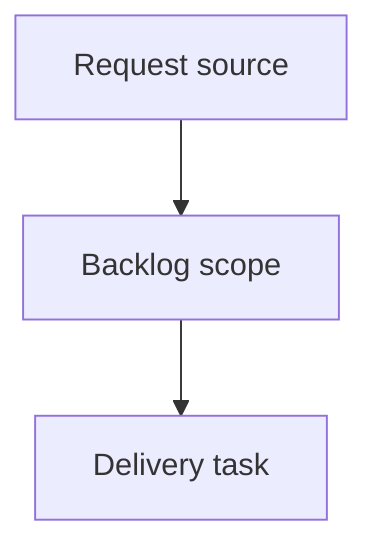

## item_388_add_github_and_folder_shortcuts_to_viewer_topbar - Add GitHub and folder shortcuts to viewer topbar
> From version: 2.5.2
> Schema version: 1.0
> Status: Done
> Understanding: 90%
> Confidence: 85%
> Progress: 100%
> Complexity: High
> Theme: Operator workflow and runtime integration
> Reminder: Update status/understanding/confidence/progress and linked request/task references when you edit this doc.

# Problem
Add compact repository shortcuts beside the workspace title pill in the local viewer topbar.
Show a GitHub shortcut only when the current workspace is backed by a GitHub remote.
Always provide a repository-folder shortcut when the viewer can resolve the local repo root.
Keep the controls visually quiet and consistent with the existing topbar, badges, and VS Code-like theme.

# Scope
- In:
  - one coherent delivery slice from the source request
- Out:
  - unrelated sibling slices that should stay in separate backlog items instead of widening this doc

# Acceptance criteria
- AC1: The viewer topbar renders compact repository shortcut buttons immediately beside the workspace/repository pill.
- AC2: The GitHub shortcut is visible only when a valid GitHub remote URL can be resolved for the current repository.
- AC3: GitHub SSH and HTTPS remote formats are normalized to the canonical web URL before opening.
- AC4: Clicking the GitHub shortcut opens the repository page externally without changing the current viewer state.
- AC5: The local folder shortcut opens the resolved repository root in the operating system file browser.
- AC6: If the repository folder cannot be opened, the viewer reports a discreet failure message in the existing status/meta surface.
- AC7: Shortcut buttons use icon-first controls with accessible labels and tooltips, and no disabled empty states are shown.
- AC8: The controls remain aligned with the workspace pill and do not collide with the topbar action cluster on narrow viewports.
- AC9: Tests cover GitHub remote detection, hidden GitHub state for non-GitHub repos, and the folder-open action path.

# AC Traceability
- request-AC1 -> This backlog slice. Proof: AC1: The viewer topbar renders compact repository shortcut buttons immediately beside the workspace/repository pill.
- request-AC2 -> This backlog slice. Proof: AC2: The GitHub shortcut is visible only when a valid GitHub remote URL can be resolved for the current repository.
- request-AC3 -> This backlog slice. Proof: AC3: GitHub SSH and HTTPS remote formats are normalized to the canonical web URL before opening.
- request-AC4 -> This backlog slice. Proof: AC4: Clicking the GitHub shortcut opens the repository page externally without changing the current viewer state.
- request-AC5 -> This backlog slice. Proof: AC5: The local folder shortcut opens the resolved repository root in the operating system file browser.
- request-AC6 -> This backlog slice. Proof: AC6: If the repository folder cannot be opened, the viewer reports a discreet failure message in the existing status/meta surface.
- request-AC7 -> This backlog slice. Proof: AC7: Shortcut buttons use icon-first controls with accessible labels and tooltips, and no disabled empty states are shown.
- request-AC8 -> This backlog slice. Proof: AC8: The controls remain aligned with the workspace pill and do not collide with the topbar action cluster on narrow viewports.
- request-AC9 -> This backlog slice. Proof: AC9: Tests cover GitHub remote detection, hidden GitHub state for non-GitHub repos, and the folder-open action path.

# Decision framing
- Product framing: Not needed
- Product signals: (none detected)
- Product follow-up: No product brief follow-up is expected based on current signals.
- Architecture framing: Not needed
- Architecture signals: (none detected)
- Architecture follow-up: No architecture decision follow-up is expected based on current signals.

# Links
- Product brief(s): (none yet)
- Architecture decision(s): (none yet)
- Request: `logics/request/req_222_add_github_and_folder_shortcuts_to_viewer_topbar.md`
- Primary task(s): (none yet)

# AI Context
- Summary: Add GitHub and folder shortcuts to viewer topbar
- Keywords: backlog-groom, request, add github and folder shortcuts to viewer topbar, bounded slice
- Use when: Use when implementing or reviewing the delivery slice for Add GitHub and folder shortcuts to viewer topbar.
- Skip when: Skip when the change is unrelated to this delivery slice or its linked request.

# Priority
- Impact:
- Urgency:

# Notes
- Hybrid rationale: Derived from request `req_222_add_github_and_folder_shortcuts_to_viewer_topbar` and kept bounded to one coherent delivery slice.
- Source file: `logics/request/req_222_add_github_and_folder_shortcuts_to_viewer_topbar.md`.
- Generated locally by logics-manager.
- Task `task_196_add_github_and_folder_shortcuts_to_viewer_topbar` was finished via `logics-manager flow finish task` on 2026-06-11.

# Tasks
- `task_196_add_github_and_folder_shortcuts_to_viewer_topbar`
