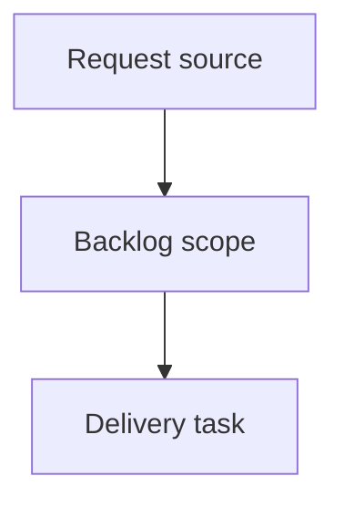

## item_389_fix_bottom_details_panel_width_in_narrow_breakdown_layout - Fix bottom details panel width in narrow breakdown layout
> From version: 2.5.2
> Schema version: 1.0
> Status: Done
> Understanding: 90%
> Confidence: 85%
> Progress: 100%
> Complexity: High
> Theme: Operator workflow and runtime integration
> Reminder: Update status/understanding/confidence/progress and linked request/task references when you edit this doc.

# Problem
Fix the details panel layout when the UI switches from right-side details to bottom/stacked details.
In the narrow breakdown layout, the details panel must take the full available width when it is positioned below the board or list.
Prevent the bottom details panel from keeping a narrow side-panel width after the layout breakpoint changes.

# Scope
- In:
  - one coherent delivery slice from the source request
- Out:
  - unrelated sibling slices that should stay in separate backlog items instead of widening this doc

# Acceptance criteria
- AC1: When the layout places the details panel below the board/list, the details panel takes the full available width of the view/content area.
- AC2: Bottom-positioned details do not inherit the right-side panel width, max-width, flex-basis, or persisted resize value.
- AC3: Wide layouts continue to render the details panel on the right with the existing resizable width behavior.
- AC4: Collapsed details in bottom/stacked mode remain compact and do not re-enable splitter resizing while collapsed.
- AC5: Switching between wide and narrow layouts restores the correct width contract for each placement without requiring a reload.
- AC6: Board/list content remains visible and aligned after the details panel moves to the bottom.
- AC7: Regression coverage or a visual smoke case verifies the bottom-details full-width state at the relevant narrow breakpoint.

# AC Traceability
- request-AC1 -> This backlog slice. Proof: AC1: When the layout places the details panel below the board/list, the details panel takes the full available width of the view/content area.
- request-AC2 -> This backlog slice. Proof: AC2: Bottom-positioned details do not inherit the right-side panel width, max-width, flex-basis, or persisted resize value.
- request-AC3 -> This backlog slice. Proof: AC3: Wide layouts continue to render the details panel on the right with the existing resizable width behavior.
- request-AC4 -> This backlog slice. Proof: AC4: Collapsed details in bottom/stacked mode remain compact and do not re-enable splitter resizing while collapsed.
- request-AC5 -> This backlog slice. Proof: AC5: Switching between wide and narrow layouts restores the correct width contract for each placement without requiring a reload.
- request-AC6 -> This backlog slice. Proof: AC6: Board/list content remains visible and aligned after the details panel moves to the bottom.
- request-AC7 -> This backlog slice. Proof: AC7: Regression coverage or a visual smoke case verifies the bottom-details full-width state at the relevant narrow breakpoint.

# Decision framing
- Product framing: Not needed
- Product signals: (none detected)
- Product follow-up: No product brief follow-up is expected based on current signals.
- Architecture framing: Not needed
- Architecture signals: (none detected)
- Architecture follow-up: No architecture decision follow-up is expected based on current signals.

# Links
- Product brief(s): (none yet)
- Architecture decision(s): (none yet)
- Request: `logics/request/req_223_fix_bottom_details_panel_width_in_narrow_breakdown_layout.md`
- Primary task(s): (none yet)

# AI Context
- Summary: Fix bottom details panel width in narrow breakdown layout
- Keywords: backlog-groom, request, fix bottom details panel width in narrow breakdown layout, bounded slice
- Use when: Use when implementing or reviewing the delivery slice for Fix bottom details panel width in narrow breakdown layout.
- Skip when: Skip when the change is unrelated to this delivery slice or its linked request.

# Priority
- Impact:
- Urgency:

# Notes
- Hybrid rationale: Derived from request `req_223_fix_bottom_details_panel_width_in_narrow_breakdown_layout` and kept bounded to one coherent delivery slice.
- Source file: `logics/request/req_223_fix_bottom_details_panel_width_in_narrow_breakdown_layout.md`.
- Generated locally by logics-manager.
- Task `task_197_fix_bottom_details_panel_width_in_narrow_breakdown_layout` was finished via `logics-manager flow finish task` on 2026-06-11.

# Tasks
- `task_197_fix_bottom_details_panel_width_in_narrow_breakdown_layout`
