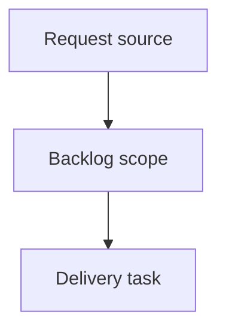

## item_390_add_progressive_reveal_to_git_history_commits - Add progressive reveal to Git history commits
> From version: 2.5.2
> Schema version: 1.0
> Status: Ready
> Understanding: 90%
> Confidence: 85%
> Progress: 0%
> Complexity: High
> Theme: Operator workflow and runtime integration
> Reminder: Update status/understanding/confidence/progress and linked request/task references when you edit this doc.

# Problem
Make the Git cockpit History section easier to scan by showing 10 commits by default instead of the current visual limit of 8.
Add an in-flow reveal control that shows 10 more commits each time the user asks for more.
Reuse the same progressive-disclosure behavior already established for large corpus groups in the board/list.

# Scope
- In:
  - one coherent delivery slice from the source request
- Out:
  - unrelated sibling slices that should stay in separate backlog items instead of widening this doc

# Acceptance criteria
- AC1: Git History renders 10 commit rows by default when at least 10 commits are available.
- AC2: When more than 10 commits are available, the History list shows a clear in-flow `Show 10 more` control after the rendered rows.
- AC3: Each activation of the reveal control displays the next 10 commits without reordering or duplicating existing rows.
- AC4: The reveal control disappears when all available commits in the current payload are visible.
- AC5: The History domain count continues to represent the available recent commit count, while the list itself can show a smaller visible subset.
- AC6: Refreshing or receiving a materially different Git payload reconciles the visible limit predictably and avoids stale expansion state.
- AC7: The empty-history and single-commit fallback states remain unchanged.
- AC8: Focused tests cover the initial 10-row render, one or more reveal clicks, and the absence of the reveal control when no hidden commits remain.

# AC Traceability
- request-AC1 -> This backlog slice. Proof: AC1: Git History renders 10 commit rows by default when at least 10 commits are available.
- request-AC2 -> This backlog slice. Proof: AC2: When more than 10 commits are available, the History list shows a clear in-flow `Show 10 more` control after the rendered rows.
- request-AC3 -> This backlog slice. Proof: AC3: Each activation of the reveal control displays the next 10 commits without reordering or duplicating existing rows.
- request-AC4 -> This backlog slice. Proof: AC4: The reveal control disappears when all available commits in the current payload are visible.
- request-AC5 -> This backlog slice. Proof: AC5: The History domain count continues to represent the available recent commit count, while the list itself can show a smaller visible subset.
- request-AC6 -> This backlog slice. Proof: AC6: Refreshing or receiving a materially different Git payload reconciles the visible limit predictably and avoids stale expansion state.
- request-AC7 -> This backlog slice. Proof: AC7: The empty-history and single-commit fallback states remain unchanged.
- request-AC8 -> This backlog slice. Proof: AC8: Focused tests cover the initial 10-row render, one or more reveal clicks, and the absence of the reveal control when no hidden commits remain.

# Decision framing
- Product framing: Not needed
- Product signals: (none detected)
- Product follow-up: No product brief follow-up is expected based on current signals.
- Architecture framing: Not needed
- Architecture signals: (none detected)
- Architecture follow-up: No architecture decision follow-up is expected based on current signals.

# Links
- Product brief(s): (none yet)
- Architecture decision(s): (none yet)
- Request: `logics/request/req_224_add_progressive_reveal_to_git_history_commits.md`
- Primary task(s): (none yet)

# AI Context
- Summary: Add progressive reveal to Git history commits
- Keywords: backlog-groom, request, add progressive reveal to git history commits, bounded slice
- Use when: Use when implementing or reviewing the delivery slice for Add progressive reveal to Git history commits.
- Skip when: Skip when the change is unrelated to this delivery slice or its linked request.

# Priority
- Impact:
- Urgency:

# Notes
- Hybrid rationale: Derived from request `req_224_add_progressive_reveal_to_git_history_commits` and kept bounded to one coherent delivery slice.
- Source file: `logics/request/req_224_add_progressive_reveal_to_git_history_commits.md`.
- Generated locally by logics-manager.

# Tasks
- `task_198_add_progressive_reveal_to_git_history_commits`
