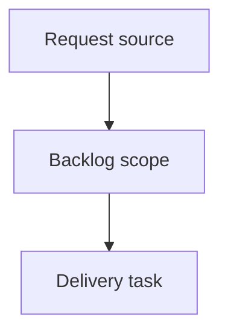

## item_391_show_local_viewer_server_connection_status - Show local viewer server connection status
> From version: 2.5.2
> Schema version: 1.0
> Status: Ready
> Understanding: 90%
> Confidence: 85%
> Progress: 0%
> Complexity: High
> Theme: Operator workflow and runtime integration
> Reminder: Update status/understanding/confidence/progress and linked request/task references when you edit this doc.

# Problem
When the local viewer loses contact with its server process, the UI must make that state visible to the operator instead of only failing refresh actions silently or through transient meta text.
The viewer should automatically clear the disconnected state after the server is restarted and a normal data refresh succeeds.

# Scope
- In: add a visible disconnected/sync warning to the browser-hosted local viewer.
- In: drive the connection state from existing viewer data refresh calls such as `/api/items` and `/api/refresh`.
- In: preserve the currently rendered corpus while making clear that it may be stale.
- In: clear the warning automatically after a successful refresh, including after the server has been restarted.
- In: keep `clients/viewer/*` and `logics_manager/viewer_assets/viewer/*` aligned.
- Out: remote uptime monitoring, external process supervision, or distinguishing intentional server shutdown from crash.
- Out: changing Logics workflow document semantics or requiring manual dismissal of the disconnected state.

# Delivery notes
- Prefer reusing the existing update-banner chrome pattern with a warning/error tone.
- Avoid adding a separate polling loop unless the existing auto-refresh flow cannot provide reliable recovery.
- Keep manual refresh and auto-refresh behavior consistent so either path can reconnect the viewer.

# Acceptance criteria
- AC1: The local viewer displays a persistent disconnected banner when its data refresh cannot reach the local server.
- AC2: The banner makes clear that the currently displayed data may be stale and that the viewer is waiting for reconnection.
- AC3: The disconnected state clears automatically after the local server is restarted and a viewer refresh succeeds.
- AC4: Existing auto-refresh behavior is reused for reconnection attempts unless a dedicated health endpoint is justified during implementation.
- AC5: Manual refresh also retries the connection and updates the connection banner state consistently.
- AC6: The implementation preserves the existing corpus display while disconnected instead of replacing it with a blank or fatal error screen.
- AC7: The UI treatment reuses existing viewer chrome patterns such as the update banner styling, with an appropriate warning/error tone.
- AC8: Both source viewer assets and packaged viewer assets remain in sync.

# AC Traceability
- request-AC1 -> This backlog slice. Proof: AC1: The local viewer displays a persistent disconnected banner when its data refresh cannot reach the local server.
- request-AC2 -> This backlog slice. Proof: AC2: The banner makes clear that the currently displayed data may be stale and that the viewer is waiting for reconnection.
- request-AC3 -> This backlog slice. Proof: AC3: The disconnected state clears automatically after the local server is restarted and a viewer refresh succeeds.
- request-AC4 -> This backlog slice. Proof: AC4: Existing auto-refresh behavior is reused for reconnection attempts unless a dedicated health endpoint is justified during implementation.
- request-AC5 -> This backlog slice. Proof: AC5: Manual refresh also retries the connection and updates the connection banner state consistently.
- request-AC6 -> This backlog slice. Proof: AC6: The implementation preserves the existing corpus display while disconnected instead of replacing it with a blank or fatal error screen.
- request-AC7 -> This backlog slice. Proof: AC7: The UI treatment reuses existing viewer chrome patterns such as the update banner styling, with an appropriate warning/error tone.
- request-AC8 -> This backlog slice. Proof: AC8: Both source viewer assets and packaged viewer assets remain in sync.

# Decision framing
- Product framing: Not needed
- Product signals: (none detected)
- Product follow-up: No product brief follow-up is expected based on current signals.
- Architecture framing: Not needed
- Architecture signals: (none detected)
- Architecture follow-up: No architecture decision follow-up is expected based on current signals.

# Links
- Product brief(s): (none yet)
- Architecture decision(s): (none yet)
- Request: `logics/request/req_225_show_local_viewer_server_connection_status.md`
- Primary task(s): (none yet)

# AI Context
- Summary: Show local viewer server connection status
- Keywords: backlog-groom, request, show local viewer server connection status, bounded slice
- Use when: Use when implementing or reviewing the delivery slice for Show local viewer server connection status.
- Skip when: Skip when the change is unrelated to this delivery slice or its linked request.

# Priority
- Impact:
- Urgency:

# Notes
- Hybrid rationale: Derived from request `req_225_show_local_viewer_server_connection_status` and kept bounded to one coherent delivery slice.
- Source file: `logics/request/req_225_show_local_viewer_server_connection_status.md`.
- Generated locally by logics-manager.

# Tasks
- `task_199_show_local_viewer_server_connection_status`
