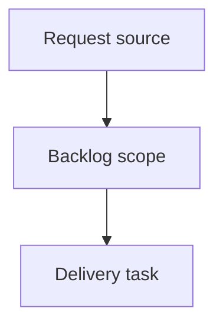

## item_392_show_github_actions_ci_status_in_local_viewer - Show GitHub Actions CI status in local viewer
> From version: 2.5.2
> Schema version: 1.0
> Status: Ready
> Understanding: 90%
> Confidence: 85%
> Progress: 0%
> Complexity: High
> Theme: Operator workflow and runtime integration
> Reminder: Update status/understanding/confidence/progress and linked request/task references when you edit this doc.

# Problem
The local viewer should expose GitHub Actions CI state next to the existing repository/runtime controls, so operators can see whether the current work is validated, failing, or still running without leaving the viewer.
The CI control should only appear for repositories that have a GitHub remote and GitHub Actions workflows configured.

# Scope
- In: add a conditional `CI` topbar action between `Git` and `CDX`.
- In: add a compact CI badge that distinguishes passing, failing, running, queued, cancelled, unavailable, and unknown states.
- In: add a dedicated CI status panel with latest relevant GitHub Actions run details.
- In: add or extend backend support for retrieving GitHub Actions status from local repository context.
- In: prefer current branch or current HEAD status, with a clear fallback when exact run matching is unavailable.
- In: keep source viewer assets and packaged viewer assets aligned.
- Out: editing GitHub workflow definitions, triggering or rerunning workflows, storing browser-side GitHub credentials, or supporting non-GitHub CI providers.

# Delivery notes
- Prefer `gh` CLI integration when available because it reuses local GitHub authentication.
- Detect availability using GitHub remote information and `.github/workflows/*.yml` or `.yaml`.
- Treat authentication failure as an unavailable state distinct from CI passing or failing.
- Keep CI refresh non-blocking so corpus loading and existing viewer controls continue to work.

# Acceptance criteria
- AC1: The viewer has a `CI` action positioned between `Git` and `CDX` when GitHub Actions support is available for the repository.
- AC2: The `CI` action is hidden when the repository has no GitHub remote or no configured GitHub Actions workflows.
- AC3: The `CI` action displays a compact status badge for passing, failing, running, queued, cancelled, unavailable, or unknown CI state.
- AC4: Clicking `CI` opens a dedicated viewer panel with the latest relevant GitHub Actions run details.
- AC5: CI status prioritizes the current branch or current HEAD and uses a documented fallback when exact matching data is unavailable.
- AC6: The backend provides the CI data through a local endpoint and does not expose GitHub credentials to browser code.
- AC7: If GitHub Actions is configured but authentication is unavailable, the UI reports that state clearly instead of showing a misleading success or failure.
- AC8: CI status refresh does not block normal corpus rendering or existing Git, CDX, Health, and viewer refresh behavior.
- AC9: Both source viewer assets and packaged viewer assets remain in sync.

# AC Traceability
- request-AC1 -> This backlog slice. Proof: AC1: The viewer has a `CI` action positioned between `Git` and `CDX` when GitHub Actions support is available for the repository.
- request-AC2 -> This backlog slice. Proof: AC2: The `CI` action is hidden when the repository has no GitHub remote or no configured GitHub Actions workflows.
- request-AC3 -> This backlog slice. Proof: AC3: The `CI` action displays a compact status badge for passing, failing, running, queued, cancelled, unavailable, or unknown CI state.
- request-AC4 -> This backlog slice. Proof: AC4: Clicking `CI` opens a dedicated viewer panel with the latest relevant GitHub Actions run details.
- request-AC5 -> This backlog slice. Proof: AC5: CI status prioritizes the current branch or current HEAD and uses a documented fallback when exact matching data is unavailable.
- request-AC6 -> This backlog slice. Proof: AC6: The backend provides the CI data through a local endpoint and does not expose GitHub credentials to browser code.
- request-AC7 -> This backlog slice. Proof: AC7: If GitHub Actions is configured but authentication is unavailable, the UI reports that state clearly instead of showing a misleading success or failure.
- request-AC8 -> This backlog slice. Proof: AC8: CI status refresh does not block normal corpus rendering or existing Git, CDX, Health, and viewer refresh behavior.
- request-AC9 -> This backlog slice. Proof: AC9: Both source viewer assets and packaged viewer assets remain in sync.

# Decision framing
- Product framing: Not needed
- Product signals: (none detected)
- Product follow-up: No product brief follow-up is expected based on current signals.
- Architecture framing: Not needed
- Architecture signals: (none detected)
- Architecture follow-up: No architecture decision follow-up is expected based on current signals.

# Links
- Product brief(s): (none yet)
- Architecture decision(s): (none yet)
- Request: `logics/request/req_226_show_github_actions_ci_status_in_local_viewer.md`
- Primary task(s): `logics/tasks/task_200_show_github_actions_ci_status_in_local_viewer.md`

# AI Context
- Summary: Add conditional GitHub Actions CI status to the local viewer with a quick badge and detailed run panel.
- Keywords: backlog-groom, local-viewer, github-actions, ci-status, status-badge, backend-endpoint
- Use when: Use when implementing or reviewing the delivery slice for Show GitHub Actions CI status in local viewer.
- Skip when: Skip when the change is unrelated to this delivery slice or its linked request.

# Priority
- Impact:
- Urgency:

# Notes
- Hybrid rationale: Derived from request `req_226_show_github_actions_ci_status_in_local_viewer` and kept bounded to one coherent delivery slice.
- Source file: `logics/request/req_226_show_github_actions_ci_status_in_local_viewer.md`.
- Generated locally by logics-manager.

# Tasks
- `task_200_show_github_actions_ci_status_in_local_viewer`
