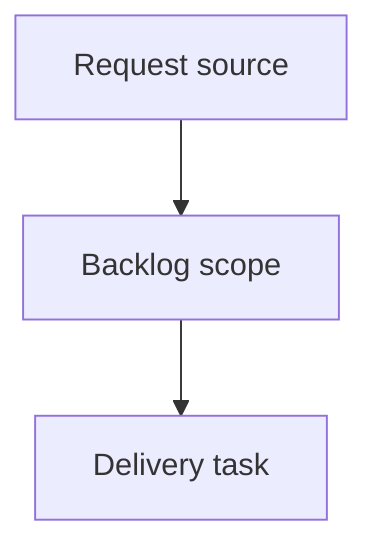

## item_393_group_viewer_utility_actions_under_settings_menu - Group viewer utility actions under settings menu
> From version: 2.5.2
> Schema version: 1.0
> Status: Done
> Understanding: 90%
> Confidence: 85%
> Progress: 100%
> Complexity: High
> Theme: Operator workflow and runtime integration
> Reminder: Update status/understanding/confidence/progress and linked request/task references when you edit this doc.

# Problem
The local viewer topbar should reserve first-level space for primary runtime/status views while grouping lower-frequency utility actions into a compact `Settings` menu.
`Refresh`, `Insights`, and `Health` should move out of the main topbar button row and into that menu, reducing visual noise now that `Git`, `CI`, and `CDX` are primary status controls.

# Scope
- In: reshape the local viewer topbar so primary status buttons remain visible and utility actions move into a `Settings` menu.
- In: move refresh controls, `Insights`, and `Health` into the settings menu without changing their underlying behavior.
- In: preserve auto-refresh, manual refresh, interval selection, and panel opening behavior.
- In: preserve outside-click and Escape close behavior for the new menu.
- In: keep source viewer assets and packaged viewer assets aligned.
- Out: changing Git, CI, or CDX status panel internals.
- Out: redesigning the document filter toolbar or details panel.

# Delivery notes
- Prefer reusing the existing refresh menu mechanics where possible.
- The settings control should sit at the right side of the topbar action group.
- The menu should be compact and operational, not a marketing or help surface.

# Acceptance criteria
- AC1: `Git`, conditional `CI`, and `CDX` remain visible as first-level topbar status actions.
- AC2: `Refresh`, `Insights`, and `Health` are accessible from a right-side `Settings` menu instead of separate topbar peer buttons.
- AC3: Manual refresh, auto-refresh toggle, and refresh interval selection continue to work from the new menu.
- AC4: `Insights` and `Health` continue to open their existing viewer panels from the new menu.
- AC5: The settings menu closes on outside click and Escape with behavior consistent with existing viewer menus.
- AC6: The topbar remains readable and non-overlapping on narrow and desktop widths.
- AC7: Both source viewer assets and packaged viewer assets remain in sync.

# AC Traceability
- request-AC1 -> This backlog slice. Proof: AC1: `Git`, conditional `CI`, and `CDX` remain visible as first-level topbar status actions.
- request-AC2 -> This backlog slice. Proof: AC2: `Refresh`, `Insights`, and `Health` are accessible from a right-side `Settings` menu instead of separate topbar peer buttons.
- request-AC3 -> This backlog slice. Proof: AC3: Manual refresh, auto-refresh toggle, and refresh interval selection continue to work from the new menu.
- request-AC4 -> This backlog slice. Proof: AC4: `Insights` and `Health` continue to open their existing viewer panels from the new menu.
- request-AC5 -> This backlog slice. Proof: AC5: The settings menu closes on outside click and Escape with behavior consistent with existing viewer menus.
- request-AC6 -> This backlog slice. Proof: AC6: The topbar remains readable and non-overlapping on narrow and desktop widths.
- request-AC7 -> This backlog slice. Proof: AC7: Both source viewer assets and packaged viewer assets remain in sync.

# Decision framing
- Product framing: Not needed
- Product signals: (none detected)
- Product follow-up: No product brief follow-up is expected based on current signals.
- Architecture framing: Not needed
- Architecture signals: (none detected)
- Architecture follow-up: No architecture decision follow-up is expected based on current signals.

# Links
- Product brief(s): (none yet)
- Architecture decision(s): (none yet)
- Request: `logics/request/req_227_group_viewer_utility_actions_under_settings_menu.md`
- Primary task(s): `logics/tasks/task_201_group_viewer_utility_actions_under_settings_menu.md`

# AI Context
- Summary: Group viewer utility actions under settings menu
- Keywords: backlog-groom, request, group viewer utility actions under settings menu, bounded slice
- Use when: Use when implementing or reviewing the delivery slice for Group viewer utility actions under settings menu.
- Skip when: Skip when the change is unrelated to this delivery slice or its linked request.

# Priority
- Impact:
- Urgency:

# Notes
- Hybrid rationale: Derived from request `req_227_group_viewer_utility_actions_under_settings_menu` and kept bounded to one coherent delivery slice.
- Source file: `logics/request/req_227_group_viewer_utility_actions_under_settings_menu.md`.
- Generated locally by logics-manager.
- Task `task_201_group_viewer_utility_actions_under_settings_menu` was finished via `logics-manager flow finish task` on 2026-06-11.

# Tasks
- `task_201_group_viewer_utility_actions_under_settings_menu`
