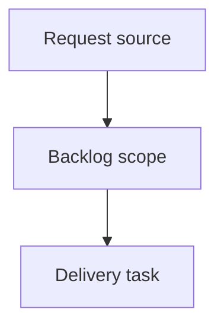

## item_394_show_active_assistant_indicator_on_cdx_button - Show active assistant indicator on CDX button
> From version: 2.5.2
> Schema version: 1.0
> Status: Ready
> Understanding: 90%
> Confidence: 85%
> Progress: 0%
> Complexity: High
> Theme: Operator workflow and runtime integration
> Reminder: Update status/understanding/confidence/progress and linked request/task references when you edit this doc.

# Problem
The local viewer should show a quick visual indicator on the `CDX` button when at least one assistant/session is active.
Operators should be able to see active assistant presence without opening the full CDX status panel.

# Scope
- In: add an active-assistant badge to the existing `CDX` topbar button.
- In: derive active state from the existing CDX status payload used by the CDX panel.
- In: hide the badge when no assistant/session is active or CDX status cannot be read reliably.
- In: preserve the existing CDX panel and button behavior.
- In: keep source viewer assets and packaged viewer assets aligned.
- Out: changing CDX runtime/session semantics.
- Out: adding assistant lifecycle controls or a new assistant management panel.

# Delivery notes
- Prefer a count badge when the active session count is reliable.
- The indicator should follow existing Git/CI badge sizing so the topbar remains stable.
- Coordinate with the settings-menu request so the CDX button remains a first-level status action.

# Acceptance criteria
- AC1: The `CDX` topbar button displays a compact badge when at least one assistant/session is active.
- AC2: The badge is hidden when CDX reports no active assistants/sessions.
- AC3: The badge is hidden or neutral when CDX status is unavailable, so it does not imply active work incorrectly.
- AC4: The indicator uses the existing CDX status data path and does not introduce a separate assistant polling API unless implementation proves it necessary.
- AC5: Clicking `CDX` continues to open the existing CDX status panel without behavior regression.
- AC6: The badge remains readable and non-overlapping in the topbar, including after the Settings menu request is implemented.
- AC7: Both source viewer assets and packaged viewer assets remain in sync.

# AC Traceability
- request-AC1 -> This backlog slice. Proof: AC1: The `CDX` topbar button displays a compact badge when at least one assistant/session is active.
- request-AC2 -> This backlog slice. Proof: AC2: The badge is hidden when CDX reports no active assistants/sessions.
- request-AC3 -> This backlog slice. Proof: AC3: The badge is hidden or neutral when CDX status is unavailable, so it does not imply active work incorrectly.
- request-AC4 -> This backlog slice. Proof: AC4: The indicator uses the existing CDX status data path and does not introduce a separate assistant polling API unless implementation proves it necessary.
- request-AC5 -> This backlog slice. Proof: AC5: Clicking `CDX` continues to open the existing CDX status panel without behavior regression.
- request-AC6 -> This backlog slice. Proof: AC6: The badge remains readable and non-overlapping in the topbar, including after the Settings menu request is implemented.
- request-AC7 -> This backlog slice. Proof: AC7: Both source viewer assets and packaged viewer assets remain in sync.

# Decision framing
- Product framing: Not needed
- Product signals: (none detected)
- Product follow-up: No product brief follow-up is expected based on current signals.
- Architecture framing: Not needed
- Architecture signals: (none detected)
- Architecture follow-up: No architecture decision follow-up is expected based on current signals.

# Links
- Product brief(s): (none yet)
- Architecture decision(s): (none yet)
- Request: `logics/request/req_228_show_active_assistant_indicator_on_cdx_button.md`
- Primary task(s): `logics/tasks/task_202_show_active_assistant_indicator_on_cdx_button.md`

# AI Context
- Summary: Show active assistant indicator on CDX button
- Keywords: backlog-groom, request, show active assistant indicator on cdx button, bounded slice
- Use when: Use when implementing or reviewing the delivery slice for Show active assistant indicator on CDX button.
- Skip when: Skip when the change is unrelated to this delivery slice or its linked request.

# Priority
- Impact:
- Urgency:

# Notes
- Hybrid rationale: Derived from request `req_228_show_active_assistant_indicator_on_cdx_button` and kept bounded to one coherent delivery slice.
- Source file: `logics/request/req_228_show_active_assistant_indicator_on_cdx_button.md`.
- Generated locally by logics-manager.

# Tasks
- `task_202_show_active_assistant_indicator_on_cdx_button`
