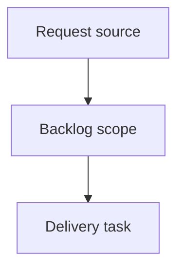

## item_395_fix_collapsed_bottom_details_panel_empty_space - Fix collapsed bottom details panel empty space
> From version: 2.5.2
> Schema version: 1.0
> Status: Done
> Understanding: 90%
> Confidence: 85%
> Progress: 100%
> Complexity: High
> Theme: Operator workflow and runtime integration
> Reminder: Update status/understanding/confidence/progress and linked request/task references when you edit this doc.

# Problem
When the local viewer is in bottom-details layout, collapsing the details panel with the right-side chevron should reclaim the panel height.
Today the details content collapses visually, but the bottom area can remain reserved as empty space, reducing the usable board area.

# Scope
- In: fix bottom-details collapse layout so the main board regains the vertical space.
- In: preserve expand/collapse state and the chevron accessibility attributes.
- In: verify the behavior after viewport resize and display-mode changes.
- In: keep source viewer assets and packaged viewer assets aligned if viewer assets change.
- Out: changing details content rendering, card selection, or unrelated topbar/menu work.
- Out: redesigning the splitter interaction beyond what is required to remove the empty reserved area.

# Delivery notes
- Inspect `clients/shared-web/media/layoutController.js` and viewer CSS before changing behavior.
- Prefer a targeted layout-state fix over broad details panel refactoring.
- Validate both collapsed and expanded bottom-details states.

# Acceptance criteria
- AC1: Collapsing the bottom details panel removes the visible empty reserved area below the main board.
- AC2: Expanding the details panel restores the details area without overlapping board content.
- AC3: The chevron toggle remains accessible and keeps accurate expanded/collapsed state.
- AC4: The fix works after viewport resize and view-mode changes.
- AC5: The change is limited to viewer layout behavior and does not alter details content semantics.
- AC6: Source viewer assets and packaged viewer assets remain in sync if viewer assets are changed.

# AC Traceability
- request-AC1 -> This backlog slice. Proof: AC1: Collapsing the bottom details panel removes the visible empty reserved area below the main board.
- request-AC2 -> This backlog slice. Proof: AC2: Expanding the details panel restores the details area without overlapping board content.
- request-AC3 -> This backlog slice. Proof: AC3: The chevron toggle remains accessible and keeps accurate expanded/collapsed state.
- request-AC4 -> This backlog slice. Proof: AC4: The fix works after viewport resize and view-mode changes.
- request-AC5 -> This backlog slice. Proof: AC5: The change is limited to viewer layout behavior and does not alter details content semantics.
- request-AC6 -> This backlog slice. Proof: AC6: Source viewer assets and packaged viewer assets remain in sync if viewer assets are changed.

# Decision framing
- Product framing: Not needed
- Product signals: (none detected)
- Product follow-up: No product brief follow-up is expected based on current signals.
- Architecture framing: Not needed
- Architecture signals: (none detected)
- Architecture follow-up: No architecture decision follow-up is expected based on current signals.

# Links
- Product brief(s): (none yet)
- Architecture decision(s): (none yet)
- Request: `logics/request/req_229_fix_collapsed_bottom_details_panel_empty_space.md`
- Primary task(s): `logics/tasks/task_203_fix_collapsed_bottom_details_panel_empty_space.md`

# AI Context
- Summary: Fix collapsed bottom details panel empty space
- Keywords: backlog-groom, request, fix collapsed bottom details panel empty space, bounded slice
- Use when: Use when implementing or reviewing the delivery slice for Fix collapsed bottom details panel empty space.
- Skip when: Skip when the change is unrelated to this delivery slice or its linked request.

# Priority
- Impact:
- Urgency:

# Notes
- Hybrid rationale: Derived from request `req_229_fix_collapsed_bottom_details_panel_empty_space` and kept bounded to one coherent delivery slice.
- Source file: `logics/request/req_229_fix_collapsed_bottom_details_panel_empty_space.md`.
- Generated locally by logics-manager.
- Task `task_203_fix_collapsed_bottom_details_panel_empty_space` was finished via `logics-manager flow finish task` on 2026-06-11.

# Tasks
- `task_203_fix_collapsed_bottom_details_panel_empty_space`
