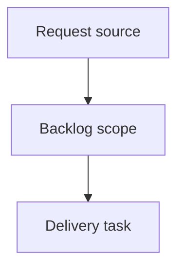

## item_396_add_logics_assistant_runs_cockpit_and_report_to_workflow_actions - Add Logics assistant runs cockpit and report-to-workflow actions
> From version: 2.6.0
> Schema version: 1.0
> Status: Ready
> Understanding: 90%
> Confidence: 85%
> Progress: 0%
> Complexity: High
> Theme: Operator workflow and runtime integration
> Reminder: Update status/understanding/confidence/progress and linked request/task references when you edit this doc.

# Problem
Logics should expose assistant run execution as an operator-visible workflow surface, not as invisible background activity.
Operators need a dedicated runs cockpit that shows what assistant runs are in progress, what finished, what failed, and where the resulting report/artifacts are.
Structured CDX reports, especially code-review findings, should be convertible into Logics workflow docs so follow-up work can be tracked as requests, backlog items, and tasks.

# Scope
- In:
  - one coherent delivery slice from the source request
- Out:
  - unrelated sibling slices that should stay in separate backlog items instead of widening this doc

# Acceptance criteria
- AC1: The viewer exposes an assistant runs cockpit or sub-screen that lists recent and active CDX runs from a stable JSON source.
- AC2: Active and terminal run states are visually distinct and include enough metadata to understand what is running, where, and through which provider/session.
- AC3: The cockpit can refresh or poll run state so a run visibly moves from running to a terminal state without restarting the viewer.
- AC4: A completed run can be opened as a report with summary, structured output, artifact paths, and errors when present.
- AC5: Code-review reports render normalized findings with severity, title, file/line references when available, and recommendation text.
- AC6: Operators can draft a Logics request from code-review findings with traceability back to the CDX `run_id` and report artifact.
- AC7: Report-to-workflow actions keep an operator review boundary before writing docs by default.
- AC8: The implementation degrades clearly when CDX does not yet expose run status/report commands or when a run has only raw artifacts.
- AC9: Tests cover CDX payload mapping, active/terminal rendering, refresh behavior, report rendering, and request draft/create behavior.

# AC Traceability
- request-AC1 -> This backlog slice. Proof: AC1: The viewer exposes an assistant runs cockpit or sub-screen that lists recent and active CDX runs from a stable JSON source.
- request-AC2 -> This backlog slice. Proof: AC2: Active and terminal run states are visually distinct and include enough metadata to understand what is running, where, and through which provider/session.
- request-AC3 -> This backlog slice. Proof: AC3: The cockpit can refresh or poll run state so a run visibly moves from running to a terminal state without restarting the viewer.
- request-AC4 -> This backlog slice. Proof: AC4: A completed run can be opened as a report with summary, structured output, artifact paths, and errors when present.
- request-AC5 -> This backlog slice. Proof: AC5: Code-review reports render normalized findings with severity, title, file/line references when available, and recommendation text.
- request-AC6 -> This backlog slice. Proof: AC6: Operators can draft a Logics request from code-review findings with traceability back to the CDX `run_id` and report artifact.
- request-AC7 -> This backlog slice. Proof: AC7: Report-to-workflow actions keep an operator review boundary before writing docs by default.
- request-AC8 -> This backlog slice. Proof: AC8: The implementation degrades clearly when CDX does not yet expose run status/report commands or when a run has only raw artifacts.
- request-AC9 -> This backlog slice. Proof: AC9: Tests cover CDX payload mapping, active/terminal rendering, refresh behavior, report rendering, and request draft/create behavior.

# Decision framing
- Product framing: Not needed
- Product signals: (none detected)
- Product follow-up: No product brief follow-up is expected based on current signals.
- Architecture framing: Not needed
- Architecture signals: (none detected)
- Architecture follow-up: No architecture decision follow-up is expected based on current signals.

# Links
- Product brief(s): (none yet)
- Architecture decision(s): (none yet)
- Request: `logics/request/req_230_add_logics_assistant_runs_cockpit_and_report_to_workflow_actions.md`
- Primary task(s): (none yet)

# AI Context
- Summary: Add Logics assistant runs cockpit and report-to-workflow actions
- Keywords: backlog-groom, request, add logics assistant runs cockpit and report-to-workflow actions, bounded slice
- Use when: Use when implementing or reviewing the delivery slice for Add Logics assistant runs cockpit and report-to-workflow actions.
- Skip when: Skip when the change is unrelated to this delivery slice or its linked request.

# Priority
- Impact:
- Urgency:

# Notes
- Hybrid rationale: Derived from request `req_230_add_logics_assistant_runs_cockpit_and_report_to_workflow_actions` and kept bounded to one coherent delivery slice.
- Source file: `logics/request/req_230_add_logics_assistant_runs_cockpit_and_report_to_workflow_actions.md`.
- Generated locally by logics-manager.

# Tasks
- `task_204_add_logics_assistant_runs_cockpit_and_report_to_workflow_actions`
