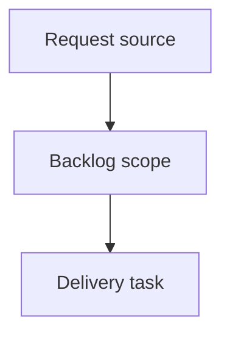

## item_397_add_multi_project_navigation_to_the_logics_viewer - Add multi-project navigation to the Logics viewer
> From version: 2.6.0
> Schema version: 1.0
> Status: Done
> Understanding: 90%
> Confidence: 85%
> Progress: 100%
> Complexity: High
> Theme: Operator workflow and runtime integration
> Reminder: Update status/understanding/confidence/progress and linked request/task references when you edit this doc.

# Problem
The Logics viewer should let an operator move between known projects without stopping and relaunching a separate viewer for each repository.
Operators working across Logics, CDX, and product repositories need quick project switching to inspect workflow state, Git/CI/CDX status, and future assistant runs in the right context.
Project navigation must stay safe: the browser UI should not be able to request arbitrary filesystem paths outside a backend-controlled allowlist.

# Scope
- In:
  - one coherent delivery slice from the source request
- Out:
  - unrelated sibling slices that should stay in separate backlog items instead of widening this doc

# Acceptance criteria
- AC1: The viewer exposes a project navigation control in the left-side identity/context area of the topbar, replacing or extending the repository pill.
- AC2: Selecting a project changes the active viewer context and reloads the board/document data from that project's Logics corpus.
- AC3: Git, CI, CDX, and activity/status panels use the selected project context after a switch rather than the original launch repository.
- AC4: The backend rejects switching to paths that are not in the known/allowed project registry.
- AC5: The viewer clearly handles projects with no Logics corpus, missing Git metadata, unavailable CDX status, or inaccessible paths.
- AC6: The selected project can be restored or shown as the current context after refresh.
- AC7: The implementation provides a stable JSON surface for listing projects and switching/inspecting the active project.
- AC8: The topbar keeps project context visually separate from right-side actions such as Git, CI, CDX, and Settings.
- AC9: Tests cover backend allowlist behavior, project registry payloads, switching success/failure, UI rendering, and data refresh after switching.

# AC Traceability
- request-AC1 -> This backlog slice. Proof: AC1: The viewer exposes a project navigation control in the left-side identity/context area of the topbar, replacing or extending the repository pill.
- request-AC2 -> This backlog slice. Proof: AC2: Selecting a project changes the active viewer context and reloads the board/document data from that project's Logics corpus.
- request-AC3 -> This backlog slice. Proof: AC3: Git, CI, CDX, and activity/status panels use the selected project context after a switch rather than the original launch repository.
- request-AC4 -> This backlog slice. Proof: AC4: The backend rejects switching to paths that are not in the known/allowed project registry.
- request-AC5 -> This backlog slice. Proof: AC5: The viewer clearly handles projects with no Logics corpus, missing Git metadata, unavailable CDX status, or inaccessible paths.
- request-AC6 -> This backlog slice. Proof: AC6: The selected project can be restored or shown as the current context after refresh.
- request-AC7 -> This backlog slice. Proof: AC7: The implementation provides a stable JSON surface for listing projects and switching/inspecting the active project.
- request-AC8 -> This backlog slice. Proof: AC8: The topbar keeps project context visually separate from right-side actions such as Git, CI, CDX, and Settings.
- request-AC9 -> This backlog slice. Proof: AC9: Tests cover backend allowlist behavior, project registry payloads, switching success/failure, UI rendering, and data refresh after switching.

# Decision framing
- Product framing: Not needed
- Product signals: (none detected)
- Product follow-up: No product brief follow-up is expected based on current signals.
- Architecture framing: Not needed
- Architecture signals: (none detected)
- Architecture follow-up: No architecture decision follow-up is expected based on current signals.

# Links
- Product brief(s): (none yet)
- Architecture decision(s): (none yet)
- Request: `logics/request/req_231_add_multi_project_navigation_to_the_logics_viewer.md`
- Primary task(s): (none yet)

# AI Context
- Summary: Add multi-project navigation to the Logics viewer
- Keywords: backlog-groom, request, add multi-project navigation to the logics viewer, bounded slice
- Use when: Use when implementing or reviewing the delivery slice for Add multi-project navigation to the Logics viewer.
- Skip when: Skip when the change is unrelated to this delivery slice or its linked request.

# Priority
- Impact:
- Urgency:

# Notes
- Hybrid rationale: Derived from request `req_231_add_multi_project_navigation_to_the_logics_viewer` and kept bounded to one coherent delivery slice.
- Source file: `logics/request/req_231_add_multi_project_navigation_to_the_logics_viewer.md`.
- Generated locally by logics-manager.
- Task `task_205_add_multi_project_navigation_to_the_logics_viewer` was finished via `logics-manager flow finish task` on 2026-06-11.

# Tasks
- `task_205_add_multi_project_navigation_to_the_logics_viewer`
