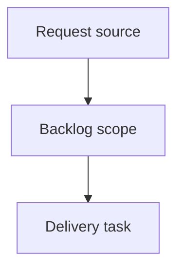

## item_398_stop_generating_generic_task_mermaid_diagrams - Stop generating generic task Mermaid diagrams
> From version: 2.6.1
> Schema version: 1.0
> Status: Done
> Understanding: 90%
> Confidence: 85%
> Progress: 100%
> Complexity: High
> Theme: Operator workflow and runtime integration
> Reminder: Update status/understanding/confidence/progress and linked request/task references when you edit this doc.

# Problem
Logics task documents should stop receiving generic Mermaid diagrams that only repeat the Logics delivery lifecycle.
A task diagram should either explain something specific about the task's implementation or be omitted.
Generated task docs should prioritize useful execution context over decorative process diagrams.

# Scope
- In:
  - one coherent delivery slice from the source request
- Out:
  - unrelated sibling slices that should stay in separate backlog items instead of widening this doc

# Acceptance criteria
- AC1: Newly generated task documents do not include the generic Logics lifecycle Mermaid diagram by default.
- AC2: Task documents without Mermaid still pass Logics lint and closeout validation.
- AC3: The generator still permits task-specific Mermaid when a caller/template explicitly provides meaningful task behavior or architecture.
- AC4: Request and backlog Mermaid behavior is unchanged.
- AC5: Tests cover task generation without Mermaid and protect against the old generic `Backlog -> Build -> Validate -> Close` diagram returning by default.
- AC6: Documentation or examples that describe generated task structure are updated to match the new default.

# AC Traceability
- request-AC1 -> This backlog slice. Proof: AC1: Newly generated task documents do not include the generic Logics lifecycle Mermaid diagram by default.
- request-AC2 -> This backlog slice. Proof: AC2: Task documents without Mermaid still pass Logics lint and closeout validation.
- request-AC3 -> This backlog slice. Proof: AC3: The generator still permits task-specific Mermaid when a caller/template explicitly provides meaningful task behavior or architecture.
- request-AC4 -> This backlog slice. Proof: AC4: Request and backlog Mermaid behavior is unchanged.
- request-AC5 -> This backlog slice. Proof: AC5: Tests cover task generation without Mermaid and protect against the old generic `Backlog -> Build -> Validate -> Close` diagram returning by default.
- request-AC6 -> This backlog slice. Proof: AC6: Documentation or examples that describe generated task structure are updated to match the new default.

# Decision framing
- Product framing: Not needed
- Product signals: (none detected)
- Product follow-up: No product brief follow-up is expected based on current signals.
- Architecture framing: Not needed
- Architecture signals: (none detected)
- Architecture follow-up: No architecture decision follow-up is expected based on current signals.

# Links
- Product brief(s): (none yet)
- Architecture decision(s): (none yet)
- Request: `logics/request/req_232_stop_generating_generic_task_mermaid_diagrams.md`
- Primary task(s): (none yet)

# AI Context
- Summary: Stop generating generic task Mermaid diagrams
- Keywords: backlog-groom, request, stop generating generic task mermaid diagrams, bounded slice
- Use when: Use when implementing or reviewing the delivery slice for Stop generating generic task Mermaid diagrams.
- Skip when: Skip when the change is unrelated to this delivery slice or its linked request.

# Priority
- Impact:
- Urgency:

# Notes
- Hybrid rationale: Derived from request `req_232_stop_generating_generic_task_mermaid_diagrams` and kept bounded to one coherent delivery slice.
- Source file: `logics/request/req_232_stop_generating_generic_task_mermaid_diagrams.md`.
- Generated locally by logics-manager.
- Task `task_206_stop_generating_generic_task_mermaid_diagrams` was finished via `logics-manager flow finish task` on 2026-06-11.

# Tasks
- `task_206_stop_generating_generic_task_mermaid_diagrams`
