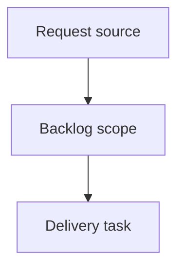

## item_399_add_project_capability_detection_for_viewer_features - Add project capability detection for viewer features
> From version: 2.6.1
> Schema version: 1.0
> Status: Done
> Understanding: 90%
> Confidence: 85%
> Progress: 100%
> Complexity: High
> Theme: Operator workflow and runtime integration
> Reminder: Update status/understanding/confidence/progress and linked request/task references when you edit this doc.

# Problem
The Logics viewer should detect which project capabilities are available before enabling feature surfaces.
A selected project may not have Logics, Git, CI, CDX, or assistant-run support, and that must be a first-class state rather than an exceptional failure.
Feature availability should be represented by a stable backend capability snapshot that all viewer panels can consume.

# Scope
- In:
  - one coherent delivery slice from the source request
- Out:
  - unrelated sibling slices that should stay in separate backlog items instead of widening this doc

# Acceptance criteria
- AC1: The backend exposes a project capability snapshot for the active viewer project.
- AC2: The snapshot includes Logics, Git, CI, CDX, and CDX runs capabilities with state and human-readable reason fields.
- AC3: Capability states distinguish absent/unconfigured/unauthorized/unsupported cases from unexpected errors where possible.
- AC4: Capability detection runs when the viewer loads and when a project switch occurs.
- AC5: The browser host can consume the snapshot without calling every feature endpoint first.
- AC6: Tests cover representative project states: full project, no Git, no Logics corpus, no CDX, CI unavailable/private, and CDX runs unsupported.

# AC Traceability
- request-AC1 -> This backlog slice. Proof: AC1: The backend exposes a project capability snapshot for the active viewer project.
- request-AC2 -> This backlog slice. Proof: AC2: The snapshot includes Logics, Git, CI, CDX, and CDX runs capabilities with state and human-readable reason fields.
- request-AC3 -> This backlog slice. Proof: AC3: Capability states distinguish absent/unconfigured/unauthorized/unsupported cases from unexpected errors where possible.
- request-AC4 -> This backlog slice. Proof: AC4: Capability detection runs when the viewer loads and when a project switch occurs.
- request-AC5 -> This backlog slice. Proof: AC5: The browser host can consume the snapshot without calling every feature endpoint first.
- request-AC6 -> This backlog slice. Proof: AC6: Tests cover representative project states: full project, no Git, no Logics corpus, no CDX, CI unavailable/private, and CDX runs unsupported.

# Decision framing
- Product framing: Not needed
- Product signals: (none detected)
- Product follow-up: No product brief follow-up is expected based on current signals.
- Architecture framing: Not needed
- Architecture signals: (none detected)
- Architecture follow-up: No architecture decision follow-up is expected based on current signals.

# Links
- Product brief(s): (none yet)
- Architecture decision(s): (none yet)
- Request: `logics/request/req_233_add_project_capability_detection_for_viewer_features.md`
- Primary task(s): (none yet)

# AI Context
- Summary: Add project capability detection for viewer features
- Keywords: backlog-groom, request, add project capability detection for viewer features, bounded slice
- Use when: Use when implementing or reviewing the delivery slice for Add project capability detection for viewer features.
- Skip when: Skip when the change is unrelated to this delivery slice or its linked request.

# Priority
- Impact:
- Urgency:

# Notes
- Hybrid rationale: Derived from request `req_233_add_project_capability_detection_for_viewer_features` and kept bounded to one coherent delivery slice.
- Source file: `logics/request/req_233_add_project_capability_detection_for_viewer_features.md`.
- Generated locally by logics-manager.
- Task `task_207_add_project_capability_detection_for_viewer_features` was finished via `logics-manager flow finish task` on 2026-06-11.

# Tasks
- `task_207_add_project_capability_detection_for_viewer_features`
