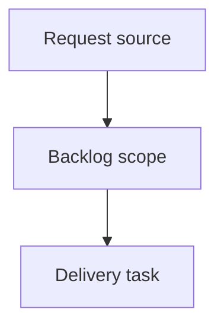

## item_400_add_new_project_onboarding_and_bootstrap_states_to_the_viewer - Add new project onboarding and bootstrap states to the viewer
> From version: 2.6.1
> Schema version: 1.0
> Status: Done
> Understanding: 90%
> Confidence: 85%
> Progress: 100%
> Complexity: High
> Theme: Operator workflow and runtime integration
> Reminder: Update status/understanding/confidence/progress and linked request/task references when you edit this doc.

# Problem
The Logics viewer should guide operators when the selected project is new, incomplete, or not yet bootstrapped.
A project without a Logics corpus, Git repository, runtime setup, or CDX integration should show clear states and safe next actions.
Bootstrap/init actions must remain explicit and reviewable rather than happening automatically.

# Scope
- In:
  - one coherent delivery slice from the source request
- Out:
  - unrelated sibling slices that should stay in separate backlog items instead of widening this doc

# Acceptance criteria
- AC1: The viewer shows clear onboarding states when the selected project has no Logics corpus or incomplete Logics setup.
- AC2: The viewer can show missing Git as a normal project state and does not render Git-specific controls as if they work.
- AC3: Bootstrap/init actions are only shown when supported by capability state and require explicit user action.
- AC4: Mutating onboarding actions explain what will be created or changed before execution.
- AC5: Onboarding actions apply only to the active selected project.
- AC6: Progress, success, and failure states are visible after bootstrap/environment actions.
- AC7: Tests cover no-Logics, no-Git, missing runtime, failed bootstrap, successful bootstrap, and project-switch safety.

# AC Traceability
- request-AC1 -> This backlog slice. Proof: AC1: The viewer shows clear onboarding states when the selected project has no Logics corpus or incomplete Logics setup.
- request-AC2 -> This backlog slice. Proof: AC2: The viewer can show missing Git as a normal project state and does not render Git-specific controls as if they work.
- request-AC3 -> This backlog slice. Proof: AC3: Bootstrap/init actions are only shown when supported by capability state and require explicit user action.
- request-AC4 -> This backlog slice. Proof: AC4: Mutating onboarding actions explain what will be created or changed before execution.
- request-AC5 -> This backlog slice. Proof: AC5: Onboarding actions apply only to the active selected project.
- request-AC6 -> This backlog slice. Proof: AC6: Progress, success, and failure states are visible after bootstrap/environment actions.
- request-AC7 -> This backlog slice. Proof: AC7: Tests cover no-Logics, no-Git, missing runtime, failed bootstrap, successful bootstrap, and project-switch safety.

# Decision framing
- Product framing: Not needed
- Product signals: (none detected)
- Product follow-up: No product brief follow-up is expected based on current signals.
- Architecture framing: Not needed
- Architecture signals: (none detected)
- Architecture follow-up: No architecture decision follow-up is expected based on current signals.

# Links
- Product brief(s): (none yet)
- Architecture decision(s): (none yet)
- Request: `logics/request/req_234_add_new_project_onboarding_and_bootstrap_states_to_the_viewer.md`
- Primary task(s): (none yet)

# AI Context
- Summary: Add new project onboarding and bootstrap states to the viewer
- Keywords: backlog-groom, request, add new project onboarding and bootstrap states to the viewer, bounded slice
- Use when: Use when implementing or reviewing the delivery slice for Add new project onboarding and bootstrap states to the viewer.
- Skip when: Skip when the change is unrelated to this delivery slice or its linked request.

# Priority
- Impact:
- Urgency:

# Notes
- Hybrid rationale: Derived from request `req_234_add_new_project_onboarding_and_bootstrap_states_to_the_viewer` and kept bounded to one coherent delivery slice.
- Source file: `logics/request/req_234_add_new_project_onboarding_and_bootstrap_states_to_the_viewer.md`.
- Generated locally by logics-manager.
- Task `task_208_add_new_project_onboarding_and_bootstrap_states_to_the_viewer` was finished via `logics-manager flow finish task` on 2026-06-11.

# Tasks
- `task_208_add_new_project_onboarding_and_bootstrap_states_to_the_viewer`
