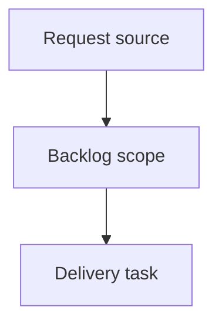

## item_401_gate_viewer_git_ci_cdx_and_runs_actions_by_project_availability - Gate viewer Git CI CDX and Runs actions by project availability
> From version: 2.6.1
> Schema version: 1.0
> Status: Ready
> Understanding: 90%
> Confidence: 85%
> Progress: 0%
> Complexity: High
> Theme: Operator workflow and runtime integration
> Reminder: Update status/understanding/confidence/progress and linked request/task references when you edit this doc.

# Problem
The viewer should disable, hide, or explain Git, CI, CDX, and CDX Runs actions when the selected project does not support them.
Missing dependencies should produce intentional UI states, not repeated failed calls or misleading controls.
Operators should understand whether a feature is unavailable because it is absent, unconfigured, unauthorized, unsupported, or temporarily failing.

# Scope
- In:
  - one coherent delivery slice from the source request
- Out:
  - unrelated sibling slices that should stay in separate backlog items instead of widening this doc

# Acceptance criteria
- AC1: Git controls are disabled, hidden, or replaced with a clear unavailable state when the selected project is not a Git repository.
- AC2: Git-specific refs such as branch, history, staged files, and diff preview are not shown as active content for non-Git projects.
- AC3: CI controls clearly handle unconfigured, private, unauthorized, unsupported, and unavailable CI states.
- AC4: CDX controls clearly handle missing CDX, unavailable CDX, and unsupported CDX project/runtime states.
- AC5: The CDX `Runs` view is disabled or marked unsupported when CDX run registry/status/report commands are not available.
- AC6: The viewer avoids automatic calls to endpoints for capabilities marked unavailable, except for explicit refresh/check actions.
- AC7: Tooltips, labels, or empty states explain why each unavailable action cannot run and what the operator can do next when applicable.
- AC8: Tests cover no Git, private/unavailable CI, missing CDX, old CDX without Runs, and recovery after capability refresh.

# AC Traceability
- request-AC1 -> This backlog slice. Proof: AC1: Git controls are disabled, hidden, or replaced with a clear unavailable state when the selected project is not a Git repository.
- request-AC2 -> This backlog slice. Proof: AC2: Git-specific refs such as branch, history, staged files, and diff preview are not shown as active content for non-Git projects.
- request-AC3 -> This backlog slice. Proof: AC3: CI controls clearly handle unconfigured, private, unauthorized, unsupported, and unavailable CI states.
- request-AC4 -> This backlog slice. Proof: AC4: CDX controls clearly handle missing CDX, unavailable CDX, and unsupported CDX project/runtime states.
- request-AC5 -> This backlog slice. Proof: AC5: The CDX `Runs` view is disabled or marked unsupported when CDX run registry/status/report commands are not available.
- request-AC6 -> This backlog slice. Proof: AC6: The viewer avoids automatic calls to endpoints for capabilities marked unavailable, except for explicit refresh/check actions.
- request-AC7 -> This backlog slice. Proof: AC7: Tooltips, labels, or empty states explain why each unavailable action cannot run and what the operator can do next when applicable.
- request-AC8 -> This backlog slice. Proof: AC8: Tests cover no Git, private/unavailable CI, missing CDX, old CDX without Runs, and recovery after capability refresh.

# Decision framing
- Product framing: Not needed
- Product signals: (none detected)
- Product follow-up: No product brief follow-up is expected based on current signals.
- Architecture framing: Not needed
- Architecture signals: (none detected)
- Architecture follow-up: No architecture decision follow-up is expected based on current signals.

# Links
- Product brief(s): (none yet)
- Architecture decision(s): (none yet)
- Request: `logics/request/req_235_gate_viewer_git_ci_cdx_and_runs_actions_by_project_availability.md`
- Primary task(s): (none yet)

# AI Context
- Summary: Gate viewer Git CI CDX and Runs actions by project availability
- Keywords: backlog-groom, request, gate viewer git ci cdx and runs actions by project availability, bounded slice
- Use when: Use when implementing or reviewing the delivery slice for Gate viewer Git CI CDX and Runs actions by project availability.
- Skip when: Skip when the change is unrelated to this delivery slice or its linked request.

# Priority
- Impact:
- Urgency:

# Notes
- Hybrid rationale: Derived from request `req_235_gate_viewer_git_ci_cdx_and_runs_actions_by_project_availability` and kept bounded to one coherent delivery slice.
- Source file: `logics/request/req_235_gate_viewer_git_ci_cdx_and_runs_actions_by_project_availability.md`.
- Generated locally by logics-manager.

# Tasks
- `task_209_gate_viewer_git_ci_cdx_and_runs_actions_by_project_availability`
