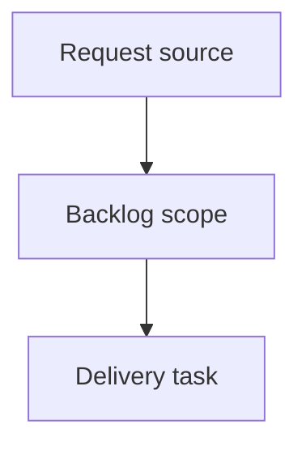

## item_402_preview_files_without_git_diffs_in_the_git_screen - Preview files without Git diffs in the Git screen
> From version: 2.7.0
> Schema version: 1.0
> Status: Done
> Understanding: 90%
> Confidence: 85%
> Progress: 100%
> Complexity: High
> Theme: Operator workflow and runtime integration
> Reminder: Update status/understanding/confidence/progress and linked request/task references when you edit this doc.

# Problem
In the local viewer Git screen, selecting a changed-file item that has no useful Git diff should still show useful read-only context by falling back to a file preview when the current file content is available.
Operators should not hit an empty or low-value diff panel for cases such as untracked files, unchanged selected modes, or files where Git returns no diff content but the file can still be inspected safely.
The fallback must clearly distinguish a file preview from a diff preview so users do not mistake current file contents for a patch.

# Scope
- In:
  - read-only fallback preview for selected Git files when `git diff` returns no useful content
  - backend path safety, text/binary/size handling, and bounded response payloads
  - browser rendering that labels fallback content as file preview rather than diff preview
  - focused tests for diff-first behavior, readable fallback, and unsupported/missing cases
- Out:
  - write-capable Git actions such as stage, unstage, discard, or commit
  - full editor integration or syntax highlighting beyond a readable bounded preview
  - preview support for non-file Git history rows

# Acceptance criteria
- AC1: When a selected Git file row produces no useful diff but the current file is readable text, the detail area renders a bounded read-only file preview instead of only an empty/no-diff message.
- AC2: The detail area labels fallback content as `File preview` or an equivalent explicit mode, keeping it visually and semantically distinct from `Diff preview`.
- AC3: Deleted files, missing files, binary/unsupported files, unsafe paths, and oversized files produce clear bounded messages rather than attempting to render misleading content.
- AC4: Existing diff behavior remains unchanged when a real diff is available, including staged versus worktree diff mode.
- AC5: File preview fallback works from the same file-oriented Git subviews that can select files: Changes, Staged, Worktree, and Untracked.
- AC6: The backend endpoint or payload used for fallback remains read-only, path-safe, and size-bounded.
- AC7: Tests cover at least one no-diff readable-file fallback, one unsupported/missing fallback, and the existing diff-first behavior.

# AC Traceability
- request-AC1 -> This backlog slice. Proof: AC1: When a selected Git file row produces no useful diff but the current file is readable text, the detail area renders a bounded read-only file preview instead of only an empty/no-diff message.
- request-AC2 -> This backlog slice. Proof: AC2: The detail area labels fallback content as `File preview` or an equivalent explicit mode, keeping it visually and semantically distinct from `Diff preview`.
- request-AC3 -> This backlog slice. Proof: AC3: Deleted files, missing files, binary/unsupported files, unsafe paths, and oversized files produce clear bounded messages rather than attempting to render misleading content.
- request-AC4 -> This backlog slice. Proof: AC4: Existing diff behavior remains unchanged when a real diff is available, including staged versus worktree diff mode.
- request-AC5 -> This backlog slice. Proof: AC5: File preview fallback works from the same file-oriented Git subviews that can select files: Changes, Staged, Worktree, and Untracked.
- request-AC6 -> This backlog slice. Proof: AC6: The backend endpoint or payload used for fallback remains read-only, path-safe, and size-bounded.
- request-AC7 -> This backlog slice. Proof: AC7: Tests cover at least one no-diff readable-file fallback, one unsupported/missing fallback, and the existing diff-first behavior.

# Decision framing
- Product framing: Not needed
- Product signals: (none detected)
- Product follow-up: No product brief follow-up is expected based on current signals.
- Architecture framing: Not needed
- Architecture signals: (none detected)
- Architecture follow-up: No architecture decision follow-up is expected based on current signals.

# Links
- Product brief(s): (none yet)
- Architecture decision(s): (none yet)
- Request: `req_236_preview_files_without_git_diffs_in_the_git_screen`
- Primary task(s): `task_210_preview_files_without_git_diffs_in_the_git_screen`

# AI Context
- Summary: Preview files without Git diffs in the Git screen
- Keywords: backlog-groom, request, preview files without git diffs in the git screen, bounded slice
- Use when: Use when implementing or reviewing the delivery slice for Preview files without Git diffs in the Git screen.
- Skip when: Skip when the change is unrelated to this delivery slice or its linked request.

# Priority
- Impact: Medium - improves Git cockpit usefulness for untracked/no-diff rows without changing write behavior.
- Urgency: Medium - the current no-diff message is safe but low-value during review and staging decisions.

# Notes
- Hybrid rationale: Derived from request `req_236_preview_files_without_git_diffs_in_the_git_screen` and kept bounded to one coherent delivery slice.
- Source file: `logics/request/req_236_preview_files_without_git_diffs_in_the_git_screen.md`.
- Generated locally by logics-manager.
- Delivered with read-only Git file preview fallback, explicit `File preview` labeling, and focused backend/browser tests.

# Tasks
- `task_210_preview_files_without_git_diffs_in_the_git_screen`
