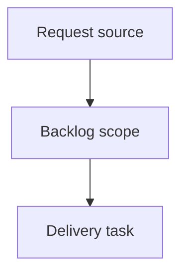

## item_403_avoid_unnecessary_viewer_refresh_work_when_state_is_unchanged - Avoid unnecessary viewer refresh work when state is unchanged
> From version: 2.7.0
> Schema version: 1.0
> Status: Ready
> Understanding: 90%
> Confidence: 85%
> Progress: 0%
> Complexity: High
> Theme: Operator workflow and runtime integration
> Reminder: Update status/understanding/confidence/progress and linked request/task references when you edit this doc.

# Problem
The local viewer should avoid doing expensive or visually disruptive refresh work when a refresh observes the same effective project state as the previous refresh.
Operators frequently refresh to check whether Git, CDX, CI, health, or corpus state changed; when nothing changed, the viewer should confirm the check without needlessly rerendering the active screen, resetting local panel state, or reloading detail content.
The optimization must preserve correctness: the viewer still needs to perform enough lightweight observation to know whether state changed, and explicit manual refresh must remain trustworthy.

# Scope
- In:
  - in-memory state signatures for refresh-relevant viewer payloads
  - no-change detection that preserves active panel/detail state and avoids redundant DOM replacement
  - changed-state path that continues to update all affected viewer surfaces
  - manual refresh feedback and a force-refresh escape hatch
- Out:
  - persistent cross-session caches
  - skipping the lightweight probes needed to know whether state changed
  - backend indexer performance work unrelated to browser refresh rendering

# Acceptance criteria
- AC1: The viewer defines a stable state signature for the refresh-relevant data it already observes, covering at minimum corpus item identity/status timestamps, Git branch/count/badge state, and project capability state.
- AC2: When a refresh produces the same signature as the previous refresh, the viewer avoids replacing the active document/panel content and avoids reloading selected detail content solely because refresh was requested.
- AC3: When the signature changes, the viewer performs the normal update path and the UI reflects the new Git/CDX/CI/health/corpus state.
- AC4: Manual refresh still provides visible feedback that a check occurred, even when no state changed.
- AC5: A force-refresh path or equivalent escape hatch can bypass the unchanged-state shortcut for debugging or recovery.
- AC6: The signature comparison is deterministic and ignores volatile fields that should not trigger UI rerenders on their own, such as "checked at" timestamps or transient fetch bookkeeping.
- AC7: Tests cover unchanged refresh, changed refresh, manual no-change feedback, and at least one active-panel preservation case.
- AC8: The implementation does not introduce persistent cache complexity or stale-state risk beyond the current in-memory viewer session.

# AC Traceability
- request-AC1 -> This backlog slice. Proof: AC1: The viewer defines a stable state signature for the refresh-relevant data it already observes, covering at minimum corpus item identity/status timestamps, Git branch/count/badge state, and project capability state.
- request-AC2 -> This backlog slice. Proof: AC2: When a refresh produces the same signature as the previous refresh, the viewer avoids replacing the active document/panel content and avoids reloading selected detail content solely because refresh was requested.
- request-AC3 -> This backlog slice. Proof: AC3: When the signature changes, the viewer performs the normal update path and the UI reflects the new Git/CDX/CI/health/corpus state.
- request-AC4 -> This backlog slice. Proof: AC4: Manual refresh still provides visible feedback that a check occurred, even when no state changed.
- request-AC5 -> This backlog slice. Proof: AC5: A force-refresh path or equivalent escape hatch can bypass the unchanged-state shortcut for debugging or recovery.
- request-AC6 -> This backlog slice. Proof: AC6: The signature comparison is deterministic and ignores volatile fields that should not trigger UI rerenders on their own, such as "checked at" timestamps or transient fetch bookkeeping.
- request-AC7 -> This backlog slice. Proof: AC7: Tests cover unchanged refresh, changed refresh, manual no-change feedback, and at least one active-panel preservation case.
- request-AC8 -> This backlog slice. Proof: AC8: The implementation does not introduce persistent cache complexity or stale-state risk beyond the current in-memory viewer session.

# Decision framing
- Product framing: Not needed
- Product signals: (none detected)
- Product follow-up: No product brief follow-up is expected based on current signals.
- Architecture framing: Not needed
- Architecture signals: (none detected)
- Architecture follow-up: No architecture decision follow-up is expected based on current signals.

# Links
- Product brief(s): (none yet)
- Architecture decision(s): (none yet)
- Request: `req_237_avoid_unnecessary_viewer_refresh_work_when_state_is_unchanged`
- Primary task(s): `task_211_avoid_unnecessary_viewer_refresh_work_when_state_is_unchanged`

# AI Context
- Summary: Avoid unnecessary viewer refresh work when state is unchanged
- Keywords: backlog-groom, request, avoid unnecessary viewer refresh work when state is unchanged, bounded slice
- Use when: Use when implementing or reviewing the delivery slice for Avoid unnecessary viewer refresh work when state is unchanged.
- Skip when: Skip when the change is unrelated to this delivery slice or its linked request.

# Priority
- Impact: Medium - reduces unnecessary UI churn and avoids disrupting active viewer context on repeated refreshes.
- Urgency: Medium - useful polish before adding more expensive viewer panels and refresh-triggered checks.

# Notes
- Hybrid rationale: Derived from request `req_237_avoid_unnecessary_viewer_refresh_work_when_state_is_unchanged` and kept bounded to one coherent delivery slice.
- Source file: `logics/request/req_237_avoid_unnecessary_viewer_refresh_work_when_state_is_unchanged.md`.
- Generated locally by logics-manager.

# Tasks
- `task_211_avoid_unnecessary_viewer_refresh_work_when_state_is_unchanged`
