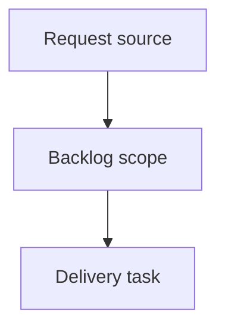

## item_404_block_concurrent_viewer_actions_and_show_loading_state - Block concurrent viewer actions and show loading state
> From version: 2.7.0
> Schema version: 1.0
> Status: Done
> Understanding: 90%
> Confidence: 85%
> Progress: 100%
> Complexity: High
> Theme: Operator workflow and runtime integration
> Reminder: Update status/understanding/confidence/progress and linked request/task references when you edit this doc.

# Problem
The local viewer should make asynchronous actions visibly busy while they are loading and prevent competing actions from being triggered until the current operation settles.
Operators currently can click other topbar or panel actions during normal network/runtime latency, which can create duplicate requests, competing document replacements, confusing status text, or unclear "did my click work?" moments.
The UI should provide immediate feedback that an action is in progress, while preserving lightweight local interactions that do not compete with the active async operation.

# Scope
- In:
  - busy-state wrapper for primary async viewer actions
  - visible loading feedback for accepted async actions
  - prevention of duplicate or competing async requests while busy
  - cleanup on success and error paths
  - tests for double-click, competing action, and failure recovery
- Out:
  - blocking every local-only UI interaction
  - redesigning the topbar or panel navigation
  - changing backend endpoint behavior beyond request concurrency caused by the viewer

# Acceptance criteria
- AC1: Starting a primary async viewer action marks that action as loading and shows visible feedback before the awaited work completes.
- AC2: While a primary async action is loading, competing primary async actions are disabled or ignored so double-clicks and rapid cross-action clicks do not start duplicate/conflicting requests.
- AC3: The busy state is always cleared after success or failure, and errors leave the viewer interactive again.
- AC4: Local-only interactions that do not fetch or replace active content remain usable while safe, or are explicitly documented if they are intentionally blocked.
- AC5: The loading feedback identifies either the active action or a generic viewer loading state so users can tell that the click was accepted.
- AC6: Tests cover duplicate-click prevention for at least one network-backed action and competing-action prevention between two primary actions.
- AC7: Tests cover error cleanup so a failed async action does not leave buttons disabled or the loader visible.
- AC8: Existing action-specific guards such as Git history reveal busy handling continue to work and are not replaced by a less precise global lock.

# AC Traceability
- request-AC1 -> This backlog slice. Proof: AC1: Starting a primary async viewer action marks that action as loading and shows visible feedback before the awaited work completes.
- request-AC2 -> This backlog slice. Proof: AC2: While a primary async action is loading, competing primary async actions are disabled or ignored so double-clicks and rapid cross-action clicks do not start duplicate/conflicting requests.
- request-AC3 -> This backlog slice. Proof: AC3: The busy state is always cleared after success or failure, and errors leave the viewer interactive again.
- request-AC4 -> This backlog slice. Proof: AC4: Local-only interactions that do not fetch or replace active content remain usable while safe, or are explicitly documented if they are intentionally blocked.
- request-AC5 -> This backlog slice. Proof: AC5: The loading feedback identifies either the active action or a generic viewer loading state so users can tell that the click was accepted.
- request-AC6 -> This backlog slice. Proof: AC6: Tests cover duplicate-click prevention for at least one network-backed action and competing-action prevention between two primary actions.
- request-AC7 -> This backlog slice. Proof: AC7: Tests cover error cleanup so a failed async action does not leave buttons disabled or the loader visible.
- request-AC8 -> This backlog slice. Proof: AC8: Existing action-specific guards such as Git history reveal busy handling continue to work and are not replaced by a less precise global lock.

# Decision framing
- Product framing: Not needed
- Product signals: (none detected)
- Product follow-up: No product brief follow-up is expected based on current signals.
- Architecture framing: Not needed
- Architecture signals: (none detected)
- Architecture follow-up: No architecture decision follow-up is expected based on current signals.

# Links
- Product brief(s): (none yet)
- Architecture decision(s): (none yet)
- Request: `req_238_block_concurrent_viewer_actions_and_show_loading_state`
- Primary task(s): `task_212_block_concurrent_viewer_actions_and_show_loading_state`

# AI Context
- Summary: Block concurrent viewer actions and show loading state
- Keywords: backlog-groom, request, block concurrent viewer actions and show loading state, bounded slice
- Use when: Use when implementing or reviewing the delivery slice for Block concurrent viewer actions and show loading state.
- Skip when: Skip when the change is unrelated to this delivery slice or its linked request.

# Priority
- Impact: High - prevents duplicate async requests and makes accepted clicks visible during normal latency.
- Urgency: Medium - important before expanding viewer actions that can compete for the same document surface.

# Notes
- Hybrid rationale: Derived from request `req_238_block_concurrent_viewer_actions_and_show_loading_state` and kept bounded to one coherent delivery slice.
- Source file: `logics/request/req_238_block_concurrent_viewer_actions_and_show_loading_state.md`.
- Generated locally by logics-manager.
- Delivered with a primary action busy wrapper, visible loading/busy state, duplicate/competing action prevention, and error cleanup tests.

# Tasks
- `task_212_block_concurrent_viewer_actions_and_show_loading_state`
