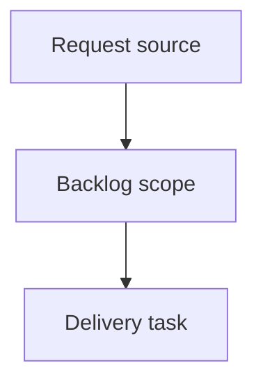

## item_405_define_guided_cdx_mission_catalog_and_setup_ui - Define guided CDX mission catalog and setup UI
> From version: 2.7.0
> Schema version: 1.0
> Status: Ready
> Understanding: 90%
> Confidence: 85%
> Progress: 0%
> Complexity: High
> Theme: Operator workflow and runtime integration
> Reminder: Update status/understanding/confidence/progress and linked request/task references when you edit this doc.

# Problem
The local Logics viewer should let operators launch guided CDX missions directly from the CDX screen instead of leaving the viewer to assemble commands manually.
The first experience should focus on safe, opinionated missions such as a full audit, a review since the latest release tag, and preparing the Logics corpus for development from open workflow requests.
Operators should be able to choose the target session, execution strength, and scope before launch, see a clear command/plan preview, and inspect run status and usage after execution.
CDX should provide reasoning and analysis, while Logics remains responsible for deterministic workflow mutations such as promoting requests into backlog items/tasks after operator confirmation.

# Scope
- In:
  - CDX screen entry point for creating a guided run
  - mission catalog for `Full audit`, `Review since latest release`, and `Prepare corpus ready for dev`
  - setup UI for mission scope, session selection, and execution strength
  - command/plan preview surface with detected tag/scope and warnings
- Out:
  - actually executing CDX commands
  - run history persistence and token usage parsing
  - applying corpus mutations after a corpus-preparation plan

# Acceptance criteria
- AC1: The CDX screen exposes a `New CDX Run` or equivalent entry point for launching guided missions.
- AC2: The first mission catalog includes at least `Full audit`, `Review since latest release`, and `Prepare corpus ready for dev`.
- AC3: Mission setup lets the operator choose a CDX session and an execution strength such as Standard, Deep, or Max, using available CDX status data where possible.
- AC4: Scope selection supports at least repository-wide audit, latest-release-tag comparison, and open workflow docs/requests as the corpus-preparation target.
- AC5: Before launch, the viewer shows a safe preview of the planned command or execution plan, including detected tag/scope and any risk/availability warnings.
- AC6: The setup UI handles missing CDX, missing sessions, low quota indicators, and missing release tags with clear non-launchable warnings.
- AC7: Tests cover mission catalog rendering, session/strength controls, scope selection, and preview warning states.

# AC Traceability
- request-AC1 -> This backlog slice. Proof: AC1: The CDX screen exposes a `New CDX Run` or equivalent entry point for launching guided missions.
- request-AC2 -> This backlog slice. Proof: AC2: The first mission catalog includes at least `Full audit`, `Review since latest release`, and `Prepare corpus ready for dev`.
- request-AC3 -> This backlog slice. Proof: AC3: Mission setup lets the operator choose a CDX session and an execution strength such as Standard, Deep, or Max, using available CDX status data where possible.
- request-AC4 -> This backlog slice. Proof: AC4: Scope selection supports at least repository-wide audit, latest-release-tag comparison, and open workflow docs/requests as the corpus-preparation target.
- request-AC5 -> This backlog slice. Proof: AC5: Before launch, the viewer shows a safe preview of the planned command or execution plan, including detected tag/scope and any risk/availability warnings.
- request-AC9 -> This backlog slice. Proof: setup warning states cover missing CDX, unavailable session, low quota, and missing release tag before launch.
- request-AC10 -> This backlog slice. Proof: tests cover catalog, session/strength selection, scope selection, and plan preview warning behavior.

# Decision framing
- Product framing: Not needed
- Product signals: (none detected)
- Product follow-up: No product brief follow-up is expected based on current signals.
- Architecture framing: Not needed
- Architecture signals: (none detected)
- Architecture follow-up: No architecture decision follow-up is expected based on current signals.

# Links
- Product brief(s): (none yet)
- Architecture decision(s): (none yet)
- Request: `req_239_launch_guided_cdx_missions_from_the_logics_viewer`
- Primary task(s): `task_213_orchestrate_guided_cdx_mission_launch_delivery`

# AI Context
- Summary: Define guided CDX mission catalog and setup UI
- Keywords: backlog-groom, request, define guided cdx mission catalog and setup ui, bounded slice
- Use when: Use when implementing or reviewing the delivery slice for Define guided CDX mission catalog and setup UI.
- Skip when: Skip when the change is unrelated to this delivery slice or its linked request.

# Priority
- Impact: High - turns passive CDX status into a controlled launch workflow for common operator missions.
- Urgency: Medium - should land before adding broader free-form CDX controls.

# Notes
- Hybrid rationale: Derived from request `req_239_launch_guided_cdx_missions_from_the_logics_viewer` and kept bounded to one coherent delivery slice.
- Source file: `logics/request/req_239_launch_guided_cdx_missions_from_the_logics_viewer.md`.
- Generated locally by logics-manager.

# Tasks
- `task_213_orchestrate_guided_cdx_mission_launch_delivery`
