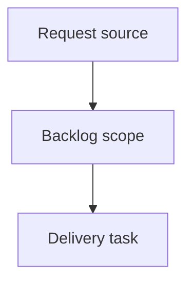

## item_406_add_constrained_cdx_mission_execution_and_run_usage_reporting - Add constrained CDX mission execution and run usage reporting
> From version: 2.7.0
> Schema version: 1.0
> Status: Done
> Understanding: 90%
> Confidence: 85%
> Progress: 100%
> Complexity: High
> Theme: Operator workflow and runtime integration
> Reminder: Update status/understanding/confidence/progress and linked request/task references when you edit this doc.

# Problem
The local Logics viewer should let operators launch guided CDX missions directly from the CDX screen instead of leaving the viewer to assemble commands manually.
The first experience should focus on safe, opinionated missions such as a full audit, a review since the latest release tag, and preparing the Logics corpus for development from open workflow requests.
Operators should be able to choose the target session, execution strength, and scope before launch, see a clear command/plan preview, and inspect run status and usage after execution.
CDX should provide reasoning and analysis, while Logics remains responsible for deterministic workflow mutations such as promoting requests into backlog items/tasks after operator confirmation.

# Scope
- In:
  - backend endpoint for constrained CDX mission execution
  - command generation from known mission templates only
  - run status, bounded output, and usage metadata parsing
  - browser rendering of active/completed/failed runs and usage details
- Out:
  - arbitrary shell command execution from browser input
  - deterministic Logics workflow mutations for corpus preparation
  - long-term persistent analytics beyond the current run history surface

# Acceptance criteria
- AC1: The backend execution path accepts only known mission identifiers, validated scopes, validated session identifiers, and known strength values.
- AC2: The backend maps each executable mission to a bounded CDX command/template and rejects arbitrary command strings from browser payloads.
- AC3: Runs expose status such as queued/running/succeeded/failed and bounded stdout/stderr or summary output.
- AC4: Runs report usage metadata when available, including token usage if CDX exposes it, and fall back to duration/session/provider/model metadata when tokens are unavailable.
- AC5: Failure states such as missing CDX, unavailable session, command failure, or unsupported usage metadata are shown clearly without corrupting viewer state.
- AC6: Tests cover mission command generation, launch guardrails, run status rendering, failure rendering, and usage metadata rendering.

# AC Traceability
- request-AC6 -> This backlog slice. Proof: backend execution is constrained to known mission templates and rejects arbitrary browser-provided commands.
- request-AC7 -> This backlog slice. Proof: run status, bounded output, and usage metadata are rendered when available.
- request-AC9 -> This backlog slice. Proof: launch and command failure states are shown without corrupting viewer state.
- request-AC10 -> This backlog slice. Proof: tests cover command generation, guardrails, run status, failure rendering, and usage metadata rendering.

# Decision framing
- Product framing: Not needed
- Product signals: (none detected)
- Product follow-up: No product brief follow-up is expected based on current signals.
- Architecture framing: Not needed
- Architecture signals: (none detected)
- Architecture follow-up: No architecture decision follow-up is expected based on current signals.

# Links
- Product brief(s): (none yet)
- Architecture decision(s): (none yet)
- Request: `req_239_launch_guided_cdx_missions_from_the_logics_viewer`
- Primary task(s): `task_213_orchestrate_guided_cdx_mission_launch_delivery`

# AI Context
- Summary: Add constrained CDX mission execution and run usage reporting
- Keywords: backlog-groom, request, add constrained cdx mission execution and run usage reporting, bounded slice
- Use when: Use when implementing or reviewing the delivery slice for Add constrained CDX mission execution and run usage reporting.
- Skip when: Skip when the change is unrelated to this delivery slice or its linked request.

# Priority
- Impact: High - provides the safe execution bridge from mission setup to actual CDX runs.
- Urgency: High - this is the core safety boundary for launching CDX from the viewer.

# Notes
- Hybrid rationale: Derived from request `req_239_launch_guided_cdx_missions_from_the_logics_viewer` and kept bounded to one coherent delivery slice.
- Source file: `logics/request/req_239_launch_guided_cdx_missions_from_the_logics_viewer.md`.
- Generated locally by logics-manager.

# Tasks
- `task_213_orchestrate_guided_cdx_mission_launch_delivery`

# Report
- Added backend CDX mission plan/run endpoints using known mission templates only.
- Added validation for mission identifiers, strength values, session identifiers, CDX availability, and latest release tag discovery.
- Added bounded stdout/stderr rendering and token usage extraction when CDX returns structured usage.
- Covered by `tests/python/test_logics_manager_cli.py -k cdx` and `tests/viewer.browser-host.test.ts`.
