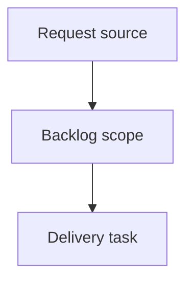

## item_407_make_corpus_preparation_a_plan_first_cdx_and_logics_workflow - Make corpus preparation a plan-first CDX and Logics workflow
> From version: 2.7.0
> Schema version: 1.0
> Status: Done
> Understanding: 90%
> Confidence: 85%
> Progress: 100%
> Complexity: High
> Theme: Operator workflow and runtime integration
> Reminder: Update status/understanding/confidence/progress and linked request/task references when you edit this doc.

# Problem
The local Logics viewer should let operators launch guided CDX missions directly from the CDX screen instead of leaving the viewer to assemble commands manually.
The first experience should focus on safe, opinionated missions such as a full audit, a review since the latest release tag, and preparing the Logics corpus for development from open workflow requests.
Operators should be able to choose the target session, execution strength, and scope before launch, see a clear command/plan preview, and inspect run status and usage after execution.
CDX should provide reasoning and analysis, while Logics remains responsible for deterministic workflow mutations such as promoting requests into backlog items/tasks after operator confirmation.

# Scope
- In:
  - corpus-preparation mission behavior that asks CDX for a plan first
  - bounded plan rendering for request/backlog/task preparation work
  - explicit operator confirmation before Logics applies deterministic workflow commands
  - clear separation between CDX reasoning and `logics-manager flow` mutations
- Out:
  - silently creating or modifying workflow docs without confirmation
  - allowing CDX to execute arbitrary Logics workflow commands directly
  - replacing existing `logics-manager flow` promotion/repair commands

# Acceptance criteria
- AC1: The `Prepare corpus ready for dev` mission runs in plan-first mode and does not mutate workflow docs during the initial CDX analysis step.
- AC2: The viewer renders a bounded corpus-preparation plan that explains proposed request/backlog/task promotions or repairs.
- AC3: Applying the plan requires explicit operator confirmation after the plan is visible.
- AC4: Confirmed plan application uses deterministic `logics-manager flow` operations rather than arbitrary CDX-generated shell commands.
- AC5: The plan application result reports created/updated docs, validation status, and any blocked steps.
- AC6: Tests cover plan-only generation, confirmation gating, deterministic command mapping, blocked-plan behavior, and successful plan application reporting.

# AC Traceability
- request-AC2 -> This backlog slice. Proof: `Prepare corpus ready for dev` is one of the initial guided missions.
- request-AC4 -> This backlog slice. Proof: open workflow docs/requests are supported as the corpus-preparation target scope.
- request-AC5 -> This backlog slice. Proof: corpus-preparation preview shows the proposed plan and warnings before action.
- request-AC8 -> This backlog slice. Proof: corpus-preparation is explicitly plan-first and requires confirmation before workflow mutations.
- request-AC9 -> This backlog slice. Proof: blocked or failed plan application states are surfaced without corrupting viewer state.
- request-AC10 -> This backlog slice. Proof: tests cover plan-first generation, confirmation gating, command mapping, and plan application reporting.

# Decision framing
- Product framing: Not needed
- Product signals: (none detected)
- Product follow-up: No product brief follow-up is expected based on current signals.
- Architecture framing: Not needed
- Architecture signals: (none detected)
- Architecture follow-up: No architecture decision follow-up is expected based on current signals.

# Links
- Product brief(s): (none yet)
- Architecture decision(s): (none yet)
- Request: `req_239_launch_guided_cdx_missions_from_the_logics_viewer`
- Primary task(s): `task_213_orchestrate_guided_cdx_mission_launch_delivery`

# AI Context
- Summary: Make corpus preparation a plan-first CDX and Logics workflow
- Keywords: backlog-groom, request, make corpus preparation a plan-first cdx and logics workflow, bounded slice
- Use when: Use when implementing or reviewing the delivery slice for Make corpus preparation a plan-first CDX and Logics workflow.
- Skip when: Skip when the change is unrelated to this delivery slice or its linked request.

# Priority
- Impact: High - turns CDX analysis into actionable Logics workflow preparation without sacrificing deterministic control.
- Urgency: Medium - should follow the safe mission execution boundary but remain in the same delivery wave.

# Notes
- Hybrid rationale: Derived from request `req_239_launch_guided_cdx_missions_from_the_logics_viewer` and kept bounded to one coherent delivery slice.
- Source file: `logics/request/req_239_launch_guided_cdx_missions_from_the_logics_viewer.md`.
- Generated locally by logics-manager.

# Tasks
- `task_213_orchestrate_guided_cdx_mission_launch_delivery`

# Report
- Implemented the corpus mission as a `--plan-only` CDX mission template.
- The viewer renders returned corpus actions before apply and disables apply until actions exist.
- Applying the plan calls only allowlisted deterministic `logics-manager flow` operations.
- Covered by Python allowlist tests and browser-host preview/run/apply coverage.
