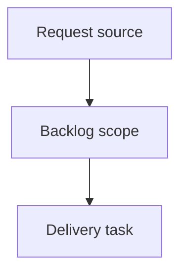

## item_408_add_discoverable_workflow_inspection_aliases - Add discoverable workflow inspection aliases
> From version: 2.7.0
> Schema version: 1.0
> Status: Done
> Understanding: 92%
> Confidence: 87%
> Progress: 100%
> Complexity: High
> Theme: Operator workflow and runtime integration
> Reminder: Update status/understanding/confidence/progress and linked request/task references when you edit this doc.

# Problem
Agents and operators naturally try commands such as `logics-manager flow show <ref>` when they need to inspect workflow docs, but the command does not exist and the error does not point to the right alternative.
Inspection should be discoverable from the `flow` surface because `flow` already owns workflow lifecycle operations.

# Scope
- In:
  - add `flow show <ref>` or an equivalent inspection alias that returns a bounded workflow document view
  - make unsupported `flow` subcommands suggest the nearest valid command or equivalent `sync read-doc` usage
  - keep the alias read-only and compatible with existing `sync read-doc` behavior
  - tests for alias behavior and unsupported-command suggestions
- Out:
  - changing workflow document schemas
  - adding write-capable lifecycle behavior to inspection commands
  - replacing `sync read-doc`

# Acceptance criteria
- AC1: `logics-manager flow show <ref>` or a documented equivalent returns a bounded, useful view of the requested workflow doc.
- AC2: Invalid commands such as `flow show` on older syntax paths or unknown subcommands produce actionable guidance instead of only `Unsupported command`.
- AC3: The inspection path remains read-only and does not mutate workflow docs.
- AC4: Tests cover a valid inspection call and at least one helpful unsupported-command suggestion.

# AC Traceability
- request-AC1 -> This backlog slice. Proof: AC1 covers discoverable workflow inspection through `flow show` or equivalent alias.
- request-AC5 -> This backlog slice. Proof: AC2 covers actionable unsupported-command guidance.
- request-AC7 -> This backlog slice. Proof: AC4 requires tests for the alias and guidance.
- request-AC6 -> This backlog slice. Evidence needed: Agent-facing documentation or cookbook examples cover common workflows: inspect one doc, inspect linked docs, gather a multi-doc context pack, close out a task/request chain, and repair scoped Mermaid/signature issues.

# Decision framing
- Product framing: Not needed
- Product signals: (none detected)
- Product follow-up: No product brief follow-up is expected based on current signals.
- Architecture framing: Not needed
- Architecture signals: (none detected)
- Architecture follow-up: No architecture decision follow-up is expected based on current signals.

# Links
- Product brief(s): (none yet)
- Architecture decision(s): (none yet)
- Request: `req_240_make_logics_manager_cli_agent_friendly_for_workflow_inspection_and_closeout`
- Primary task(s): `task_214_implement_agent_friendly_logics_cli_workflow_improvements`

# AI Context
- Summary: Add discoverable workflow inspection aliases
- Keywords: backlog-groom, request, add discoverable workflow inspection aliases, bounded slice
- Use when: Use when implementing or reviewing the delivery slice for Add discoverable workflow inspection aliases.
- Skip when: Skip when the change is unrelated to this delivery slice or its linked request.

# Priority
- Impact: High - reduces agent fallback to raw file reads and prevents command dead ends during workflow inspection.
- Urgency: Medium - useful before more agents rely on the Logics workflow CLI as the primary context surface.

# Notes
- Hybrid rationale: Derived from request `req_240_make_logics_manager_cli_agent_friendly_for_workflow_inspection_and_closeout` and kept bounded to one coherent delivery slice.
- Source file: `logics/request/req_240_make_logics_manager_cli_agent_friendly_for_workflow_inspection_and_closeout.md`.
- Generated locally by logics-manager.
- Task `task_214_implement_agent_friendly_logics_cli_workflow_improvements` was finished via `logics-manager flow finish task` on 2026-06-12.

# Tasks
- `task_214_implement_agent_friendly_logics_cli_workflow_improvements`
