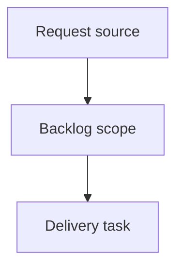

## item_409_make_bounded_document_context_commands_agent_friendly - Make bounded document context commands agent-friendly
> From version: 2.7.0
> Schema version: 1.0
> Status: Ready
> Understanding: 92%
> Confidence: 87%
> Progress: 0%
> Complexity: High
> Theme: Operator workflow and runtime integration
> Reminder: Update status/understanding/confidence/progress and linked request/task references when you edit this doc.

# Problem
Bounded context commands exist, but their current ergonomics do not match common agent needs.
`sync read-doc` should make the document body easy to retrieve, and `sync context-pack` should support a small set of refs without requiring agents to make repeated calls or fall back to raw file reads.

# Scope
- In:
  - make `sync read-doc` display useful document content by default or through an obvious flag
  - preserve metadata-only output behind an explicit option if needed
  - support multi-ref context packs or add a clear multi-ref syntax
  - tests for bounded output, metadata behavior, and multi-ref context
- Out:
  - loading the whole corpus by default
  - removing existing JSON/text format modes
  - changing document content on read

# Acceptance criteria
- AC1: `sync read-doc <ref>` provides bounded body content suitable for agent context, with metadata still available through a clear option or format.
- AC2: `sync context-pack` accepts multiple refs or documents a supported multi-ref argument form.
- AC3: Multi-ref context remains bounded by profile/mode/max output and does not silently expand to the full corpus.
- AC4: Tests cover body content retrieval, metadata-only compatibility, and multi-ref context packing.

# AC Traceability
- request-AC2 -> This backlog slice. Proof: AC1 and AC2 cover read-doc and context-pack agent-friendly behavior.
- request-AC7 -> This backlog slice. Proof: AC4 requires tests for the bounded context commands.

# Decision framing
- Product framing: Not needed
- Product signals: (none detected)
- Product follow-up: No product brief follow-up is expected based on current signals.
- Architecture framing: Not needed
- Architecture signals: (none detected)
- Architecture follow-up: No architecture decision follow-up is expected based on current signals.

# Links
- Product brief(s): (none yet)
- Architecture decision(s): (none yet)
- Request: `logics/request/req_240_make_logics_manager_cli_agent_friendly_for_workflow_inspection_and_closeout.md`
- Primary task(s): `task_214_implement_agent_friendly_logics_cli_workflow_improvements`

# AI Context
- Summary: Make bounded document context commands agent-friendly
- Keywords: backlog-groom, request, make bounded document context commands agent-friendly, bounded slice
- Use when: Use when implementing or reviewing the delivery slice for Make bounded document context commands agent-friendly.
- Skip when: Skip when the change is unrelated to this delivery slice or its linked request.

# Priority
- Impact: High - keeps agents on bounded CLI context instead of raw file reads.
- Urgency: Medium - directly supports documented project instructions to prefer `logics-manager`.

# Notes
- Hybrid rationale: Derived from request `req_240_make_logics_manager_cli_agent_friendly_for_workflow_inspection_and_closeout` and kept bounded to one coherent delivery slice.
- Source file: `logics/request/req_240_make_logics_manager_cli_agent_friendly_for_workflow_inspection_and_closeout.md`.
- Generated locally by logics-manager.
