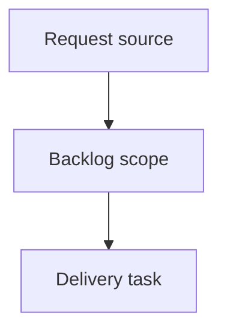

## item_410_scope_mermaid_signature_refresh_and_deterministic_closeout_repairs - Scope Mermaid signature refresh and deterministic closeout repairs
> From version: 2.7.0
> Schema version: 1.0
> Status: Ready
> Understanding: 92%
> Confidence: 87%
> Progress: 0%
> Complexity: High
> Theme: Operator workflow and runtime integration
> Reminder: Update status/understanding/confidence/progress and linked request/task references when you edit this doc.

# Problem
Workflow closeout currently requires several predictable manual repairs after implementation is done.
Agents need scoped commands for Mermaid signatures and deterministic closeout hygiene so one completed delivery does not create unrelated Git changes or late audit/lint failures.

# Scope
- In:
  - add scoped Mermaid signature refresh for one ref/path and/or changed docs
  - add deterministic closeout repair behavior for eligible requests, DoR/DoD checks, indicators, and Mermaid signatures where safe
  - improve closeout command output so agents know what was repaired and what still requires manual input
  - tests for scoped refresh and deterministic closeout repair
- Out:
  - broad semantic rewriting of workflow document prose
  - closing docs whose linked work is not complete
  - modifying unrelated workflow files when a scoped command is requested

# Acceptance criteria
- AC1: Mermaid signature refresh supports a scoped ref/path or changed-docs mode that avoids unrelated file modifications.
- AC2: A closeout or repair command can deterministically handle eligible request closure, checklist hygiene, indicator bumps, and scoped Mermaid signatures when the closure chain is otherwise valid.
- AC3: The command reports any remaining manual blockers clearly instead of requiring agents to infer them from separate lint/audit failures.
- AC4: Tests cover scoped Mermaid refresh, no unrelated modifications, and at least one deterministic closeout repair path.

# AC Traceability
- request-AC3 -> This backlog slice. Proof: AC1 covers scoped Mermaid/signature refresh.
- request-AC4 -> This backlog slice. Proof: AC2 and AC3 cover deterministic closeout repairs and reporting.
- request-AC7 -> This backlog slice. Proof: AC4 requires tests for scoped repair behavior.

# Decision framing
- Product framing: Not needed
- Product signals: (none detected)
- Product follow-up: No product brief follow-up is expected based on current signals.
- Architecture framing: Not needed
- Architecture signals: (none detected)
- Architecture follow-up: No architecture decision follow-up is expected based on current signals.

# Links
- Product brief(s): (none yet)
- Architecture decision(s): (none yet)
- Request: `logics/request/req_240_make_logics_manager_cli_agent_friendly_for_workflow_inspection_and_closeout.md`
- Primary task(s): `task_214_implement_agent_friendly_logics_cli_workflow_improvements`

# AI Context
- Summary: Scope Mermaid signature refresh and deterministic closeout repairs
- Keywords: backlog-groom, request, scope mermaid signature refresh and deterministic closeout repairs, bounded slice
- Use when: Use when implementing or reviewing the delivery slice for Scope Mermaid signature refresh and deterministic closeout repairs.
- Skip when: Skip when the change is unrelated to this delivery slice or its linked request.

# Priority
- Impact: High - prevents noisy unrelated workflow diffs and late closeout failures.
- Urgency: High - directly addresses issues observed during the latest delivery closeout.

# Notes
- Hybrid rationale: Derived from request `req_240_make_logics_manager_cli_agent_friendly_for_workflow_inspection_and_closeout` and kept bounded to one coherent delivery slice.
- Source file: `logics/request/req_240_make_logics_manager_cli_agent_friendly_for_workflow_inspection_and_closeout.md`.
- Generated locally by logics-manager.
