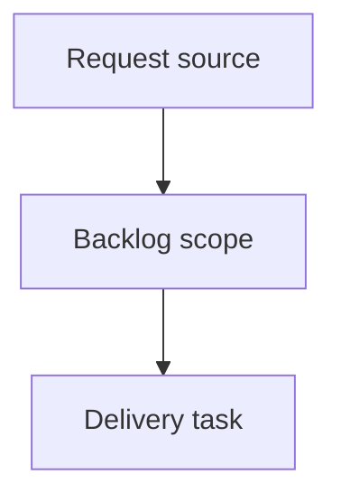

## item_411_document_and_clarify_agent_cli_workflows - Document and clarify agent CLI workflows
> From version: 2.7.0
> Schema version: 1.0
> Status: Done
> Understanding: 92%
> Confidence: 87%
> Progress: 100%
> Complexity: High
> Theme: Operator workflow and runtime integration
> Reminder: Update status/understanding/confidence/progress and linked request/task references when you edit this doc.

# Problem
Even when the right CLI behavior exists, agents need concise examples that map common workflow intent to the right command.
The documentation should reduce trial-and-error around inspection, bounded context packs, validation, closeout, and scoped repairs.

# Scope
- In:
  - add or update an agent CLI cookbook for common Logics workflow operations
  - include examples for inspecting one doc, reading linked docs, building multi-doc context, closing out a task chain, repairing scoped Mermaid/signature issues, and interpreting lint/audit output
  - align help text and docs with the implemented commands
  - tests or documentation checks where the project has an established pattern
- Out:
  - broad user manual rewrite
  - documenting internal implementation details that are not stable CLI contracts
  - replacing generated `AGENTS.md` instructions

# Acceptance criteria
- AC1: Agent-facing docs show the recommended command for inspecting one workflow doc.
- AC2: Docs show how to collect bounded context for multiple linked docs.
- AC3: Docs show the recommended closeout/repair sequence for completed task/backlog/request chains.
- AC4: Docs explain how to avoid noisy Mermaid/signature refreshes.
- AC5: CLI help and documentation examples stay consistent with implemented syntax.

# AC Traceability
- request-AC5 -> This backlog slice. Proof: AC5 covers help/docs consistency for command guidance.
- request-AC6 -> This backlog slice. Proof: AC1 through AC4 cover the required cookbook workflows.
- request-AC7 -> This backlog slice. Evidence needed: Tests cover the new aliases/options, scoped behavior, closeout/repair behavior, and error-message guidance without requiring external services.

# Decision framing
- Product framing: Not needed
- Product signals: (none detected)
- Product follow-up: No product brief follow-up is expected based on current signals.
- Architecture framing: Not needed
- Architecture signals: (none detected)
- Architecture follow-up: No architecture decision follow-up is expected based on current signals.

# Links
- Product brief(s): (none yet)
- Architecture decision(s): (none yet)
- Request: `req_240_make_logics_manager_cli_agent_friendly_for_workflow_inspection_and_closeout`
- Primary task(s): `task_214_implement_agent_friendly_logics_cli_workflow_improvements`

# AI Context
- Summary: Document and clarify agent CLI workflows
- Keywords: backlog-groom, request, document and clarify agent cli workflows, bounded slice
- Use when: Use when implementing or reviewing the delivery slice for Document and clarify agent CLI workflows.
- Skip when: Skip when the change is unrelated to this delivery slice or its linked request.

# Priority
- Impact: Medium - reduces repeated command discovery mistakes and improves agent consistency.
- Urgency: Medium - should land with or immediately after the CLI behavior changes.

# Notes
- Hybrid rationale: Derived from request `req_240_make_logics_manager_cli_agent_friendly_for_workflow_inspection_and_closeout` and kept bounded to one coherent delivery slice.
- Source file: `logics/request/req_240_make_logics_manager_cli_agent_friendly_for_workflow_inspection_and_closeout.md`.
- Generated locally by logics-manager.
- Task `task_214_implement_agent_friendly_logics_cli_workflow_improvements` was finished via `logics-manager flow finish task` on 2026-06-12.

# Tasks
- `task_214_implement_agent_friendly_logics_cli_workflow_improvements`
