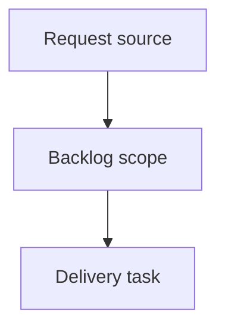

## item_412_add_wish_to_request_guided_cdx_mission - Add wish-to-request guided CDX mission
> From version: 2.7.0
> Schema version: 1.0
> Status: Ready
> Understanding: 92%
> Confidence: 87%
> Progress: 0%
> Complexity: High
> Theme: Operator workflow and runtime integration
> Reminder: Update status/understanding/confidence/progress and linked request/task references when you edit this doc.

# Problem
Operators need a low-risk guided mission that turns a rough wish or intent into a structured Logics request draft.
The mission should reduce boilerplate while preserving review: unclear wishes should stay draft-like and surface assumptions/questions instead of pretending the request is ready.

# Scope
- In:
  - add a `wish-to-request` guided CDX mission in the viewer mission catalog
  - provide a free-form wish/intent input in the mission UI
  - send a bounded backend payload that can generate or preview a Logics request draft
  - report the generated request ID/path or preview result back to the viewer
  - tests for catalog rendering, input payload handling, and request draft generation path
- Out:
  - automatic backlog/task promotion
  - broad product planning beyond the generated request draft
  - write operations outside the intended request document

# Acceptance criteria
- AC1: The viewer exposes a `wish-to-request` guided mission with a free-form input for the user's wish or intent.
- AC2: The `wish-to-request` mission produces a structured Logics request draft with needs, context, acceptance criteria, DoR state, references when available, and clear questions/open assumptions when the wish is under-specified.
- AC3: The `wish-to-request` mission remains read/write bounded to request creation or preview and does not promote backlog/tasks automatically unless explicitly added in a future request.
- AC4: Backend mission payloads are path-safe, command-bounded, and auditable; any generated request file is reported back to the viewer with ID/path.
- AC5: Existing guided missions continue to work and remain visible after adding the new mission.

# AC Traceability
- request-AC1 -> This backlog slice. Proof: AC1: The viewer exposes a `wish-to-request` guided mission with a free-form input for the user's wish or intent.
- request-AC2 -> This backlog slice. Proof: AC2: The `wish-to-request` mission produces a structured Logics request draft with needs, context, acceptance criteria, DoR state, references when available, and clear questions/open assumptions when the wish is under-specified.
- request-AC3 -> This backlog slice. Proof: AC3: The `wish-to-request` mission remains read/write bounded to request creation or preview and does not promote backlog/tasks automatically unless explicitly added in a future request.
- request-AC7 -> This backlog slice. Proof: AC4 covers bounded backend payloads and reporting.
- request-AC8 -> This backlog slice. Proof: AC4 and scope require tests for rendering, payload handling, and request generation.
- request-AC9 -> This backlog slice. Proof: AC5 protects existing missions.

# Decision framing
- Product framing: Not needed
- Product signals: (none detected)
- Product follow-up: No product brief follow-up is expected based on current signals.
- Architecture framing: Not needed
- Architecture signals: (none detected)
- Architecture follow-up: No architecture decision follow-up is expected based on current signals.

# Links
- Product brief(s): (none yet)
- Architecture decision(s): (none yet)
- Request: `logics/request/req_241_add_wish_to_request_and_guided_pre_release_cdx_missions.md`
- Primary task(s): `task_215_add_wish_to_request_guided_cdx_mission`

# AI Context
- Summary: Add wish-to-request guided CDX mission
- Keywords: backlog-groom, request, add wish-to-request guided cdx mission, bounded slice
- Use when: Use when implementing or reviewing the delivery slice for Add wish-to-request guided CDX mission.
- Skip when: Skip when the change is unrelated to this delivery slice or its linked request.

# Priority
- Impact: High - turns rough operator intent into a structured workflow artifact without manual boilerplate.
- Urgency: Medium - useful as the guided mission surface expands.

# Notes
- Hybrid rationale: Derived from request `req_241_add_wish_to_request_and_guided_pre_release_cdx_missions` and kept bounded to one coherent delivery slice.
- Source file: `logics/request/req_241_add_wish_to_request_and_guided_pre_release_cdx_missions.md`.
- Generated locally by logics-manager.

# Tasks
- `task_215_add_wish_to_request_guided_cdx_mission`
