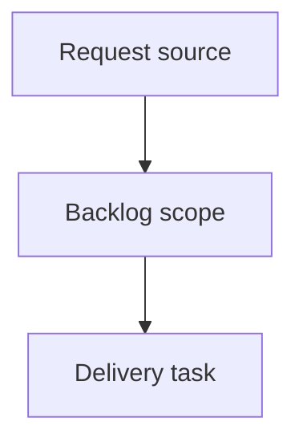

## item_413_add_guarded_pre_release_guided_cdx_mission - Add guarded pre-release guided CDX mission
> From version: 2.7.0
> Schema version: 1.0
> Status: Done
> Understanding: 92%
> Confidence: 87%
> Progress: 100%
> Complexity: High
> Theme: Operator workflow and runtime integration
> Reminder: Update status/understanding/confidence/progress and linked request/task references when you edit this doc.

# Problem
Operators need a guarded pre-release mission that prepares release material for a specific editable version without accidentally publishing, tagging, pushing, or mutating package versions.
The mission should make the validation intent explicit and produce a plan/report plus actionable fixes when full validation is requested.

# Scope
- In:
  - add a `pre-release` guided CDX mission in the viewer mission catalog
  - add an editable `vX.X.X` version field with validation
  - add an explicit checkbox for running full validation and fixing before pre-release
  - generate a pre-release plan/report and validation evidence
  - surface actionable fixes or generated workflow docs when validation fails
  - tests for version validation, checkbox payload handling, report generation, and no-publish guarantees
- Out:
  - creating Git tags
  - publishing releases
  - pushing branches
  - changing package versions
  - replacing existing release publish workflows

# Acceptance criteria
- AC1: The viewer exposes a guarded `pre-release` guided mission with an editable version field that validates `vX.X.X`-style semantic versions and rejects empty or malformed values.
- AC2: The `pre-release` mission includes an explicit checkbox for running full validation and fixing before pre-release; the UI and payload make the selected validation behavior unambiguous.
- AC3: The initial `pre-release` scope generates a pre-release plan/report, validation evidence, and actionable fixes or generated workflow docs when problems are found, without creating tags, publishing releases, pushing branches, or changing package versions.
- AC4: Backend mission payloads are path-safe, command-bounded, and auditable; any generated files are reported back to the viewer with IDs/paths.
- AC5: Existing guided missions continue to work and remain visible after adding the new mission.

# AC Traceability
- request-AC4 -> This backlog slice. Proof: AC1 covers the editable semantic version field.
- request-AC5 -> This backlog slice. Proof: AC2 covers the explicit validation/fix checkbox.
- request-AC6 -> This backlog slice. Proof: AC3 covers report generation and no-publish boundaries.
- request-AC7 -> This backlog slice. Proof: AC4 covers bounded backend payloads and reporting.
- request-AC8 -> This backlog slice. Proof: AC1 through AC4 require tests for rendering, payload handling, validation, and no-publish behavior.
- request-AC9 -> This backlog slice. Proof: AC5 protects existing missions.

# Decision framing
- Product framing: Not needed
- Product signals: (none detected)
- Product follow-up: No product brief follow-up is expected based on current signals.
- Architecture framing: Not needed
- Architecture signals: (none detected)
- Architecture follow-up: No architecture decision follow-up is expected based on current signals.

# Links
- Product brief(s): (none yet)
- Architecture decision(s): (none yet)
- Request: `req_241_add_wish_to_request_and_guided_pre_release_cdx_missions`
- Primary task(s): `task_216_add_guarded_pre_release_guided_cdx_mission`

# AI Context
- Summary: Add guarded pre-release guided CDX mission
- Keywords: backlog-groom, request, add guarded pre-release guided cdx mission, bounded slice
- Use when: Use when implementing or reviewing the delivery slice for Add guarded pre-release guided CDX mission.
- Skip when: Skip when the change is unrelated to this delivery slice or its linked request.

# Priority
- Impact: High - gives operators a guarded pre-release preparation path without release side effects.
- Urgency: Medium - should land before expanding any publish/tag automation.

# Notes
- Hybrid rationale: Derived from request `req_241_add_wish_to_request_and_guided_pre_release_cdx_missions` and kept bounded to one coherent delivery slice.
- Source file: `logics/request/req_241_add_wish_to_request_and_guided_pre_release_cdx_missions.md`.
- Generated locally by logics-manager.
- Task `task_216_add_guarded_pre_release_guided_cdx_mission` was finished via `logics-manager flow finish task` on 2026-06-12.

# Tasks
- `task_216_add_guarded_pre_release_guided_cdx_mission`
