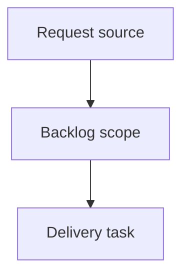

## item_414_address_full_audit_validation_and_documentation_drift - Address full audit validation and documentation drift
> From version: 2.8.0
> Schema version: 1.0
> Status: Done
> Understanding: 100%
> Confidence: 95%
> Progress: 100%
> Complexity: High
> Theme: Operator workflow and runtime integration
> Reminder: Update status/understanding/confidence/progress and linked request/task references when you edit this doc.

# Problem
Address the actionable follow-up from the June 12, 2026 full repository audit without mixing broad product fixes into the audit closeout.
The most important correctness gap is that `logics-manager audit --governance-profile strict` can report `ok: false`, hundreds of blocking findings, `can_continue: false`, and `release_ready: false` while the top-level CLI still exits with status 0.
Documentation and validation also need cleanup: README badges are stale, dependency audit validation is blocked by external/cache assumptions in local runs, strict governance debt is large enough to be hidden by the passing standard audit, and several high-risk runtime/viewer surfaces remain oversized or weakly covered.

# Scope
- In:
  - one coherent delivery slice from the source request
- Out:
  - unrelated sibling slices that should stay in separate backlog items instead of widening this doc

# Acceptance criteria
- AC1: Failed audit payloads produce nonzero process exits across `logics-manager audit`, `python -m logics_manager audit`, npm wrapper invocation, and relevant npm scripts, with tests covering JSON and text modes.
- AC2: Strict governance/token-hygiene debt is either reduced or explicitly separated from release-blocking standard audit gates so operators can see when strict mode is advisory versus mandatory.
- AC3: README and release-facing badges/docs are refreshed from current repository metadata or validated by a drift check so version/test-tooling badges do not lag releases.
- AC4: Dependency audit and package validation scripts document or implement local-cache and offline behavior clearly, distinguishing unreachable registry results from clean advisory status.
- AC5: Viewer smoke skips are visible in validation summaries and CI expectations, with at least one non-skipped CI lane or documented fallback proving the local viewer shell/API path.
- AC6: High-risk oversized runtime/viewer/test files have an actionable decomposition and coverage plan focused on correctness-critical surfaces rather than cosmetic refactors.
- AC7: Follow-up validation evidence includes standard audit/lint, strict audit exit behavior, npm package dry run, dependency audit outcome, and targeted tests for the changed validation contracts.

# AC Traceability
- request-AC1 -> This backlog slice. Proof: `task_217` shipped audit exit propagation and regression tests for CLI, module, npm wrapper, and strict npm-script behavior.
- request-AC2 -> This backlog slice. Proof: README now separates standard active-work audit failures from strict release/governance cleanup and the strict npm script exits nonzero on existing token-hygiene debt.
- request-AC3 -> This backlog slice. Proof: README badges are refreshed and `npm run docs:check` is wired into `ci:check`.
- request-AC4 -> This backlog slice. Proof: `scripts/check-npm-audit.mjs` distinguishes registry unavailability from a clean audit state, and README documents registry versus local-only validation behavior.
- request-AC5 -> This backlog slice. Proof: README documents viewer-smoke summaries and fallbacks; current `npm run test:viewer-smoke` passed in Chrome mode for desktop, tablet, and mobile.
- request-AC6 -> This backlog slice. Proof: README links oversized-file decomposition to `adr_020` and defines correctness-first coverage expectations.
- request-AC7 -> This backlog slice. Proof: `task_217` records standard audit/lint, strict audit exit behavior, npm pack dry run, dependency audit, viewer smoke, and targeted tests.

# Decision framing
- Product framing: Not needed
- Product signals: (none detected)
- Product follow-up: No product brief follow-up is expected based on current signals.
- Architecture framing: Not needed
- Architecture signals: (none detected)
- Architecture follow-up: No architecture decision follow-up is expected based on current signals.

# Links
- Product brief(s): (none yet)
- Architecture decision(s): (none yet)
- Request: `logics/request/req_242_address_full_audit_validation_and_documentation_drift.md`
- Primary task(s): (none yet)

# AI Context
- Summary: Address full audit validation and documentation drift
- Keywords: backlog-groom, request, address full audit validation and documentation drift, bounded slice
- Use when: Use when implementing or reviewing the delivery slice for Address full audit validation and documentation drift.
- Skip when: Skip when the change is unrelated to this delivery slice or its linked request.

# Priority
- Impact:
- Urgency:

# Notes
- Hybrid rationale: Derived from request `req_242_address_full_audit_validation_and_documentation_drift` and kept bounded to one coherent delivery slice.
- Source file: `logics/request/req_242_address_full_audit_validation_and_documentation_drift.md`.
- Generated locally by logics-manager.

# Tasks
- `task_217_address_full_audit_validation_and_documentation_drift`
