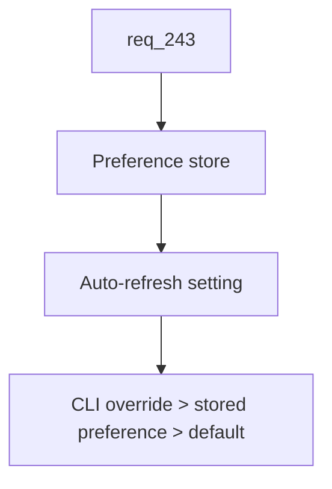

## item_415_persist_viewer_preferences_and_refresh_settings - Persist viewer preferences and refresh settings
> From version: 2.8.0
> Schema version: 1.0
> Status: Ready
> Understanding: 95%
> Confidence: 85%
> Progress: 0%
> Complexity: Medium
> Theme: Viewer operator workflow
> Reminder: Update status/understanding/confidence/progress and linked request/task references when you edit this doc.

# Problem
Viewer launches currently treat operator UI choices as disposable state. Auto-refresh is the first concrete case: when an operator changes the slider and no terminal launch value is forced, the next viewer launch should restore that choice instead of reverting to the application default.

# Scope
- In:
  - Versioned local viewer preference payload.
  - Read/write helpers with safe fallback when stored data is absent, malformed, or from an unknown version.
  - Auto-refresh precedence: explicit CLI launch value, then stored preference, then application default.
  - UI slider persistence only when the user changes the setting inside the viewer.
- Out:
  - Syncing preferences across machines or browser profiles.
  - Persisting every transient UI state in the first delivery.
  - Treating CLI launch overrides as user preference writes.

# Acceptance criteria
- AC1: A versioned viewer preference payload is persisted locally and read during viewer startup.
- AC2: Malformed or incompatible stored preferences are ignored safely without breaking viewer startup.
- AC3: Auto-refresh initialization follows `explicit CLI launch value > stored user preference > default`.
- AC4: Moving the auto-refresh slider in the viewer writes the new preference for future launches.
- AC5: An explicit CLI launch value controls the current session but is not persisted as a user preference unless the user changes the slider.
- AC6: Tests cover absent storage, valid storage, malformed storage, CLI override precedence, and slider writeback.

# AC Traceability
- request-AC1 -> This backlog slice. Proof: AC1 defines the versioned local preference payload.
- request-AC2 -> This backlog slice. Proof: AC3, AC4, and AC5 define refresh precedence and persistence behavior.
- request-AC10 -> This backlog slice. Proof: AC6 requires tests for preference read/write and precedence.

# Decision framing
- Product framing: Not needed
- Product signals: (none detected)
- Product follow-up: No product brief follow-up is expected based on current signals.
- Architecture framing: Not needed
- Architecture signals: (none detected)
- Architecture follow-up: No architecture decision follow-up is expected based on current signals.

# Links
- Product brief(s): (none yet)
- Architecture decision(s): (none yet)
- Request: `logics/request/req_243_persist_viewer_preferences_and_add_configurable_cdx_status_and_workspace_views.md`
- Primary task(s): `task_218_implement_persisted_viewer_preferences_cdx_status_controls_and_workspace_file_view`

# AI Context
- Summary: Persist local viewer preferences and restore auto-refresh when no CLI override is forced.
- Keywords: viewer-preferences, local-storage, auto-refresh, cli-override, slider
- Use when: Implementing viewer preference storage or refresh setting restoration.
- Skip when: The change is unrelated to persistent viewer settings.

# Priority
- Impact: High
- Urgency: Medium

# Notes
- Source request: `req_243_persist_viewer_preferences_and_add_configurable_cdx_status_and_workspace_views`.
- This slice should establish the shared preference API used by sibling CDX status slices.

# Tasks
- `task_218_implement_persisted_viewer_preferences_cdx_status_controls_and_workspace_file_view`
