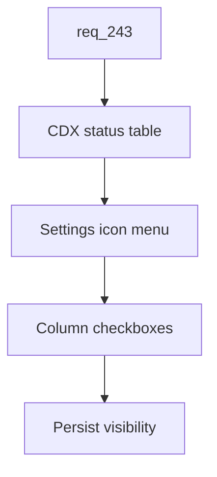

## item_416_add_configurable_cdx_status_columns - Add configurable CDX status columns
> From version: 2.8.0
> Schema version: 1.0
> Status: Done
> Understanding: 95%
> Confidence: 85%
> Progress: 100%
> Complexity: Medium
> Theme: Viewer operator workflow
> Reminder: Update status/understanding/confidence/progress and linked request/task references when you edit this doc.

# Problem
The CDX status table needs to stay scan-friendly as more status dimensions are exposed. Operators should be able to hide and restore columns from the viewer, and the default table should reduce noise by hiding `block` and `CR` unless the operator opts in.

# Scope
- In:
  - Icon-only settings button near the CDX status table controls.
  - Compact menu with one checkbox per configurable status column.
  - Stable column identifiers separate from displayed labels.
  - Persisted column visibility preferences.
  - Default visibility with `block` and `CR` disabled and other current columns enabled.
- Out:
  - Removing the `block` or `CR` data from the underlying status payload.
  - Reordering columns in this slice.
  - Server-side user preference storage.

# Acceptance criteria
- AC1: The CDX status table shows a small settings icon button for column configuration.
- AC2: Activating the button opens a compact menu with checkboxes for configurable columns.
- AC3: Toggling a checkbox updates the visible table columns without requiring a viewer restart.
- AC4: Column visibility is persisted with stable column IDs and restored on the next viewer launch.
- AC5: The default column visibility hides `block` and `CR`.
- AC6: Existing status columns other than `block` and `CR` remain visible by default.
- AC7: Tests cover default visibility, toggling behavior, persistence, and restoration.

# AC Traceability
- request-AC3 -> This backlog slice. Proof: AC1 and AC2 define the settings icon and checkbox menu.
- request-AC4 -> This backlog slice. Proof: AC4, AC5, and AC6 define persisted defaults.
- request-AC10 -> This backlog slice. Proof: AC7 requires column visibility tests.

# Decision framing
- Product framing: Not needed
- Product signals: (none detected)
- Product follow-up: No product brief follow-up is expected based on current signals.
- Architecture framing: Not needed
- Architecture signals: (none detected)
- Architecture follow-up: No architecture decision follow-up is expected based on current signals.

# Links
- Product brief(s): (none yet)
- Architecture decision(s): (none yet)
- Request: `logics/request/req_243_persist_viewer_preferences_and_add_configurable_cdx_status_and_workspace_views.md`
- Primary task(s): `task_218_implement_persisted_viewer_preferences_cdx_status_controls_and_workspace_file_view`

# AI Context
- Summary: Add persisted column visibility controls to the CDX status table.
- Keywords: cdx-status, column-settings, checkbox-menu, block-column, cr-column, viewer-preferences
- Use when: Implementing or testing CDX status column visibility controls.
- Skip when: The change is only about provider filtering or non-CDX tables.

# Priority
- Impact: Medium
- Urgency: Medium

# Notes
- The UI should use an icon button and tooltip/accessible label rather than a text-heavy control.
- Task `task_218_implement_persisted_viewer_preferences_cdx_status_controls_and_workspace_file_view` was finished via `logics-manager flow finish task` on 2026-06-12.

# Tasks
- `task_218_implement_persisted_viewer_preferences_cdx_status_controls_and_workspace_file_view`
