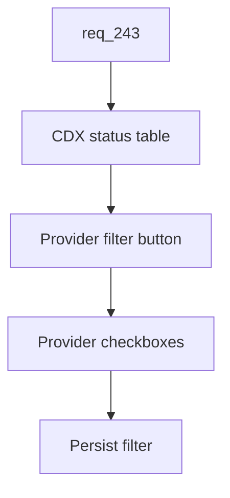

## item_417_add_persisted_provider_filters_to_cdx_status - Add persisted provider filters to CDX status
> From version: 2.8.0
> Schema version: 1.0
> Status: Ready
> Understanding: 95%
> Confidence: 85%
> Progress: 0%
> Complexity: Medium
> Theme: Viewer operator workflow
> Reminder: Update status/understanding/confidence/progress and linked request/task references when you edit this doc.

# Problem
CDX status often mixes multiple providers. Operators need to narrow the table to a provider subset during diagnosis while keeping the default view broad and resilient when new providers appear.

# Scope
- In:
  - Provider-filter icon button next to the column settings button.
  - Compact checkbox menu for discovered providers.
  - Default all-provider behavior.
  - Persisted provider filter preference.
  - Semantics that do not unexpectedly hide newly discovered providers when the user has not explicitly selected a subset.
- Out:
  - Changing provider status collection or ranking logic.
  - Creating separate provider-specific status pages.
  - Persisting filters outside the viewer preference payload.

# Acceptance criteria
- AC1: The CDX status table shows a small provider-filter icon button next to the column settings button.
- AC2: Activating the button opens a compact provider checkbox menu.
- AC3: The default state shows all providers.
- AC4: Selecting a provider subset filters visible status rows without mutating the underlying status data.
- AC5: Provider filter preferences persist across viewer restarts.
- AC6: The persisted model preserves all-provider behavior distinctly from an explicit subset so newly discovered providers remain visible by default.
- AC7: Tests cover default all-provider behavior, provider subset filtering, persistence, restoration, and newly discovered provider handling.

# AC Traceability
- request-AC5 -> This backlog slice. Proof: AC1 and AC2 define the provider-filter control.
- request-AC6 -> This backlog slice. Proof: AC3 through AC6 define persistence and all-provider semantics.
- request-AC10 -> This backlog slice. Proof: AC7 requires provider filter tests.

# Decision framing
- Product framing: Not needed
- Product signals: (none detected)
- Product follow-up: No product brief follow-up is expected based on current signals.
- Architecture framing: Not needed
- Architecture signals: (none detected)
- Architecture follow-up: No architecture decision follow-up is expected based on current signals.

# Links
- Product brief(s): (none yet)
- Architecture decision(s): (none yet)
- Request: `logics/request/req_243_persist_viewer_preferences_and_add_configurable_cdx_status_and_workspace_views.md`
- Primary task(s): `task_218_implement_persisted_viewer_preferences_cdx_status_controls_and_workspace_file_view`

# AI Context
- Summary: Add persisted provider filtering to the CDX status table while defaulting to all providers.
- Keywords: cdx-status, provider-filter, checkbox-menu, all-providers, viewer-preferences
- Use when: Implementing or testing provider filtering in the viewer CDX status table.
- Skip when: The change is about table columns or provider health collection internals.

# Priority
- Impact: Medium
- Urgency: Medium

# Notes
- Store the default state as an explicit all-provider mode or equivalent null selection, not as a stale list of currently known providers.

# Tasks
- `task_218_implement_persisted_viewer_preferences_cdx_status_controls_and_workspace_file_view`
